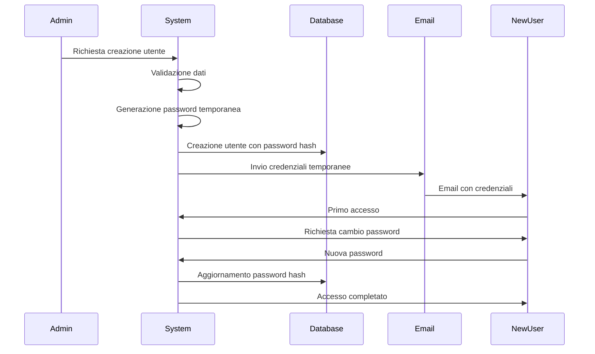
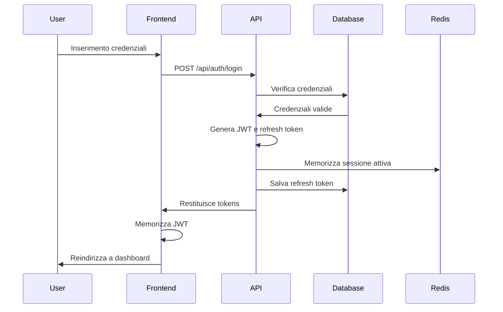
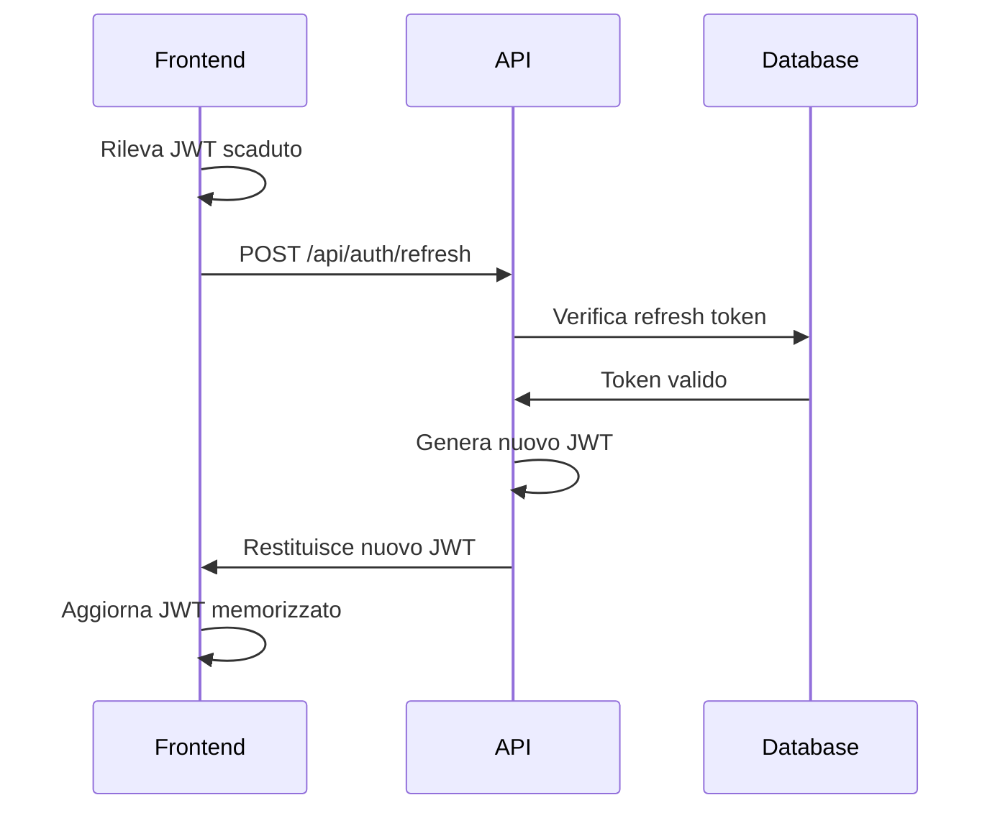
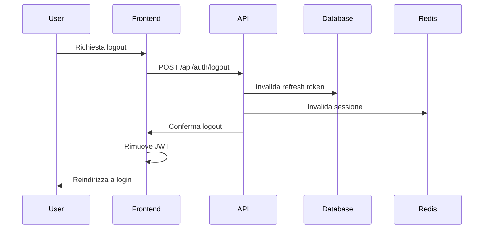
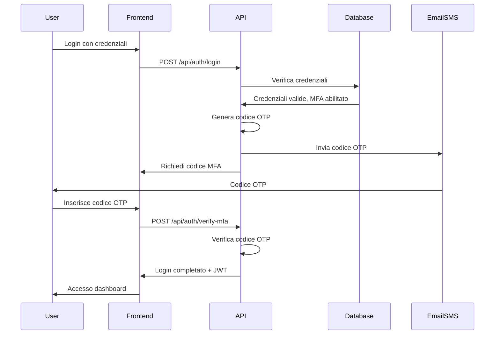

# Flussi di Autenticazione e Autorizzazione

## Panoramica

Questo documento descrive i flussi di autenticazione e autorizzazione per il sistema WebUI multitenant di SciPhi AI R2R, con particolare attenzione alla gestione dei ruoli (Admin, Company, User) e alla sicurezza enterprise-grade. Il sistema è progettato per garantire un accesso sicuro e controllato alle risorse, rispettando i principi di multitenancy e isolamento dei dati.

## Architettura di Sicurezza

L'architettura di sicurezza è basata su un modello a più livelli che comprende:

1. **Autenticazione**: Verifica dell'identità degli utenti
2. **Autorizzazione**: Controllo degli accessi alle risorse
3. **Multitenancy**: Isolamento dei dati tra tenant
4. **Audit**: Tracciamento delle attività di sicurezza

```
┌─────────────────┐     ┌─────────────────┐     ┌─────────────────┐
│                 │     │                 │     │                 │
│  Frontend       │     │  Backend        │     │  PostgreSQL     │
│  Blazor         │◄────┤  API Server     │◄────┤  Database       │
│                 │     │                 │     │                 │
└─────────────────┘     └────────┬────────┘     └─────────────────┘
                                 │                       
                                 ▼                       
                        ┌─────────────────┐              
                        │                 │              
                        │  Redis Cache    │              
                        │                 │              
                        └─────────────────┘              
```

## Flussi di Autenticazione

### 1. Registrazione Utente

La registrazione di nuovi utenti è gestita esclusivamente dagli amministratori (Admin per nuovi Company admin, Company admin per nuovi User).

**Flusso**:
1. Admin/Company admin accede alla sezione "Gestione Utenti"
2. Compila form con dati utente (nome, email, ruolo)
3. Sistema genera password temporanea
4. Sistema crea record utente in database con password hash
5. Sistema invia email con credenziali temporanee
6. Nuovo utente accede e viene forzato a cambiare password



### 2. Login Utente

**Flusso**:
1. Utente accede alla pagina di login
2. Inserisce username e password
3. Sistema verifica credenziali contro database
4. Se valide, sistema genera JWT token e refresh token
5. Sistema memorizza refresh token in database
6. Sistema restituisce JWT token al client
7. Client memorizza JWT token in localStorage/sessionStorage
8. Client include JWT token in header Authorization per richieste successive



### 3. Refresh Token

**Flusso**:
1. JWT token scade (tipicamente dopo 60 minuti)
2. Client invia refresh token al server
3. Sistema verifica validità refresh token
4. Se valido, sistema genera nuovo JWT token
5. Sistema restituisce nuovo JWT token al client



### 4. Logout

**Flusso**:
1. Utente richiede logout
2. Client invia richiesta di logout al server
3. Sistema invalida refresh token in database
4. Sistema invalida sessione in Redis
5. Client rimuove JWT token dal localStorage/sessionStorage
6. Client reindirizza alla pagina di login



### 5. Multi-Factor Authentication (Opzionale)

Per utenti con ruolo Admin o per tenant che lo richiedono, è possibile abilitare l'autenticazione a due fattori.

**Flusso**:
1. Utente completa login con username e password
2. Sistema verifica se MFA è abilitato per l'utente
3. Se abilitato, sistema genera codice OTP e lo invia via email/SMS
4. Utente inserisce codice OTP
5. Sistema verifica codice OTP
6. Se valido, sistema completa il flusso di login



## Implementazione JWT

### Struttura Token

```json
{
  "header": {
    "alg": "RS256",
    "typ": "JWT"
  },
  "payload": {
    "sub": "123",
    "name": "John Doe",
    "email": "john@example.com",
    "role": "User",
    "tenant_id": "456",
    "permissions": ["read:collections", "write:documents"],
    "iat": 1625176800,
    "exp": 1625180400,
    "iss": "r2r-webui",
    "aud": "r2r-webui-clients"
  },
  "signature": "..."
}
```

### Configurazione JWT in .NET

```csharp
// Startup.cs
public void ConfigureServices(IServiceCollection services)
{
    // JWT Authentication
    services.AddAuthentication(options =>
    {
        options.DefaultAuthenticateScheme = JwtBearerDefaults.AuthenticationScheme;
        options.DefaultChallengeScheme = JwtBearerDefaults.AuthenticationScheme;
    })
    .AddJwtBearer(options =>
    {
        options.TokenValidationParameters = new TokenValidationParameters
        {
            ValidateIssuer = true,
            ValidateAudience = true,
            ValidateLifetime = true,
            ValidateIssuerSigningKey = true,
            ValidIssuer = Configuration["Authentication:JwtIssuer"],
            ValidAudience = Configuration["Authentication:JwtAudience"],
            IssuerSigningKey = new SymmetricSecurityKey(
                Encoding.UTF8.GetBytes(Configuration["Authentication:JwtSecret"])),
            ClockSkew = TimeSpan.Zero // Rimuove la tolleranza predefinita di 5 minuti
        };
        
        // Gestione eventi JWT
        options.Events = new JwtBearerEvents
        {
            OnAuthenticationFailed = context =>
            {
                if (context.Exception.GetType() == typeof(SecurityTokenExpiredException))
                {
                    context.Response.Headers.Add("Token-Expired", "true");
                }
                return Task.CompletedTask;
            },
            OnTokenValidated = context =>
            {
                var userService = context.HttpContext.RequestServices.GetRequiredService<IUserService>();
                var userId = int.Parse(context.Principal.Identity.Name);
                var user = userService.GetById(userId);
                
                // Verifica se l'utente è ancora attivo
                if (user == null || !user.IsActive)
                {
                    context.Fail("Unauthorized");
                }
                
                return Task.CompletedTask;
            }
        };
    });
}
```

### Servizio di Autenticazione

```csharp
public class AuthService : IAuthService
{
    private readonly UserManager<ApplicationUser> _userManager;
    private readonly SignInManager<ApplicationUser> _signInManager;
    private readonly IOptions<JwtOptions> _jwtOptions;
    private readonly IDistributedCache _cache;
    private readonly IUserRepository _userRepository;
    
    public AuthService(
        UserManager<ApplicationUser> userManager,
        SignInManager<ApplicationUser> signInManager,
        IOptions<JwtOptions> jwtOptions,
        IDistributedCache cache,
        IUserRepository userRepository)
    {
        _userManager = userManager;
        _signInManager = signInManager;
        _jwtOptions = jwtOptions;
        _cache = cache;
        _userRepository = userRepository;
    }
    
    public async Task<AuthResult> LoginAsync(LoginRequest request)
    {
        var user = await _userManager.FindByNameAsync(request.Username);
        
        if (user == null)
        {
            return new AuthResult { Succeeded = false, ErrorMessage = "Invalid username or password" };
        }
        
        var result = await _signInManager.CheckPasswordSignInAsync(user, request.Password, lockoutOnFailure: true);
        
        if (!result.Succeeded)
        {
            return new AuthResult { Succeeded = false, ErrorMessage = "Invalid username or password" };
        }
        
        if (!user.IsActive)
        {
            return new AuthResult { Succeeded = false, ErrorMessage = "User account is disabled" };
        }
        
        // Verifica se MFA è richiesto
        if (await _userManager.GetTwoFactorEnabledAsync(user))
        {
            return new AuthResult 
            { 
                Succeeded = false, 
                RequiresMfa = true,
                UserId = user.Id,
                ErrorMessage = "MFA required" 
            };
        }
        
        // Genera token
        var (accessToken, refreshToken) = await GenerateTokensAsync(user);
        
        // Salva refresh token
        user.RefreshToken = refreshToken;
        user.RefreshTokenExpiryTime = DateTime.UtcNow.AddDays(_jwtOptions.Value.RefreshTokenExpirationDays);
        await _userManager.UpdateAsync(user);
        
        // Memorizza sessione attiva in Redis
        await _cache.SetStringAsync(
            $"user_session:{user.Id}",
            JsonSerializer.Serialize(new { UserId = user.Id, Username = user.UserName }),
            new DistributedCacheEntryOptions
            {
                AbsoluteExpirationRelativeToNow = TimeSpan.FromMinutes(_jwtOptions.Value.TokenExpirationMinutes)
            });
        
        return new AuthResult
        {
            Succeeded = true,
            AccessToken = accessToken,
            RefreshToken = refreshToken,
            UserId = user.Id,
            Username = user.UserName,
            Role = (await _userManager.GetRolesAsync(user)).FirstOrDefault()
        };
    }
    
    public async Task<AuthResult> RefreshTokenAsync(RefreshTokenRequest request)
    {
        var principal = GetPrincipalFromExpiredToken(request.AccessToken);
        var userId = principal.Identity.Name;
        
        var user = await _userManager.FindByIdAsync(userId);
        
        if (user == null || user.RefreshToken != request.RefreshToken || user.RefreshTokenExpiryTime <= DateTime.UtcNow)
        {
            return new AuthResult { Succeeded = false, ErrorMessage = "Invalid refresh token" };
        }
        
        // Genera nuovo access token
        var (accessToken, refreshToken) = await GenerateTokensAsync(user);
        
        // Aggiorna refresh token
        user.RefreshToken = refreshToken;
        user.RefreshTokenExpiryTime = DateTime.UtcNow.AddDays(_jwtOptions.Value.RefreshTokenExpirationDays);
        await _userManager.UpdateAsync(user);
        
        return new AuthResult
        {
            Succeeded = true,
            AccessToken = accessToken,
            RefreshToken = refreshToken,
            UserId = user.Id,
            Username = user.UserName,
            Role = (await _userManager.GetRolesAsync(user)).FirstOrDefault()
        };
    }
    
    public async Task LogoutAsync(string userId)
    {
        var user = await _userManager.FindByIdAsync(userId);
        
        if (user != null)
        {
            // Invalida refresh token
            user.RefreshToken = null;
            await _userManager.UpdateAsync(user);
            
            // Rimuovi sessione da Redis
            await _cache.RemoveAsync($"user_session:{userId}");
        }
    }
    
    private async Task<(string accessToken, string refreshToken)> GenerateTokensAsync(ApplicationUser user)
    {
        var userRoles = await _userManager.GetRolesAsync(user);
        var userClaims = await _userManager.GetClaimsAsync(user);
        
        var claims = new List<Claim>
        {
            new Claim(ClaimTypes.Name, user.Id.ToString()),
            new Claim(ClaimTypes.Email, user.Email),
            new Claim("tenant_id", user.CompanyId.ToString()),
            new Claim(JwtRegisteredClaimNames.Jti, Guid.NewGuid().ToString())
        };
        
        // Aggiungi ruoli come claims
        foreach (var role in userRoles)
        {
            claims.Add(new Claim(ClaimTypes.Role, role));
        }
        
        // Aggiungi claims personalizzati
        claims.AddRange(userClaims);
        
        var key = new SymmetricSecurityKey(Encoding.UTF8.GetBytes(_jwtOptions.Value.Secret));
        var creds = new SigningCredentials(key, SecurityAlgorithms.HmacSha256);
        
        var token = new JwtSecurityToken(
            issuer: _jwtOptions.Value.Issuer,
            audience: _jwtOptions.Value.Audience,
            claims: claims,
            expires: DateTime.UtcNow.AddMinutes(_jwtOptions.Value.TokenExpirationMinutes),
            signingCredentials: creds
        );
        
        var accessToken = new JwtSecurityTokenHandler().WriteToken(token);
        var refreshToken = GenerateRefreshToken();
        
        return (accessToken, refreshToken);
    }
    
    private string GenerateRefreshToken()
    {
        var randomNumber = new byte[32];
        using var rng = RandomNumberGenerator.Create();
        rng.GetBytes(randomNumber);
        return Convert.ToBase64String(randomNumber);
    }
    
    private ClaimsPrincipal GetPrincipalFromExpiredToken(string token)
    {
        var tokenValidationParameters = new TokenValidationParameters
        {
            ValidateIssuer = true,
            ValidateAudience = true,
            ValidateLifetime = false, // Non validare la scadenza
            ValidateIssuerSigningKey = true,
            ValidIssuer = _jwtOptions.Value.Issuer,
            ValidAudience = _jwtOptions.Value.Audience,
            IssuerSigningKey = new SymmetricSecurityKey(Encoding.UTF8.GetBytes(_jwtOptions.Value.Secret))
        };
        
        var tokenHandler = new JwtSecurityTokenHandler();
        var principal = tokenHandler.ValidateToken(token, tokenValidationParameters, out var securityToken);
        
        if (!(securityToken is JwtSecurityToken jwtSecurityToken) || 
            !jwtSecurityToken.Header.Alg.Equals(SecurityAlgorithms.HmacSha256, StringComparison.InvariantCultureIgnoreCase))
        {
            throw new SecurityTokenException("Invalid token");
        }
        
        return principal;
    }
}
```

## Flussi di Autorizzazione

### 1. Modello RBAC (Role-Based Access Control)

Il sistema implementa un modello RBAC con tre ruoli principali:

1. **Admin**: Amministratore di sistema con accesso completo
2. **Company**: Amministratore aziendale con accesso limitato alla propria azienda
3. **User**: Utente standard con accesso limitato alle proprie risorse

**Matrice di Permessi**:

| Risorsa | Operazione | Admin | Company | User |
|---------|------------|-------|---------|------|
| Companies | View All | ✓ | ✗ | ✗ |
| Companies | View Own | ✓ | ✓ | ✓ |
| Companies | Create | ✓ | ✗ | ✗ |
| Companies | Update | ✓ | ✗ | ✗ |
| Companies | Delete | ✓ | ✗ | ✗ |
| Users | View All | ✓ | ✗ | ✗ |
| Users | View Company | ✓ | ✓ | ✗ |
| Users | View Self | ✓ | ✓ | ✓ |
| Users | Create | ✓ | ✓ | ✗ |
| Users | Update | ✓ | ✓ | ✗ |
| Users | Update Self | ✓ | ✓ | ✓ |
| Users | Delete | ✓ | ✓ | ✗ |
| Collections | View All | ✓ | ✗ | ✗ |
| Collections | View Company | ✓ | ✓ | ✗ |
| Collections | View Own | ✓ | ✓ | ✓ |
| Collections | Create | ✓ | ✓ | ✓ |
| Collections | Update Own | ✓ | ✓ | ✓ |
| Collections | Delete Own | ✓ | ✓ | ✓ |
| Documents | View All | ✓ | ✗ | ✗ |
| Documents | View Company | ✓ | ✓ | ✗ |
| Documents | View Own | ✓ | ✓ | ✓ |
| Documents | Upload | ✓ | ✓ | ✓ |
| Documents | Delete Own | ✓ | ✓ | ✓ |
| Settings | Global | ✓ | ✗ | ✗ |
| Settings | Company | ✓ | ✓ | ✗ |
| Settings | User | ✓ | ✓ | ✓ |

### 2. Implementazione Policy-Based Authorization

```csharp
// Startup.cs
public void ConfigureServices(IServiceCollection services)
{
    // Authorization Policies
    services.AddAuthorization(options =>
    {
        // Policies basate su ruoli
        options.AddPolicy("RequireAdminRole", policy => 
            policy.RequireRole("Admin"));
            
        options.AddPolicy("RequireCompanyRole", policy => 
            policy.RequireRole("Admin", "Company"));
            
        options.AddPolicy("RequireUserRole", policy => 
            policy.RequireRole("Admin", "Company", "User"));
            
        // Policies basate su operazioni
        options.AddPolicy("CanManageCompanies", policy => 
            policy.RequireRole("Admin"));
            
        options.AddPolicy("CanManageUsers", policy => 
            policy.RequireRole("Admin", "Company"));
            
        options.AddPolicy("CanManageCollections", policy => 
            policy.RequireAssertion(context => 
                context.User.IsInRole("Admin") || 
                context.User.IsInRole("Company") || 
                context.User.IsInRole("User")));
            
        options.AddPolicy("CanViewCompanyData", policy => 
            policy.RequireAssertion(context => 
                context.User.IsInRole("Admin") || 
                context.User.IsInRole("Company")));
                
        // Policies basate su risorse
        options.AddPolicy("CanAccessOwnData", policy => 
            policy.Requirements.Add(new SameUserRequirement()));
            
        options.AddPolicy("CanAccessCompanyData", policy => 
            policy.Requirements.Add(new SameCompanyRequirement()));
    });
    
    // Registrazione handler per requirements personalizzati
    services.AddScoped<IAuthorizationHandler, SameUserHandler>();
    services.AddScoped<IAuthorizationHandler, SameCompanyHandler>();
}
```

### 3. Resource-Based Authorization

Per autorizzazioni più granulari basate sulle risorse specifiche:

```csharp
public class SameUserRequirement : IAuthorizationRequirement { }

public class SameUserHandler : AuthorizationHandler<SameUserRequirement, IUserOwnedResource>
{
    protected override Task HandleRequirementAsync(
        AuthorizationHandlerContext context,
        SameUserRequirement requirement,
        IUserOwnedResource resource)
    {
        if (context.User.IsInRole("Admin"))
        {
            context.Succeed(requirement);
            return Task.CompletedTask;
        }
        
        if (context.User.FindFirst(ClaimTypes.Name)?.Value == resource.OwnerId.ToString())
        {
            context.Succeed(requirement);
        }
        
        return Task.CompletedTask;
    }
}

public class SameCompanyRequirement : IAuthorizationRequirement { }

public class SameCompanyHandler : AuthorizationHandler<SameCompanyRequirement, ICompanyOwnedResource>
{
    protected override Task HandleRequirementAsync(
        AuthorizationHandlerContext context,
        SameCompanyRequirement requirement,
        ICompanyOwnedResource resource)
    {
        if (context.User.IsInRole("Admin"))
        {
            context.Succeed(requirement);
            return Task.CompletedTask;
        }
        
        var companyIdClaim = context.User.FindFirst("tenant_id");
        if (companyIdClaim != null && companyIdClaim.Value == resource.CompanyId.ToString())
        {
            context.Succeed(requirement);
        }
        
        return Task.CompletedTask;
    }
}
```

### 4. Applicazione Autorizzazione nei Controller

```csharp
[ApiController]
[Route("api/[controller]")]
public class CollectionsController : ControllerBase
{
    private readonly ICollectionService _collectionService;
    private readonly IAuthorizationService _authorizationService;
    
    public CollectionsController(
        ICollectionService collectionService,
        IAuthorizationService authorizationService)
    {
        _collectionService = collectionService;
        _authorizationService = authorizationService;
    }
    
    [HttpGet]
    [Authorize(Policy = "RequireUserRole")]
    public async Task<IActionResult> GetCollections()
    {
        var userId = User.FindFirst(ClaimTypes.Name)?.Value;
        var companyId = User.FindFirst("tenant_id")?.Value;
        
        if (User.IsInRole("Admin"))
        {
            // Admin può vedere tutte le collezioni
            var collections = await _collectionService.GetAllCollectionsAsync();
            return Ok(collections);
        }
        else if (User.IsInRole("Company"))
        {
            // Company può vedere le collezioni della propria azienda
            var collections = await _collectionService.GetCompanyCollectionsAsync(int.Parse(companyId));
            return Ok(collections);
        }
        else
        {
            // User può vedere solo le proprie collezioni
            var collections = await _collectionService.GetUserCollectionsAsync(int.Parse(userId));
            return Ok(collections);
        }
    }
    
    [HttpGet("{id}")]
    [Authorize(Policy = "RequireUserRole")]
    public async Task<IActionResult> GetCollection(int id)
    {
        var collection = await _collectionService.GetCollectionByIdAsync(id);
        
        if (collection == null)
        {
            return NotFound();
        }
        
        // Verifica autorizzazione basata sulla risorsa
        var authorizationResult = await _authorizationService.AuthorizeAsync(
            User, collection, User.IsInRole("Company") ? "CanAccessCompanyData" : "CanAccessOwnData");
            
        if (!authorizationResult.Succeeded)
        {
            return Forbid();
        }
        
        return Ok(collection);
    }
    
    [HttpPost]
    [Authorize(Policy = "RequireUserRole")]
    public async Task<IActionResult> CreateCollection(CreateCollectionRequest request)
    {
        var userId = int.Parse(User.FindFirst(ClaimTypes.Name).Value);
        var companyId = int.Parse(User.FindFirst("tenant_id").Value);
        
        var collection = await _collectionService.CreateCollectionAsync(request, userId, companyId);
        
        return CreatedAtAction(nameof(GetCollection), new { id = collection.Id }, collection);
    }
    
    [HttpPut("{id}")]
    [Authorize(Policy = "RequireUserRole")]
    public async Task<IActionResult> UpdateCollection(int id, UpdateCollectionRequest request)
    {
        var collection = await _collectionService.GetCollectionByIdAsync(id);
        
        if (collection == null)
        {
            return NotFound();
        }
        
        // Verifica autorizzazione basata sulla risorsa
        var authorizationResult = await _authorizationService.AuthorizeAsync(
            User, collection, User.IsInRole("Company") ? "CanAccessCompanyData" : "CanAccessOwnData");
            
        if (!authorizationResult.Succeeded)
        {
            return Forbid();
        }
        
        await _collectionService.UpdateCollectionAsync(id, request);
        
        return NoContent();
    }
    
    [HttpDelete("{id}")]
    [Authorize(Policy = "RequireUserRole")]
    public async Task<IActionResult> DeleteCollection(int id)
    {
        var collection = await _collectionService.GetCollectionByIdAsync(id);
        
        if (collection == null)
        {
            return NotFound();
        }
        
        // Verifica autorizzazione basata sulla risorsa
        var authorizationResult = await _authorizationService.AuthorizeAsync(
            User, collection, User.IsInRole("Company") ? "CanAccessCompanyData" : "CanAccessOwnData");
            
        if (!authorizationResult.Succeeded)
        {
            return Forbid();
        }
        
        await _collectionService.DeleteCollectionAsync(id);
        
        return NoContent();
    }
}
```

## Multitenancy e Isolamento Dati

### 1. Tenant Context

```csharp
public class TenantContext
{
    public int Id { get; set; }
    public string Name { get; set; }
    public Dictionary<string, string> Settings { get; set; }
}

public interface ITenantContextAccessor
{
    TenantContext GetCurrentTenant();
    void SetCurrentTenant(TenantContext tenant);
}

public class TenantContextAccessor : ITenantContextAccessor
{
    private readonly IHttpContextAccessor _httpContextAccessor;
    
    public TenantContextAccessor(IHttpContextAccessor httpContextAccessor)
    {
        _httpContextAccessor = httpContextAccessor;
    }
    
    public TenantContext GetCurrentTenant()
    {
        return _httpContextAccessor.HttpContext?.Items["CurrentTenant"] as TenantContext;
    }
    
    public void SetCurrentTenant(TenantContext tenant)
    {
        if (_httpContextAccessor.HttpContext != null)
        {
            _httpContextAccessor.HttpContext.Items["CurrentTenant"] = tenant;
        }
    }
}
```

### 2. Tenant Middleware

```csharp
public class TenantMiddleware
{
    private readonly RequestDelegate _next;
    
    public TenantMiddleware(RequestDelegate next)
    {
        _next = next;
    }
    
    public async Task InvokeAsync(
        HttpContext context,
        ITenantContextAccessor tenantContextAccessor,
        ITenantRepository tenantRepository)
    {
        if (context.User.Identity.IsAuthenticated)
        {
            var tenantIdClaim = context.User.FindFirst("tenant_id");
            
            if (tenantIdClaim != null && int.TryParse(tenantIdClaim.Value, out var tenantId))
            {
                var tenant = await tenantRepository.GetByIdAsync(tenantId);
                
                if (tenant != null)
                {
                    var tenantContext = new TenantContext
                    {
                        Id = tenant.Id,
                        Name = tenant.Name,
                        Settings = await tenantRepository.GetTenantSettingsAsync(tenantId)
                    };
                    
                    tenantContextAccessor.SetCurrentTenant(tenantContext);
                    
                    // Imposta variabili di contesto per PostgreSQL RLS
                    using (var cmd = context.RequestServices
                        .GetRequiredService<NpgsqlConnection>()
                        .CreateCommand())
                    {
                        cmd.CommandText = "SET app.current_tenant_id = @tenantId";
                        cmd.Parameters.AddWithValue("tenantId", tenantId);
                        await cmd.ExecuteNonQueryAsync();
                    }
                }
            }
        }
        
        await _next(context);
    }
}
```

### 3. Row Level Security in PostgreSQL

```sql
-- Abilitazione RLS per tabelle critiche
ALTER TABLE users ENABLE ROW LEVEL SECURITY;
ALTER TABLE collections ENABLE ROW LEVEL SECURITY;
ALTER TABLE documents ENABLE ROW LEVEL SECURITY;

-- Policy per utenti Admin (accesso a tutti i dati)
CREATE POLICY admin_all_access ON users
    USING (pg_has_role(current_user, 'admin', 'member'));
    
-- Policy per utenti Company (accesso solo ai dati della propria company)
CREATE POLICY company_data_access ON users
    USING (company_id = current_setting('app.current_tenant_id', true)::INTEGER);
    
-- Policy per utenti standard (accesso solo ai propri dati)
CREATE POLICY user_data_access ON collections
    USING (
        company_id = current_setting('app.current_tenant_id', true)::INTEGER
        AND (
            pg_has_role(current_user, 'admin', 'member')
            OR pg_has_role(current_user, 'company', 'member')
            OR user_id = current_setting('app.current_user_id', true)::INTEGER
        )
    );
```

## Audit e Logging

### 1. Audit Trail

```csharp
public class AuditService : IAuditService
{
    private readonly IHttpContextAccessor _httpContextAccessor;
    private readonly ITenantContextAccessor _tenantContextAccessor;
    private readonly IAuditRepository _auditRepository;
    
    public AuditService(
        IHttpContextAccessor httpContextAccessor,
        ITenantContextAccessor tenantContextAccessor,
        IAuditRepository auditRepository)
    {
        _httpContextAccessor = httpContextAccessor;
        _tenantContextAccessor = tenantContextAccessor;
        _auditRepository = auditRepository;
    }
    
    public async Task LogActionAsync(
        string action,
        string entityType,
        string entityId,
        object oldValues = null,
        object newValues = null)
    {
        var httpContext = _httpContextAccessor.HttpContext;
        var tenant = _tenantContextAccessor.GetCurrentTenant();
        
        var userId = httpContext?.User?.FindFirst(ClaimTypes.Name)?.Value;
        
        var auditLog = new AuditLog
        {
            UserId = userId != null ? int.Parse(userId) : null,
            CompanyId = tenant?.Id,
            Action = action,
            EntityType = entityType,
            EntityId = entityId,
            OldValues = oldValues != null ? JsonSerializer.Serialize(oldValues) : null,
            NewValues = newValues != null ? JsonSerializer.Serialize(newValues) : null,
            IpAddress = httpContext?.Connection?.RemoteIpAddress?.ToString(),
            UserAgent = httpContext?.Request?.Headers["User-Agent"].ToString(),
            CreatedAt = DateTime.UtcNow
        };
        
        await _auditRepository.AddAuditLogAsync(auditLog);
    }
}
```

### 2. Filtro di Audit per Controller

```csharp
public class AuditActionFilter : IAsyncActionFilter
{
    private readonly IAuditService _auditService;
    
    public AuditActionFilter(IAuditService auditService)
    {
        _auditService = auditService;
    }
    
    public async Task OnActionExecutionAsync(
        ActionExecutingContext context,
        ActionExecutionDelegate next)
    {
        var result = await next();
        
        if (context.HttpContext.User.Identity.IsAuthenticated)
        {
            var controllerName = context.Controller.GetType().Name;
            var actionName = context.ActionDescriptor.DisplayName;
            var httpMethod = context.HttpContext.Request.Method;
            
            var entityType = controllerName.Replace("Controller", "");
            var entityId = context.ActionArguments.ContainsKey("id") 
                ? context.ActionArguments["id"]?.ToString() 
                : null;
                
            var action = $"{httpMethod}_{actionName}";
            
            // Per richieste POST/PUT, registra i valori
            object requestBody = null;
            if (httpMethod == "POST" || httpMethod == "PUT")
            {
                requestBody = context.ActionArguments.Values.FirstOrDefault();
            }
            
            await _auditService.LogActionAsync(action, entityType, entityId, null, requestBody);
        }
    }
}
```

## Sicurezza Avanzata

### 1. Protezione contro Attacchi Comuni

```csharp
// Startup.cs
public void Configure(IApplicationBuilder app, IWebHostEnvironment env)
{
    // Security Headers
    app.UseSecurityHeaders(policies =>
        policies
            .AddDefaultSecurityHeaders()
            .AddStrictTransportSecurityMaxAgeIncludeSubDomains(maxAgeInSeconds: 60 * 60 * 24 * 365) // 1 anno
            .AddXssProtectionBlock()
            .AddContentTypeOptionsNoSniff()
            .AddReferrerPolicyStrictOriginWhenCrossOrigin()
            .RemoveServerHeader()
    );
    
    // Anti-forgery
    app.UseAntiforgery();
    
    // CORS
    app.UseCors("DefaultPolicy");
    
    // Rate Limiting
    app.UseRateLimiting();
}
```

### 2. Password Policy

```csharp
// Startup.cs
public void ConfigureServices(IServiceCollection services)
{
    services.AddIdentity<ApplicationUser, IdentityRole<int>>(options =>
    {
        // Password settings
        options.Password.RequireDigit = true;
        options.Password.RequiredLength = 12;
        options.Password.RequireNonAlphanumeric = true;
        options.Password.RequireUppercase = true;
        options.Password.RequireLowercase = true;
        
        // Lockout settings
        options.Lockout.DefaultLockoutTimeSpan = TimeSpan.FromMinutes(15);
        options.Lockout.MaxFailedAccessAttempts = 5;
        options.Lockout.AllowedForNewUsers = true;
        
        // User settings
        options.User.RequireUniqueEmail = true;
    })
    .AddEntityFrameworkStores<ApplicationDbContext>()
    .AddDefaultTokenProviders();
}
```

### 3. API Key Management

```csharp
public class ApiKeyService : IApiKeyService
{
    private readonly IApiKeyRepository _apiKeyRepository;
    private readonly IEncryptionService _encryptionService;
    
    public ApiKeyService(
        IApiKeyRepository apiKeyRepository,
        IEncryptionService encryptionService)
    {
        _apiKeyRepository = apiKeyRepository;
        _encryptionService = encryptionService;
    }
    
    public async Task<string> GenerateApiKeyAsync(int companyId, string keyName)
    {
        // Genera API key casuale
        var apiKey = GenerateRandomApiKey();
        
        // Cripta API key per storage
        var encryptedKey = _encryptionService.Encrypt(apiKey);
        
        // Salva in database
        await _apiKeyRepository.SaveApiKeyAsync(new ApiKey
        {
            CompanyId = companyId,
            KeyName = keyName,
            KeyValue = encryptedKey,
            IsActive = true,
            CreatedAt = DateTime.UtcNow,
            UpdatedAt = DateTime.UtcNow
        });
        
        return apiKey;
    }
    
    public async Task<string> GetApiKeyAsync(int companyId, string keyName)
    {
        var apiKey = await _apiKeyRepository.GetApiKeyAsync(companyId, keyName);
        
        if (apiKey == null || !apiKey.IsActive)
        {
            return null;
        }
        
        return _encryptionService.Decrypt(apiKey.KeyValue);
    }
    
    public async Task RevokeApiKeyAsync(int companyId, string keyName)
    {
        await _apiKeyRepository.DeactivateApiKeyAsync(companyId, keyName);
    }
    
    private string GenerateRandomApiKey()
    {
        var bytes = new byte[32];
        using (var rng = RandomNumberGenerator.Create())
        {
            rng.GetBytes(bytes);
        }
        return Convert.ToBase64String(bytes);
    }
}
```

## Integrazione con Frontend Blazor

### 1. AuthenticationStateProvider

```csharp
public class ApiAuthenticationStateProvider : AuthenticationStateProvider
{
    private readonly HttpClient _httpClient;
    private readonly ILocalStorageService _localStorage;
    private readonly AuthenticationState _anonymous;
    
    public ApiAuthenticationStateProvider(
        HttpClient httpClient,
        ILocalStorageService localStorage)
    {
        _httpClient = httpClient;
        _localStorage = localStorage;
        _anonymous = new AuthenticationState(new ClaimsPrincipal(new ClaimsIdentity()));
    }
    
    public override async Task<AuthenticationState> GetAuthenticationStateAsync()
    {
        var token = await _localStorage.GetItemAsync<string>("authToken");
        
        if (string.IsNullOrWhiteSpace(token))
        {
            return _anonymous;
        }
        
        _httpClient.DefaultRequestHeaders.Authorization = new AuthenticationHeaderValue("Bearer", token);
        
        return new AuthenticationState(new ClaimsPrincipal(new ClaimsIdentity(ParseClaimsFromJwt(token), "jwt")));
    }
    
    public void MarkUserAsAuthenticated(string token)
    {
        var authenticatedUser = new ClaimsPrincipal(new ClaimsIdentity(ParseClaimsFromJwt(token), "jwt"));
        var authState = Task.FromResult(new AuthenticationState(authenticatedUser));
        NotifyAuthenticationStateChanged(authState);
    }
    
    public void MarkUserAsLoggedOut()
    {
        var authState = Task.FromResult(_anonymous);
        NotifyAuthenticationStateChanged(authState);
    }
    
    private IEnumerable<Claim> ParseClaimsFromJwt(string jwt)
    {
        var payload = jwt.Split('.')[1];
        var jsonBytes = ParseBase64WithoutPadding(payload);
        var keyValuePairs = JsonSerializer.Deserialize<Dictionary<string, object>>(jsonBytes);
        return keyValuePairs.Select(kvp => new Claim(kvp.Key, kvp.Value.ToString()));
    }
    
    private byte[] ParseBase64WithoutPadding(string base64)
    {
        switch (base64.Length % 4)
        {
            case 2: base64 += "=="; break;
            case 3: base64 += "="; break;
        }
        return Convert.FromBase64String(base64);
    }
}
```

### 2. AuthService per Blazor

```csharp
public class AuthService : IAuthService
{
    private readonly HttpClient _httpClient;
    private readonly AuthenticationStateProvider _authenticationStateProvider;
    private readonly ILocalStorageService _localStorage;
    
    public AuthService(
        HttpClient httpClient,
        AuthenticationStateProvider authenticationStateProvider,
        ILocalStorageService localStorage)
    {
        _httpClient = httpClient;
        _authenticationStateProvider = authenticationStateProvider;
        _localStorage = localStorage;
    }
    
    public async Task<AuthResult> Login(LoginRequest request)
    {
        var response = await _httpClient.PostAsJsonAsync("api/auth/login", request);
        var result = await response.Content.ReadFromJsonAsync<AuthResult>();
        
        if (result.Succeeded)
        {
            await _localStorage.SetItemAsync("authToken", result.AccessToken);
            await _localStorage.SetItemAsync("refreshToken", result.RefreshToken);
            
            ((ApiAuthenticationStateProvider)_authenticationStateProvider).MarkUserAsAuthenticated(result.AccessToken);
            
            _httpClient.DefaultRequestHeaders.Authorization = new AuthenticationHeaderValue("Bearer", result.AccessToken);
            
            return result;
        }
        
        return result;
    }
    
    public async Task<AuthResult> RefreshToken()
    {
        var token = await _localStorage.GetItemAsync<string>("authToken");
        var refreshToken = await _localStorage.GetItemAsync<string>("refreshToken");
        
        var request = new RefreshTokenRequest
        {
            AccessToken = token,
            RefreshToken = refreshToken
        };
        
        var response = await _httpClient.PostAsJsonAsync("api/auth/refresh", request);
        var result = await response.Content.ReadFromJsonAsync<AuthResult>();
        
        if (result.Succeeded)
        {
            await _localStorage.SetItemAsync("authToken", result.AccessToken);
            await _localStorage.SetItemAsync("refreshToken", result.RefreshToken);
            
            ((ApiAuthenticationStateProvider)_authenticationStateProvider).MarkUserAsAuthenticated(result.AccessToken);
            
            _httpClient.DefaultRequestHeaders.Authorization = new AuthenticationHeaderValue("Bearer", result.AccessToken);
        }
        
        return result;
    }
    
    public async Task Logout()
    {
        await _httpClient.PostAsync("api/auth/logout", null);
        
        await _localStorage.RemoveItemAsync("authToken");
        await _localStorage.RemoveItemAsync("refreshToken");
        
        ((ApiAuthenticationStateProvider)_authenticationStateProvider).MarkUserAsLoggedOut();
        
        _httpClient.DefaultRequestHeaders.Authorization = null;
    }
}
```

### 3. Componente Login

```razor
@page "/login"
@inject IAuthService AuthService
@inject NavigationManager NavigationManager

<MudContainer MaxWidth="MaxWidth.Small" Class="pa-4">
    <MudCard>
        <MudCardHeader>
            <MudText Typo="Typo.h5">Login</MudText>
        </MudCardHeader>
        <MudCardContent>
            <EditForm Model="@loginModel" OnValidSubmit="HandleLogin">
                <DataAnnotationsValidator />
                <MudTextField @bind-Value="loginModel.Username" Label="Username" Variant="Variant.Outlined" Class="mb-3" />
                <MudTextField @bind-Value="loginModel.Password" Label="Password" Variant="Variant.Outlined" InputType="InputType.Password" />
                <MudCheckBox @bind-Checked="loginModel.RememberMe" Label="Remember me" Color="Color.Primary" Class="mt-3" />
                <ValidationSummary />
            </EditForm>
        </MudCardContent>
        <MudCardActions>
            <MudButton Variant="Variant.Filled" Color="Color.Primary" OnClick="HandleLogin" FullWidth="true" Disabled="@isProcessing">
                @if (isProcessing)
                {
                    <MudProgressCircular Class="ms-n1" Size="Size.Small" Indeterminate="true" />
                    <MudText Class="ms-2">Processing</MudText>
                }
                else
                {
                    <MudText>Login</MudText>
                }
            </MudButton>
        </MudCardActions>
    </MudCard>
</MudContainer>

@code {
    private LoginRequest loginModel = new();
    private bool isProcessing = false;
    private string error;
    
    private async Task HandleLogin()
    {
        isProcessing = true;
        error = null;
        
        try
        {
            var result = await AuthService.Login(loginModel);
            
            if (result.Succeeded)
            {
                NavigationManager.NavigateTo("/");
            }
            else if (result.RequiresMfa)
            {
                NavigationManager.NavigateTo($"/mfa/{result.UserId}");
            }
            else
            {
                error = result.ErrorMessage;
            }
        }
        catch (Exception ex)
        {
            error = "An error occurred during login. Please try again.";
        }
        finally
        {
            isProcessing = false;
        }
    }
}
```

### 4. Componente AuthorizeView Personalizzato

```razor
@inherits AuthorizeView

<CascadingAuthenticationState>
    <AuthorizeView Roles="@Roles">
        <Authorized>
            @if (ChildContent != null)
            {
                @ChildContent(context)
            }
        </Authorized>
        <NotAuthorized>
            @if (NotAuthorizedContent != null)
            {
                @NotAuthorizedContent
            }
            else
            {
                <MudAlert Severity="Severity.Error">You are not authorized to view this content.</MudAlert>
            }
        </NotAuthorized>
    </AuthorizeView>
</CascadingAuthenticationState>

@code {
    [Parameter]
    public string Roles { get; set; }
    
    [Parameter]
    public RenderFragment<AuthenticationState> ChildContent { get; set; }
    
    [Parameter]
    public RenderFragment NotAuthorizedContent { get; set; }
}
```

## Conclusioni

Il sistema di autenticazione e autorizzazione progettato per la WebUI multitenant di SciPhi AI R2R implementa best practice di sicurezza enterprise-grade, garantendo:

1. **Autenticazione robusta** con JWT, refresh token e supporto per MFA
2. **Autorizzazione granulare** basata su ruoli e risorse
3. **Isolamento dati** tra tenant con Row Level Security in PostgreSQL
4. **Audit completo** di tutte le operazioni di sicurezza
5. **Protezione** contro attacchi comuni

L'architettura è progettata per essere scalabile, manutenibile e facilmente estendibile per supportare requisiti futuri di sicurezza. L'integrazione con il frontend Blazor garantisce un'esperienza utente fluida mantenendo elevati standard di sicurezza.
