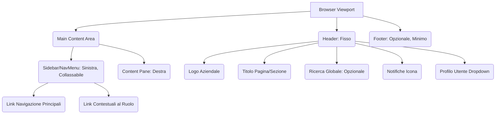

# Guida al Template Grafico per WebUI R2R

## 1. Introduzione e Obiettivi

Questa guida definisce i principi e le direttive per la creazione del template grafico della WebUI multitenant per SciPhi AI R2R. L'obiettivo primario è realizzare un'interfaccia utente (UI) che sia:

*   **Professionale e Moderna**: Allineata con gli standard attuali delle applicazioni web enterprise.
*   **Intuitiva e Facile da Usare**: Specialmente per utenti finali che **non sono informatici**.
*   **Accattivante e Non Respingente**: Deve invitare all'uso e non intimidire con complessità inutili.
*   **Efficiente**: Permettere agli utenti di completare i loro task rapidamente e con soddisfazione.
*   **Accessibile**: Conforme agli standard WCAG 2.1 AA.

Questa guida è destinata al team di sviluppo multiagente che implementerà il frontend Blazor, fornendo una base comune per le scelte di design e l'esperienza utente (UX).

## 2. Principi Guida UI/UX

L'interfaccia utente dovrà aderire ai seguenti principi:

1.  **Semplicità Radicale (Simplicity First)**: Ogni elemento, ogni interazione deve essere il più semplice possibile. Se una funzionalità può essere presentata in modo più semplice, quella è la via da seguire.
2.  **Chiarezza (Clarity)**: L'utente deve capire immediatamente cosa sta vedendo e cosa può fare. Evitare ambiguità e gergo tecnico.
3.  **Consistenza (Consistency)**: Pattern di design, terminologia, e comportamento dei componenti devono essere uniformi in tutta l'applicazione.
4.  **Feedback Immediato e Significativo (Feedback)**: L'utente deve sempre sapere cosa sta succedendo. Azioni, caricamenti, successi ed errori devono essere comunicati chiaramente.
5.  **Navigazione Intuitiva (Intuitive Navigation)**: L'utente deve potersi muovere nell'applicazione senza sforzo, trovando facilmente ciò che cerca.
6.  **Efficienza (Efficiency)**: Minimizzare il numero di click e passaggi per completare i task comuni.
7.  **Tolleranza agli Errori (Error Tolerance)**: Prevenire gli errori quando possibile e fornire messaggi chiari e costruttivi quando si verificano.
8.  **Accessibilità (Accessibility)**: Progettare per tutti, includendo utenti con disabilità.
9.  **Estetica Piacevole (Aesthetics)**: Un design pulito, moderno e gradevole migliora l'esperienza complessiva e la percezione di professionalità.

## 3. Filosofia di Design: Nascondere la Complessità

Il sistema R2R sottostante è complesso. Il compito principale della UI è **nascondere questa complessità** all'utente finale. Questo significa:

*   **Astrazione**: Presentare le funzionalità in termini che l'utente comprende, non in termini tecnici del backend.
*   **Progressive Disclosure**: Mostrare solo le informazioni e le opzioni rilevanti per il task corrente. Opzioni avanzate o meno comuni possono essere nascoste dietro un click aggiuntivo ("Avanzate", "Più opzioni").
*   **Default Intelligenti**: Pre-compilare o suggerire valori comuni per semplificare i form.
*   **Flussi Guidati**: Per operazioni complesse (es. creazione di una nuova collezione e primo upload), guidare l'utente passo dopo passo.
*   **Linguaggio Orientato all'Utente**: Usare termini come "La mia Libreria" invece di "Collezioni Utente", "Aggiungi Documento" invece di "Upload File".

## 4. Layout e Struttura Generale

L'applicazione utilizzerà un layout standard e responsivo, basato su MudBlazor.



### Elementi del Layout:

*   **Header (`MudAppBar`)**: 
    *   Fisso in alto.
    *   Contiene il logo dell'applicazione (o della Company se personalizzato), il titolo della pagina corrente.
    *   A destra: icona per le notifiche, menu dropdown per il profilo utente (Impostazioni, Logout).
*   **Sidebar/NavMenu (`MudDrawer` con `MudNavMenu`)**: 
    *   Sul lato sinistro, collassabile per risparmiare spazio (specialmente su schermi piccoli).
    *   Contiene i link di navigazione principali, organizzati gerarchicamente e filtrati per ruolo.
    *   Icone chiare accanto ad ogni link.
*   **Area Contenuto Principale (`MudMainContent`)**: 
    *   Lo spazio dove vengono renderizzate le pagine e i componenti.
    *   Deve essere pulita, con ampio uso di white space.
*   **Footer (`MudLayout` Footer)**: 
    *   Minimale, può contenere copyright e link a termini di servizio/privacy.

### Responsive Design:

*   **Mobile-First Approach**: Progettare pensando prima agli schermi piccoli, poi adattare per schermi più grandi.
*   La `MudDrawer` si trasformerà in un menu temporaneo (overlay) su mobile.
*   Le tabelle e i contenuti complessi dovranno adattarsi (es. card view per tabelle su mobile).
*   Font size e spacing dovranno essere leggibili su tutti i dispositivi.

## 5. Componenti UI Chiave (con MudBlazor)

Sfruttare i componenti MudBlazor, personalizzandoli per coerenza e semplicità.

*   **Tabelle Dati (`MudTable`)**: 
    *   Paginazione semplice e chiara.
    *   Opzioni di filtro intuitive (es. un campo di ricerca sopra la tabella, filtri per colonna se necessari ma non invasivi).
    *   Sorting per colonna indicato chiaramente.
    *   Azioni per riga (es. Modifica, Elimina) raggruppate e con icone chiare.
    *   Su mobile, considerare una visualizzazione a card o scroll orizzontale selettivo.
*   **Form (`MudForm`, `MudTextField`, `MudSelect`, etc.)**: 
    *   Etichette chiare e sempre visibili (non placeholder come etichette).
    *   Validazione inline, con messaggi di errore specifici e costruttivi vicino al campo errato.
    *   Indicazioni chiare per campi obbligatori (es. asterisco).
    *   Pulsanti di submit e cancel chiaramente distinti e posizionati consistentemente.
*   **Pulsanti (`MudButton`)**: 
    *   Gerarchia visiva chiara: primario (fill), secondario (outlined), terziario (text).
    *   Etichette concise e orientate all'azione (es. "Salva Modifiche", "Crea Collezione").
    *   Icone usate con parsimonia per rafforzare il significato, non per sostituire il testo.
*   **Modali e Dialoghi (`MudDialog`)**: 
    *   Usati per conferme critiche (es. eliminazione) o per form brevi.
    *   Titolo chiaro, contenuto conciso, azioni evidenti (es. "Conferma", "Annulla
    *   Evitare dialoghi troppo grandi o con troppi scroll.
*   **Notifiche e Alert (`MudSnackbar`, `MudAlert`)**: 
    *   Snackbar per feedback non bloccante (es. "Salvataggio completato").
    *   Alert per informazioni importanti o errori che richiedono attenzione.
    *   Colori standard: verde per successo, blu per info, giallo per warning, rosso per errore.
*   **Dashboard**: 
    *   Personalizzate per ruolo (Admin, Company, User).
    *   Presentare le informazioni più rilevanti e le azioni più comuni "above the fold".
    *   Utilizzare `MudCard` per raggruppare informazioni correlate.
    *   Grafici (`MudChart`) semplici e leggibili per visualizzare trend e statistiche.

## 6. Stile Visivo e Theming

L'obiettivo è un look & feel moderno, pulito, professionale e accogliente.

### Palette Colori:

*   **Primario**: Un colore rassicurante e professionale (es. un blu medio/scuro, un verde acqua).
*   **Secondario/Accent**: Un colore per call-to-action e highlight (es. un arancione vivace, un verde brillante), da usare con parsimonia.
*   **Neutri**: Sfumature di grigio per testo, sfondi, bordi. Evitare il nero puro per il testo su bianco puro (preferire un grigio scuro).
*   **Colori Semantici**: Verde (successo), Blu (info), Giallo (warning), Rosso (errore) – consistenti con MudBlazor defaults ma personalizzabili.
*   **Contrasto**: Assicurare un contrasto sufficiente tra testo e sfondo per l'accessibilità (minimo 4.5:1 per testo normale, 3:1 per testo grande).

    *Esempio Palette (da adattare):*
    *   Primary: `#0052CC` (Blu Atlassian)
    *   Secondary: `#FFAB00` (Giallo Ambra)
    *   Background: `#F4F5F7` (Grigio Chiaro)
    *   Testo Principale: `#172B4D` (Grigio Scuro Bluastro)
    *   Testo Secondario: `#5E6C84`

### Tipografia:

*   **Font**: Scegliere un font sans-serif moderno e leggibile (es. Inter, Roboto, Open Sans, Lato). MudBlazor usa Roboto di default, che è una buona scelta.
*   **Gerarchia**: Dimensioni e pesi del font chiaramente definiti per titoli (H1-H6), corpo del testo, etichette, didascalie.
*   **Interlinea e Spaziatura**: Adeguata interlinea (es. 1.5x) e spaziatura tra paragrafi per migliorare la leggibilità.

### Iconografia:

*   Utilizzare un set di icone consistente. MudBlazor si integra bene con **Material Icons** e **Font Awesome**. Preferire Material Icons per coerenza con il design Material.
*   Le icone devono essere semplici, riconoscibili e supportare il significato del testo associato.

### Spaziatura e Allineamento:

*   Utilizzare un sistema di spaziatura consistente (es. basato su multipli di 4px o 8px).
*   Ampio uso di "white space" (spazio negativo) per ridurre il disordine visivo e migliorare la focalizzazione.
*   Allineamento rigoroso degli elementi per creare un senso di ordine e professionalità.

### Animazioni e Transizioni:

*   Sottili e mirate, per migliorare la UX senza essere intrusive o rallentare l'applicazione.
*   Es. transizioni fluide per apertura/chiusura di drawer e dialoghi, feedback visivo al passaggio del mouse sui pulsanti.
*   MudBlazor gestisce già molte di queste.

## 7. Personalizzazione con MudBlazor

MudBlazor offre un potente sistema di theming.

*   **`MudTheme`**: Definire un tema custom in `Program.cs` (o file separato) per impostare palette colori, tipografia, border radius, ombreggiature, etc.
    ```csharp
    // Program.cs
    builder.Services.AddMudServices(config =>
    {
        config.SnackbarConfiguration.PositionClass = Defaults.Classes.Position.BottomRight;
        config.MudTheme = new MudTheme()
        {
            Palette = new PaletteLight()
            {
                Primary = "#0052CC", // Blu personalizzato
                Secondary = "#FFAB00",
                AppbarBackground = "#0052CC",
                // ...altri colori
            },
            PaletteDark = new PaletteDark() { /* ...colori per tema scuro... */ },
            Typography = new Typography()
            {
                Default = new Default()
                {
                    FontFamily = new[] { "Inter", "Roboto", "sans-serif" },
                    // ...altre proprietà tipografiche
                }
            },
            LayoutProperties = new LayoutProperties()
            {
                DefaultBorderRadius = "8px"
            }
        };
    });
    ```
*   **Variabili CSS di MudBlazor**: Per sovrascrizioni più granulari, si possono modificare le variabili CSS che MudBlazor espone (consultare la documentazione di MudBlazor).

## 8. Integrazione con Material Design 3 (M3)

MudBlazor è basato su Material Design. Per un look più vicino a M3:

*   **Colori**: Adattare la `Palette` di MudBlazor ai ruoli colore e ai token di M3 (es. primary, secondary, tertiary, surface, on-surface, etc.).
*   **Forme**: M3 usa angoli più arrotondati. Impostare `DefaultBorderRadius` in `LayoutProperties` (es. "12px" o "16px" per card e pulsanti).
*   **Tipografia**: Allinearsi alle scale tipografiche di M3 (Display, Headline, Title, Body, Label).
*   **Elevazione/Ombre**: M3 ha un sistema di elevazione più sottile, spesso basato su tinte di colore della superficie invece di ombre scure.
*   **Componenti**: Se MudBlazor non ha un componente M3 specifico, si può provare a stilizzare un componente esistente o crearne uno custom. M3 enfatizza componenti come Segmented Buttons, Badges, e Chips in modi specifici.

## 9. Utilizzo di TailwindCSS (Opzionale)

TailwindCSS può coesistere con MudBlazor per fornire utility classes per layout rapidi o personalizzazioni specifiche non facilmente ottenibili con il theming di MudBlazor.

*   **Quando Usarlo**: 
    *   Per layout complessi e responsivi che richiedono un controllo granulare.
    *   Per stilizzare componenti custom non-MudBlazor.
    *   Per micro-interazioni o stili one-off.
*   **Setup**: Seguire la documentazione ufficiale di TailwindCSS per integrarlo in un progetto Blazor (compilazione del CSS in `wwwroot`).
*   **Conflitti**: 
    *   Fare attenzione a possibili conflitti di classi CSS. Potrebbe essere necessario usare un **prefisso per le classi Tailwind** (es. `tw-flex` invece di `flex`) per evitare collisioni con gli stili di MudBlazor o stili globali.
    *   Tailwind resetta alcuni stili base del browser (`preflight`). Verificare che non impatti negativamente i componenti MudBlazor. Eventualmente, disabilitare selettivamente parti del preflight.
*   **Esempio**: `<div class="tw-flex tw-items-center tw-space-x-4">...</div>`

## 10. CSS Personalizzato (`app.css`)

Per stili globali o sovrascrizioni specifiche che non rientrano nel theming di MudBlazor o nelle utility di Tailwind.

*   **Organizzazione**: Usare una metodologia come BEM (Block, Element, Modifier) o semplicemente commenti chiari per strutturare il CSS.
*   **Specificità**: Fare attenzione alla specificità CSS quando si sovrascrivono stili di MudBlazor. Usare gli strumenti di ispezione del browser per capire quali selettori usare.
*   **Minimizzare**: Scrivere CSS custom solo quando strettamente necessario.

## 11. Accessibilità (WCAG 2.1 AA)

L'accessibilità è un requisito fondamentale.

*   **Contrasto Colori**: Verificare con strumenti appositi (es. WebAIM Contrast Checker).
*   **Navigazione da Tastiera**: Tutti gli elementi interattivi devono essere raggiungibili e operabili via tastiera.
*   **Focus Visibile**: L'elemento con focus deve essere chiaramente indicato.
*   **Testo Alternativo**: Fornire `alt` text per tutte le immagini significative.
*   **ARIA Attributes**: Usare attributi ARIA (Accessible Rich Internet Applications) dove necessario per migliorare la semantica per screen reader (MudBlazor ne usa già molti).
*   **Form Etichettati**: Associare correttamente etichette e campi input.
*   **Struttura Semantica HTML**: Usare tag HTML appropriati (es. `<nav>`, `<main>`, `<aside>`, `<button>`).

## 12. User Experience per Utenti Non Tecnici

Questo è il punto cruciale.

*   **Linguaggio Semplice**: Evitare acronimi e termini tecnici. Usare un linguaggio che un manager o un impiegato capirebbero.
    *   *No*: "Processa il parsing del documento e l'estrazione del grafo delle entità."
    *   *Sì*: "Analizza il documento per capirne il contenuto."
*   **Flussi Utente Guidati**: Per task multi-step, usare wizard o indicazioni chiare su cosa fare dopo.
*   **Messaggi di Errore Umani**: 
    *   *No*: "Error 500: NullPointerException at R2RService.Upload."
    *   *Sì*: "Spiacenti, non è stato possibile caricare il documento. Riprova tra poco. Se il problema persiste, contatta l'assistenza."
*   **Onboarding Semplice**: Se possibile, un breve tour guidato per le funzionalità principali al primo accesso.
*   **Aiuto Contestuale**: Tooltip (`MudTooltip`) per icone o termini meno ovvi. Link a una sezione FAQ o aiuto.
*   **Minimizzare le Scelte**: Troppe opzioni paralizzano. Presentare le scelte più comuni e nascondere quelle avanzate.
*   **Consistenza Visiva e Comportamentale**: L'utente impara come funziona una parte dell'applicazione e si aspetta che le altre funzionino in modo simile.

## 13. Esempi Pratici e Mockup (Concettuali)

*   **Pagina di Login**: Logo ben visibile, campi email/password chiari, pulsante "Accedi" prominente, link per recupero password. Messaggi di errore specifici.
*   **Dashboard Utente**: Benvenuto personalizzato. Riepilogo delle collezioni recenti, documenti caricati, attività chatbot. Call to action chiare (es. "Crea Nuova Collezione", "Avvia Chat"). Grafici semplici sull'utilizzo.
*   **Gestione Collezioni**: Tabella delle collezioni con nome, data creazione, numero documenti. Pulsante "Nuova Collezione". Azioni per riga: Apri, Modifica Nome, Elimina. All'interno di una collezione: lista documenti, pulsante "Aggiungi Documento".
*   **Upload Documenti**: Area drag & drop chiara, o pulsante "Seleziona File". Indicatore di progresso durante l'upload e l'elaborazione. Feedback chiaro su successo o fallimento.

## 14. Strumenti e Risorse

*   **Documentazione MudBlazor**: [https://mudblazor.com/](https://mudblazor.com/)
*   **Linee Guida Material Design 3**: [https://m3.material.io/](https://m3.material.io/)
*   **Documentazione TailwindCSS**: [https://tailwindcss.com/docs](https://tailwindcss.com/docs)
*   **Google Fonts**: Per la scelta della tipografia.
*   **Coolors.co / Adobe Color**: Per la creazione di palette colori.
*   **Material Icons Guide**: [https://fonts.google.com/icons](https://fonts.google.com/icons)
*   **WebAIM Contrast Checker**: Per verificare l'accessibilità dei colori.

## 15. Conclusioni

La creazione di un template grafico efficace per la WebUI R2R richiede un focus costante sull'utente finale non tecnico. Prioritizzando semplicità, chiarezza, e un design moderno e accogliente, e sfruttando al meglio le capacità di MudBlazor (con eventuali integrazioni M3/Tailwind), si può realizzare un'applicazione che sia non solo funzionale ma anche piacevole da usare. La collaborazione continua tra designer e sviluppatori sarà cruciale per il successo.
