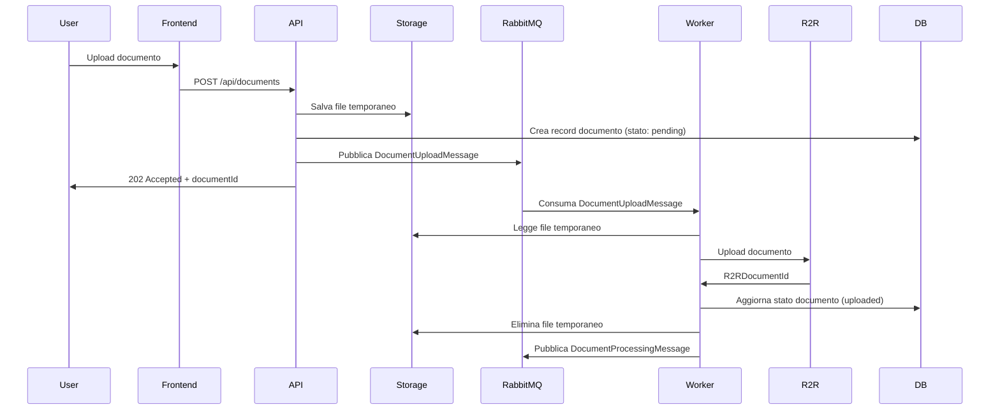
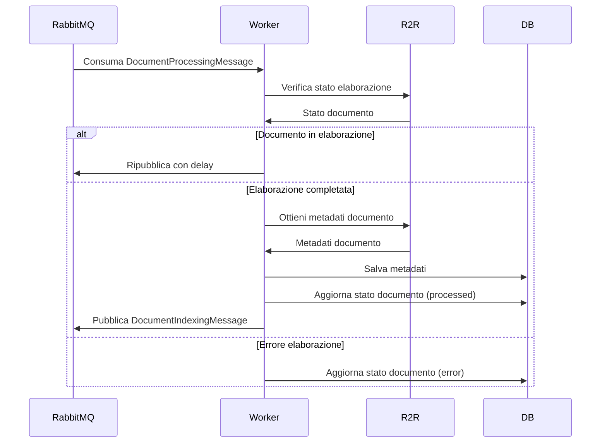
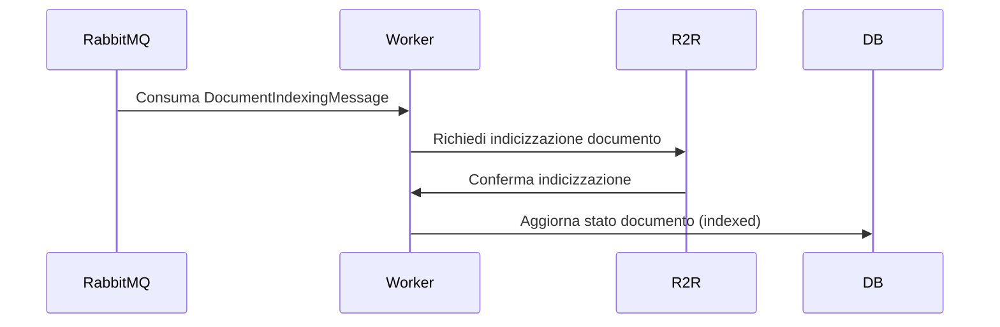

# Integrazione con R2R e Sistema di Gestione Code con RabbitMQ

## Panoramica

Questo documento descrive l'architettura e l'implementazione dell'integrazione tra il backend API server, il servizio SciPhi AI R2R e il sistema di gestione code basato su RabbitMQ. L'obiettivo è creare un sistema robusto e scalabile per gestire l'elaborazione asincrona di documenti, superando i limiti di R2R nell'elaborazione di grandi volumi di upload simultanei.

## Architettura di Integrazione

L'architettura di integrazione è progettata per disaccoppiare le operazioni sincrone (richieste API) dalle operazioni asincrone (elaborazione documenti), garantendo scalabilità, resilienza e monitoraggio.

```
┌─────────────────┐     ┌─────────────────┐     ┌─────────────────┐
│                 │     │                 │     │                 │
│  Frontend       │     │  Backend        │     │  R2R API        │
│  Blazor         │◄────┤  API Server     │────►│  Server         │
│                 │     │                 │     │                 │
└─────────────────┘     └────────┬────────┘     └─────────────────┘
                                 │                       
                                 ▼                       
                        ┌─────────────────┐              
                        │                 │              
                        │  RabbitMQ       │              
                        │                 │              
                        └────────┬────────┘              
                                 │                       
                                 ▼                       
                        ┌─────────────────┐     ┌─────────────────┐
                        │                 │     │                 │
                        │  Worker         │────►│  PostgreSQL     │
                        │  Services       │     │  Database       │
                        │                 │     │                 │
                        └─────────────────┘     └─────────────────┘
```

### Componenti Principali

1. **Backend API Server**: Riceve richieste dal frontend, interagisce direttamente con R2R per operazioni sincrone e invia messaggi a RabbitMQ per operazioni asincrone.

2. **R2R API Server**: Servizio esterno che fornisce funzionalità di elaborazione documenti, estrazione entità e ricerca semantica.

3. **RabbitMQ**: Sistema di messaggistica che gestisce code per operazioni asincrone, garantendo affidabilità e scalabilità.

4. **Worker Services**: Servizi che consumano messaggi da RabbitMQ ed eseguono operazioni asincrone come upload documenti, elaborazione e indicizzazione.

5. **PostgreSQL**: Database per memorizzare metadati, stato delle operazioni e risultati dell'elaborazione.

## Integrazione con R2R API

### Client R2R

Il client R2R è implementato come servizio che incapsula tutte le chiamate all'API R2R, gestendo autenticazione, resilienza e logging.

```csharp
public class R2RClient : IR2RClient
{
    private readonly HttpClient _httpClient;
    private readonly ILogger<R2RClient> _logger;
    private readonly IOptions<R2ROptions> _options;
    private readonly IDistributedCache _cache;
    private readonly AsyncPolicy _retryPolicy;
    private readonly AsyncCircuitBreakerPolicy _circuitBreakerPolicy;
    
    public R2RClient(
        HttpClient httpClient,
        ILogger<R2RClient> logger,
        IOptions<R2ROptions> options,
        IDistributedCache cache)
    {
        _httpClient = httpClient;
        _logger = logger;
        _options = options;
        _cache = cache;
        
        // Configura l'HttpClient
        _httpClient.BaseAddress = new Uri(options.Value.BaseUrl);
        _httpClient.Timeout = TimeSpan.FromSeconds(options.Value.Timeout);
        
        // Configura policy di resilienza
        _retryPolicy = Policy
            .Handle<HttpRequestException>()
            .Or<TimeoutException>()
            .WaitAndRetryAsync(
                options.Value.MaxRetries,
                retryAttempt => TimeSpan.FromSeconds(Math.Pow(2, retryAttempt)),
                onRetry: (exception, timeSpan, retryCount, context) =>
                {
                    _logger.LogWarning(exception, "Retry {RetryCount} after {TimeSpan}s delay due to: {Message}",
                        retryCount, timeSpan.TotalSeconds, exception.Message);
                });
                
        _circuitBreakerPolicy = Policy
            .Handle<HttpRequestException>()
            .Or<TimeoutException>()
            .CircuitBreakerAsync(
                options.Value.CircuitBreakerThreshold,
                TimeSpan.FromMinutes(options.Value.CircuitBreakerDurationMinutes),
                onBreak: (ex, breakDelay) =>
                {
                    _logger.LogError(ex, "Circuit breaker opened for {BreakDelay}m", breakDelay.TotalMinutes);
                },
                onReset: () =>
                {
                    _logger.LogInformation("Circuit breaker reset");
                });
    }
    
    public async Task<HealthCheckResponse> CheckHealthAsync(CancellationToken cancellationToken = default)
    {
        return await ExecuteWithResilienceAsync(async () =>
        {
            var response = await _httpClient.GetAsync("/v3/health", cancellationToken);
            response.EnsureSuccessStatusCode();
            return await response.Content.ReadFromJsonAsync<HealthCheckResponse>(cancellationToken: cancellationToken);
        });
    }
    
    public async Task<DocumentResponse> GetDocumentAsync(string documentId, string apiKey, CancellationToken cancellationToken = default)
    {
        return await ExecuteWithResilienceAsync(async () =>
        {
            _httpClient.DefaultRequestHeaders.Authorization = new AuthenticationHeaderValue("Bearer", apiKey);
            var response = await _httpClient.GetAsync($"/v3/documents/{documentId}", cancellationToken);
            response.EnsureSuccessStatusCode();
            return await response.Content.ReadFromJsonAsync<DocumentResponse>(cancellationToken: cancellationToken);
        });
    }
    
    public async Task<DocumentUploadResponse> UploadDocumentAsync(
        Stream fileStream, 
        string fileName, 
        string mimeType, 
        string collectionId, 
        string apiKey, 
        CancellationToken cancellationToken = default)
    {
        return await ExecuteWithResilienceAsync(async () =>
        {
            var content = new MultipartFormDataContent();
            
            // Aggiungi file
            var fileContent = new StreamContent(fileStream);
            fileContent.Headers.ContentType = new MediaTypeHeaderValue(mimeType);
            content.Add(fileContent, "file", fileName);
            
            // Aggiungi metadati
            content.Add(new StringContent(collectionId), "collection_id");
            
            // Imposta header di autenticazione
            _httpClient.DefaultRequestHeaders.Authorization = new AuthenticationHeaderValue("Bearer", apiKey);
            
            var response = await _httpClient.PostAsync("/v3/documents", content, cancellationToken);
            response.EnsureSuccessStatusCode();
            
            return await response.Content.ReadFromJsonAsync<DocumentUploadResponse>(cancellationToken: cancellationToken);
        });
    }
    
    public async Task<CollectionResponse> CreateCollectionAsync(
        CollectionRequest request, 
        string apiKey, 
        CancellationToken cancellationToken = default)
    {
        return await ExecuteWithResilienceAsync(async () =>
        {
            _httpClient.DefaultRequestHeaders.Authorization = new AuthenticationHeaderValue("Bearer", apiKey);
            var response = await _httpClient.PostAsJsonAsync("/v3/collections", request, cancellationToken);
            response.EnsureSuccessStatusCode();
            return await response.Content.ReadFromJsonAsync<CollectionResponse>(cancellationToken: cancellationToken);
        });
    }
    
    public async Task<CollectionsResponse> GetCollectionsAsync(string apiKey, CancellationToken cancellationToken = default)
    {
        return await ExecuteWithResilienceAsync(async () =>
        {
            _httpClient.DefaultRequestHeaders.Authorization = new AuthenticationHeaderValue("Bearer", apiKey);
            var response = await _httpClient.GetAsync("/v3/collections", cancellationToken);
            response.EnsureSuccessStatusCode();
            return await response.Content.ReadFromJsonAsync<CollectionsResponse>(cancellationToken: cancellationToken);
        });
    }
    
    public async Task<ChatCompletionResponse> ChatCompletionAsync(
        ChatCompletionRequest request, 
        string apiKey, 
        CancellationToken cancellationToken = default)
    {
        return await ExecuteWithResilienceAsync(async () =>
        {
            _httpClient.DefaultRequestHeaders.Authorization = new AuthenticationHeaderValue("Bearer", apiKey);
            var response = await _httpClient.PostAsJsonAsync("/v3/chat/completions", request, cancellationToken);
            response.EnsureSuccessStatusCode();
            return await response.Content.ReadFromJsonAsync<ChatCompletionResponse>(cancellationToken: cancellationToken);
        });
    }
    
    private async Task<T> ExecuteWithResilienceAsync<T>(Func<Task<T>> action)
    {
        return await _retryPolicy.WrapAsync(_circuitBreakerPolicy).ExecuteAsync(action);
    }
    
    // Metodi per caching delle risposte
    private async Task<T> GetOrSetCacheAsync<T>(string key, Func<Task<T>> factory, TimeSpan expiration)
    {
        var cachedValue = await _cache.GetStringAsync(key);
        
        if (!string.IsNullOrEmpty(cachedValue))
        {
            return JsonSerializer.Deserialize<T>(cachedValue);
        }
        
        var result = await factory();
        
        await _cache.SetStringAsync(
            key,
            JsonSerializer.Serialize(result),
            new DistributedCacheEntryOptions
            {
                AbsoluteExpirationRelativeToNow = expiration
            });
            
        return result;
    }
}
```

### Registrazione del Client R2R

```csharp
// Startup.cs
public void ConfigureServices(IServiceCollection services)
{
    // Configurazione R2R
    services.Configure<R2ROptions>(Configuration.GetSection("R2RApi"));
    
    // Registrazione client R2R
    services.AddHttpClient<IR2RClient, R2RClient>()
        .ConfigurePrimaryHttpMessageHandler(() => new HttpClientHandler
        {
            ServerCertificateCustomValidationCallback = 
                HttpClientHandler.DangerousAcceptAnyServerCertificateValidator
        })
        .AddTransientHttpErrorPolicy(policy => policy.WaitAndRetryAsync(3, _ => TimeSpan.FromSeconds(1)))
        .AddTransientHttpErrorPolicy(policy => policy.CircuitBreakerAsync(5, TimeSpan.FromMinutes(1)));
}
```

## Sistema di Gestione Code con RabbitMQ

### Configurazione RabbitMQ

```csharp
// Startup.cs
public void ConfigureServices(IServiceCollection services)
{
    // Configurazione RabbitMQ
    services.Configure<RabbitMQOptions>(Configuration.GetSection("RabbitMQ"));
    
    // Registrazione servizi RabbitMQ
    services.AddSingleton<IRabbitMQConnectionFactory, RabbitMQConnectionFactory>();
    services.AddSingleton<IRabbitMQService, RabbitMQService>();
    
    // Registrazione producer
    services.AddScoped<IDocumentUploadProducer, DocumentUploadProducer>();
    services.AddScoped<IDocumentProcessingProducer, DocumentProcessingProducer>();
    
    // Registrazione consumer (hosted services)
    services.AddHostedService<DocumentUploadConsumer>();
    services.AddHostedService<DocumentProcessingConsumer>();
    services.AddHostedService<DocumentIndexingConsumer>();
}
```

### Implementazione Factory di Connessione

```csharp
public class RabbitMQConnectionFactory : IRabbitMQConnectionFactory
{
    private readonly IOptions<RabbitMQOptions> _options;
    private readonly ILogger<RabbitMQConnectionFactory> _logger;
    private IConnection _connection;
    private bool _disposed;
    
    public RabbitMQConnectionFactory(
        IOptions<RabbitMQOptions> options,
        ILogger<RabbitMQConnectionFactory> logger)
    {
        _options = options;
        _logger = logger;
    }
    
    public IConnection GetConnection()
    {
        if (_connection != null && _connection.IsOpen)
        {
            return _connection;
        }
        
        var factory = new ConnectionFactory
        {
            HostName = _options.Value.HostName,
            Port = _options.Value.Port,
            UserName = _options.Value.UserName,
            Password = _options.Value.Password,
            VirtualHost = _options.Value.VirtualHost,
            AutomaticRecoveryEnabled = true,
            NetworkRecoveryInterval = TimeSpan.FromSeconds(10)
        };
        
        _connection = factory.CreateConnection();
        
        _connection.ConnectionShutdown += (sender, args) =>
        {
            _logger.LogWarning("RabbitMQ connection shutdown: {Reason}", args.ReplyText);
        };
        
        _logger.LogInformation("RabbitMQ connection established to {Host}:{Port}", 
            _options.Value.HostName, _options.Value.Port);
            
        return _connection;
    }
    
    public void Dispose()
    {
        Dispose(true);
        GC.SuppressFinalize(this);
    }
    
    protected virtual void Dispose(bool disposing)
    {
        if (_disposed)
        {
            return;
        }
        
        if (disposing)
        {
            _connection?.Dispose();
        }
        
        _disposed = true;
    }
}
```

### Servizio RabbitMQ

```csharp
public class RabbitMQService : IRabbitMQService
{
    private readonly IRabbitMQConnectionFactory _connectionFactory;
    private readonly ILogger<RabbitMQService> _logger;
    private readonly IOptions<RabbitMQOptions> _options;
    
    public RabbitMQService(
        IRabbitMQConnectionFactory connectionFactory,
        ILogger<RabbitMQService> logger,
        IOptions<RabbitMQOptions> options)
    {
        _connectionFactory = connectionFactory;
        _logger = logger;
        _options = options;
    }
    
    public IModel CreateChannel()
    {
        var connection = _connectionFactory.GetConnection();
        var channel = connection.CreateModel();
        
        // Configurazione QoS
        channel.BasicQos(
            prefetchSize: 0,
            prefetchCount: _options.Value.PrefetchCount,
            global: false);
            
        return channel;
    }
    
    public void DeclareQueue(IModel channel, string queueName, bool durable = true)
    {
        channel.QueueDeclare(
            queue: queueName,
            durable: durable,
            exclusive: false,
            autoDelete: false,
            arguments: new Dictionary<string, object>
            {
                { "x-message-ttl", _options.Value.MessageTtl },
                { "x-dead-letter-exchange", _options.Value.DeadLetterExchange },
                { "x-dead-letter-routing-key", $"{queueName}.dlq" }
            });
            
        // Dichiara coda DLQ
        channel.QueueDeclare(
            queue: $"{queueName}.dlq",
            durable: true,
            exclusive: false,
            autoDelete: false,
            arguments: null);
            
        _logger.LogInformation("Declared queue {QueueName} with DLQ", queueName);
    }
    
    public void DeclareExchange(IModel channel, string exchangeName, string exchangeType = ExchangeType.Direct)
    {
        channel.ExchangeDeclare(
            exchange: exchangeName,
            type: exchangeType,
            durable: true,
            autoDelete: false);
            
        _logger.LogInformation("Declared exchange {ExchangeName} of type {ExchangeType}", 
            exchangeName, exchangeType);
    }
    
    public void BindQueue(IModel channel, string queueName, string exchangeName, string routingKey)
    {
        channel.QueueBind(
            queue: queueName,
            exchange: exchangeName,
            routingKey: routingKey);
            
        _logger.LogInformation("Bound queue {QueueName} to exchange {ExchangeName} with routing key {RoutingKey}", 
            queueName, exchangeName, routingKey);
    }
    
    public void PublishMessage<T>(IModel channel, string exchangeName, string routingKey, T message, IBasicProperties properties = null)
    {
        var messageJson = JsonSerializer.Serialize(message);
        var messageBytes = Encoding.UTF8.GetBytes(messageJson);
        
        properties ??= channel.CreateBasicProperties();
        properties.Persistent = true;
        properties.ContentType = "application/json";
        properties.MessageId = Guid.NewGuid().ToString();
        properties.Timestamp = new AmqpTimestamp(DateTimeOffset.UtcNow.ToUnixTimeSeconds());
        
        channel.BasicPublish(
            exchange: exchangeName,
            routingKey: routingKey,
            basicProperties: properties,
            body: messageBytes);
            
        _logger.LogInformation("Published message to exchange {ExchangeName} with routing key {RoutingKey}", 
            exchangeName, routingKey);
    }
}
```

### Producer per Upload Documenti

```csharp
public class DocumentUploadProducer : IDocumentUploadProducer
{
    private readonly IRabbitMQService _rabbitMQService;
    private readonly ILogger<DocumentUploadProducer> _logger;
    private readonly IModel _channel;
    private readonly string _exchangeName = "r2r.documents";
    private readonly string _routingKey = "document.upload";
    private readonly string _queueName = "document-upload-queue";
    
    public DocumentUploadProducer(
        IRabbitMQService rabbitMQService,
        ILogger<DocumentUploadProducer> logger)
    {
        _rabbitMQService = rabbitMQService;
        _logger = logger;
        
        _channel = _rabbitMQService.CreateChannel();
        
        // Dichiara exchange e code
        _rabbitMQService.DeclareExchange(_channel, _exchangeName);
        _rabbitMQService.DeclareQueue(_channel, _queueName);
        _rabbitMQService.BindQueue(_channel, _queueName, _exchangeName, _routingKey);
    }
    
    public void EnqueueDocumentUpload(DocumentUploadMessage message)
    {
        try
        {
            var properties = _channel.CreateBasicProperties();
            properties.Headers = new Dictionary<string, object>
            {
                { "company_id", message.CompanyId },
                { "user_id", message.UserId },
                { "collection_id", message.CollectionId }
            };
            
            _rabbitMQService.PublishMessage(_channel, _exchangeName, _routingKey, message, properties);
            
            _logger.LogInformation("Enqueued document upload for file {FileName} in collection {CollectionId}", 
                message.FileName, message.CollectionId);
        }
        catch (Exception ex)
        {
            _logger.LogError(ex, "Error enqueueing document upload for file {FileName}", message.FileName);
            throw;
        }
    }
    
    public void Dispose()
    {
        _channel?.Dispose();
    }
}
```

### Consumer per Upload Documenti

```csharp
public class DocumentUploadConsumer : BackgroundService
{
    private readonly IRabbitMQService _rabbitMQService;
    private readonly IServiceScopeFactory _scopeFactory;
    private readonly ILogger<DocumentUploadConsumer> _logger;
    private readonly string _queueName = "document-upload-queue";
    private IModel _channel;
    
    public DocumentUploadConsumer(
        IRabbitMQService rabbitMQService,
        IServiceScopeFactory scopeFactory,
        ILogger<DocumentUploadConsumer> logger)
    {
        _rabbitMQService = rabbitMQService;
        _scopeFactory = scopeFactory;
        _logger = logger;
    }
    
    protected override Task ExecuteAsync(CancellationToken stoppingToken)
    {
        stoppingToken.ThrowIfCancellationRequested();
        
        _channel = _rabbitMQService.CreateChannel();
        _rabbitMQService.DeclareQueue(_channel, _queueName);
        
        var consumer = new AsyncEventingBasicConsumer(_channel);
        consumer.Received += async (model, ea) =>
        {
            var messageId = ea.BasicProperties.MessageId;
            var body = ea.Body.ToArray();
            var message = Encoding.UTF8.GetString(body);
            
            _logger.LogInformation("Received document upload message {MessageId}", messageId);
            
            try
            {
                var uploadMessage = JsonSerializer.Deserialize<DocumentUploadMessage>(message);
                
                using var scope = _scopeFactory.CreateScope();
                var documentService = scope.ServiceProvider.GetRequiredService<IDocumentService>();
                var r2rClient = scope.ServiceProvider.GetRequiredService<IR2RClient>();
                var apiKeyService = scope.ServiceProvider.GetRequiredService<IApiKeyService>();
                var processingProducer = scope.ServiceProvider.GetRequiredService<IDocumentProcessingProducer>();
                
                // Ottieni API key per la company
                var apiKey = await apiKeyService.GetApiKeyAsync(uploadMessage.CompanyId, "r2r");
                
                if (string.IsNullOrEmpty(apiKey))
                {
                    throw new InvalidOperationException($"API key not found for company {uploadMessage.CompanyId}");
                }
                
                // Carica file da storage temporaneo
                using var fileStream = new FileStream(uploadMessage.TempFilePath, FileMode.Open);
                
                // Upload a R2R
                var uploadResponse = await r2rClient.UploadDocumentAsync(
                    fileStream,
                    uploadMessage.FileName,
                    uploadMessage.MimeType,
                    uploadMessage.CollectionId,
                    apiKey,
                    stoppingToken);
                
                // Aggiorna stato documento nel database
                await documentService.UpdateDocumentStatusAsync(
                    uploadMessage.DocumentId,
                    "uploaded",
                    uploadResponse.Id);
                
                // Elimina file temporaneo
                File.Delete(uploadMessage.TempFilePath);
                
                // Invia messaggio per elaborazione documento
                processingProducer.EnqueueDocumentProcessing(new DocumentProcessingMessage
                {
                    DocumentId = uploadMessage.DocumentId,
                    R2RDocumentId = uploadResponse.Id,
                    CompanyId = uploadMessage.CompanyId,
                    UserId = uploadMessage.UserId,
                    CollectionId = uploadMessage.CollectionId
                });
                
                // Conferma elaborazione messaggio
                _channel.BasicAck(ea.DeliveryTag, false);
                
                _logger.LogInformation("Successfully processed document upload for {FileName}, R2R document ID: {R2RDocumentId}", 
                    uploadMessage.FileName, uploadResponse.Id);
            }
            catch (Exception ex)
            {
                _logger.LogError(ex, "Error processing document upload message {MessageId}", messageId);
                
                // Gestione errori
                if (ea.BasicProperties.Headers != null && 
                    ea.BasicProperties.Headers.TryGetValue("x-delivery-count", out var deliveryCountObj) && 
                    deliveryCountObj is byte[] deliveryCountBytes)
                {
                    var deliveryCount = BitConverter.ToInt32(deliveryCountBytes, 0);
                    
                    if (deliveryCount >= 3)
                    {
                        // Troppe retry, rifiuta definitivamente
                        _channel.BasicReject(ea.DeliveryTag, false);
                        _logger.LogWarning("Message {MessageId} rejected after {DeliveryCount} attempts", messageId, deliveryCount);
                    }
                    else
                    {
                        // Rimetti in coda per retry
                        _channel.BasicNack(ea.DeliveryTag, false, true);
                        _logger.LogWarning("Message {MessageId} nacked for retry, attempt {DeliveryCount}", messageId, deliveryCount);
                    }
                }
                else
                {
                    // Prima retry
                    _channel.BasicNack(ea.DeliveryTag, false, true);
                    _logger.LogWarning("Message {MessageId} nacked for first retry", messageId);
                }
            }
        };
        
        _channel.BasicConsume(
            queue: _queueName,
            autoAck: false,
            consumer: consumer);
            
        _logger.LogInformation("Document upload consumer started");
        
        return Task.CompletedTask;
    }
    
    public override void Dispose()
    {
        _channel?.Dispose();
        base.Dispose();
    }
}
```

### Modelli di Messaggi

```csharp
public class DocumentUploadMessage
{
    public int DocumentId { get; set; }
    public int CompanyId { get; set; }
    public int UserId { get; set; }
    public string CollectionId { get; set; }
    public string FileName { get; set; }
    public string MimeType { get; set; }
    public string TempFilePath { get; set; }
}

public class DocumentProcessingMessage
{
    public int DocumentId { get; set; }
    public string R2RDocumentId { get; set; }
    public int CompanyId { get; set; }
    public int UserId { get; set; }
    public string CollectionId { get; set; }
}

public class DocumentIndexingMessage
{
    public int DocumentId { get; set; }
    public string R2RDocumentId { get; set; }
    public int CompanyId { get; set; }
    public string CollectionId { get; set; }
}
```

## Flussi di Elaborazione Documenti

### 1. Upload Documento



### 2. Elaborazione Documento



### 3. Indicizzazione Documento



## Gestione Throttling e Limiti

### Servizio di Throttling

```csharp
public class ThrottlingService : IThrottlingService
{
    private readonly IDistributedCache _cache;
    private readonly ICompanySettingsService _companySettingsService;
    private readonly ILogger<ThrottlingService> _logger;
    
    public ThrottlingService(
        IDistributedCache cache,
        ICompanySettingsService companySettingsService,
        ILogger<ThrottlingService> logger)
    {
        _cache = cache;
        _companySettingsService = companySettingsService;
        _logger = logger;
    }
    
    public async Task<bool> CheckThrottlingLimitAsync(int companyId, ThrottlingType throttlingType)
    {
        var settings = await _companySettingsService.GetCompanySettingsAsync(companyId);
        
        int limit;
        string cacheKey;
        TimeSpan period;
        
        switch (throttlingType)
        {
            case ThrottlingType.DocumentUpload:
                limit = settings.MaxDocumentsPerHour;
                cacheKey = $"throttle:doc_upload:{companyId}";
                period = TimeSpan.FromHours(1);
                break;
                
            case ThrottlingType.ChatCompletion:
                limit = settings.MaxChatCompletionsPerHour;
                cacheKey = $"throttle:chat_completion:{companyId}";
                period = TimeSpan.FromHours(1);
                break;
                
            default:
                throw new ArgumentOutOfRangeException(nameof(throttlingType));
        }
        
        var countString = await _cache.GetStringAsync(cacheKey);
        var count = string.IsNullOrEmpty(countString) ? 0 : int.Parse(countString);
        
        if (count >= limit)
        {
            _logger.LogWarning("Throttling limit reached for company {CompanyId}, type {ThrottlingType}, limit {Limit}", 
                companyId, throttlingType, limit);
            return false;
        }
        
        await _cache.SetStringAsync(
            cacheKey,
            (count + 1).ToString(),
            new DistributedCacheEntryOptions
            {
                AbsoluteExpirationRelativeToNow = period
            });
            
        return true;
    }
}
```

### Implementazione nei Controller

```csharp
[ApiController]
[Route("api/collections/{collectionId}/documents")]
public class DocumentsController : ControllerBase
{
    private readonly IDocumentService _documentService;
    private readonly IThrottlingService _throttlingService;
    private readonly IDocumentUploadProducer _documentUploadProducer;
    
    public DocumentsController(
        IDocumentService documentService,
        IThrottlingService throttlingService,
        IDocumentUploadProducer documentUploadProducer)
    {
        _documentService = documentService;
        _throttlingService = throttlingService;
        _documentUploadProducer = documentUploadProducer;
    }
    
    [HttpPost]
    [Authorize(Policy = "RequireUserRole")]
    public async Task<IActionResult> UploadDocument(string collectionId, IFormFile file)
    {
        var userId = int.Parse(User.FindFirst(ClaimTypes.Name).Value);
        var companyId = int.Parse(User.FindFirst("tenant_id").Value);
        
        // Verifica limiti di throttling
        if (!await _throttlingService.CheckThrottlingLimitAsync(companyId, ThrottlingType.DocumentUpload))
        {
            return StatusCode(StatusCodes.Status429TooManyRequests, new { message = "Upload limit reached" });
        }
        
        // Validazione file
        if (file == null || file.Length == 0)
        {
            return BadRequest(new { message = "No file uploaded" });
        }
        
        // Salva file temporaneo
        var tempFilePath = Path.GetTempFileName();
        using (var stream = new FileStream(tempFilePath, FileMode.Create))
        {
            await file.CopyToAsync(stream);
        }
        
        // Crea record documento
        var document = await _documentService.CreateDocumentAsync(new CreateDocumentRequest
        {
            CollectionId = collectionId,
            FileName = file.FileName,
            FileSize = file.Length,
            MimeType = file.ContentType,
            UserId = userId,
            CompanyId = companyId
        });
        
        // Pubblica messaggio per upload asincrono
        _documentUploadProducer.EnqueueDocumentUpload(new DocumentUploadMessage
        {
            DocumentId = document.Id,
            CompanyId = companyId,
            UserId = userId,
            CollectionId = collectionId,
            FileName = file.FileName,
            MimeType = file.ContentType,
            TempFilePath = tempFilePath
        });
        
        return Accepted(new { id = document.Id, status = "pending" });
    }
}
```

## Monitoraggio e Gestione Errori

### Dashboard di Monitoraggio

```csharp
[ApiController]
[Route("api/monitoring")]
public class MonitoringController : ControllerBase
{
    private readonly IQueueMonitoringService _queueMonitoringService;
    private readonly IDocumentService _documentService;
    
    public MonitoringController(
        IQueueMonitoringService queueMonitoringService,
        IDocumentService documentService)
    {
        _queueMonitoringService = queueMonitoringService;
        _documentService = documentService;
    }
    
    [HttpGet("queues")]
    [Authorize(Policy = "RequireAdminRole")]
    public async Task<IActionResult> GetQueueStatus()
    {
        var status = await _queueMonitoringService.GetQueueStatusAsync();
        return Ok(status);
    }
    
    [HttpGet("documents/status")]
    [Authorize(Policy = "RequireCompanyRole")]
    public async Task<IActionResult> GetDocumentStatusSummary()
    {
        var companyId = int.Parse(User.FindFirst("tenant_id").Value);
        
        var summary = await _documentService.GetDocumentStatusSummaryAsync(companyId);
        return Ok(summary);
    }
    
    [HttpGet("documents/errors")]
    [Authorize(Policy = "RequireCompanyRole")]
    public async Task<IActionResult> GetDocumentErrors([FromQuery] DocumentErrorsRequest request)
    {
        var companyId = int.Parse(User.FindFirst("tenant_id").Value);
        
        var errors = await _documentService.GetDocumentErrorsAsync(companyId, request);
        return Ok(errors);
    }
    
    [HttpPost("documents/{id}/retry")]
    [Authorize(Policy = "RequireCompanyRole")]
    public async Task<IActionResult> RetryDocumentProcessing(int id)
    {
        var companyId = int.Parse(User.FindFirst("tenant_id").Value);
        
        var result = await _documentService.RetryDocumentProcessingAsync(id, companyId);
        
        if (!result.Succeeded)
        {
            return BadRequest(new { message = result.ErrorMessage });
        }
        
        return Accepted(new { id = id, status = "pending" });
    }
}
```

### Servizio di Monitoraggio Code

```csharp
public class QueueMonitoringService : IQueueMonitoringService
{
    private readonly IRabbitMQConnectionFactory _connectionFactory;
    private readonly IOptions<RabbitMQOptions> _options;
    
    public QueueMonitoringService(
        IRabbitMQConnectionFactory connectionFactory,
        IOptions<RabbitMQOptions> options)
    {
        _connectionFactory = connectionFactory;
        _options = options;
    }
    
    public async Task<QueueStatusResponse> GetQueueStatusAsync()
    {
        using var connection = _connectionFactory.GetConnection();
        using var channel = connection.CreateModel();
        
        var queues = new List<string>
        {
            "document-upload-queue",
            "document-processing-queue",
            "document-indexing-queue",
            "document-upload-queue.dlq",
            "document-processing-queue.dlq",
            "document-indexing-queue.dlq"
        };
        
        var queueStatus = new List<QueueStatus>();
        
        foreach (var queue in queues)
        {
            try
            {
                var queueDeclareOk = channel.QueueDeclarePassive(queue);
                
                queueStatus.Add(new QueueStatus
                {
                    Name = queue,
                    MessageCount = queueDeclareOk.MessageCount,
                    ConsumerCount = queueDeclareOk.ConsumerCount,
                    IsDlq = queue.EndsWith(".dlq")
                });
            }
            catch (Exception)
            {
                // Coda non esiste, ignora
            }
        }
        
        return new QueueStatusResponse
        {
            Queues = queueStatus,
            Timestamp = DateTime.UtcNow
        };
    }
}
```

## Configurazione

### appsettings.json

```json
{
  "ConnectionStrings": {
    "DefaultConnection": "Host=192.168.1.4;Port=5432;Database=r2r_webui;Username=r2r_app;Password=StrongPassword123;",
    "Redis": "192.168.1.4:6379,abortConnect=false,connectTimeout=30000,password=StrongRedisPassword123"
  },
  "R2RApi": {
    "BaseUrl": "http://192.168.1.4:7272",
    "Timeout": 30,
    "MaxRetries": 3,
    "CircuitBreakerThreshold": 5,
    "CircuitBreakerDurationMinutes": 1
  },
  "RabbitMQ": {
    "HostName": "192.168.1.4",
    "Port": 5672,
    "UserName": "r2r_app",
    "Password": "StrongRabbitPassword123",
    "VirtualHost": "/",
    "PrefetchCount": 10,
    "MessageTtl": 86400000,
    "DeadLetterExchange": "r2r.dlx"
  }
}
```

## Best Practices e Considerazioni

### 1. Resilienza

- **Circuit Breaker**: Implementato per prevenire cascate di errori quando R2R API è sovraccarico o non disponibile.
- **Retry con Backoff Esponenziale**: Implementato per gestire errori temporanei nelle chiamate API.
- **Dead Letter Queue**: Configurata per messaggi non elaborabili, consentendo analisi e recupero.

### 2. Scalabilità

- **Elaborazione Asincrona**: Disaccoppia richieste client dall'elaborazione documenti, migliorando la scalabilità.
- **Worker Pool**: Possibilità di scalare orizzontalmente i worker per gestire carichi elevati.
- **Throttling Configurabile**: Limiti di utilizzo configurabili per company per prevenire abusi.

### 3. Monitoraggio

- **Dashboard Operativa**: Visualizzazione stato code e documenti in tempo reale.
- **Logging Strutturato**: Logging dettagliato di tutte le operazioni per troubleshooting.
- **Metriche**: Raccolta metriche su tempi di elaborazione, tassi di errore e throughput.

### 4. Sicurezza

- **API Key Management**: Gestione sicura delle API key per R2R API.
- **Isolamento Tenant**: Ogni operazione è associata a un tenant specifico per garantire isolamento dati.
- **Audit Trail**: Registrazione completa di tutte le operazioni per compliance e sicurezza.

## Conclusioni

L'integrazione tra il backend API server, R2R API e RabbitMQ crea un sistema robusto e scalabile per la gestione di documenti in un ambiente multitenant. L'architettura asincrona con code permette di superare i limiti di R2R nell'elaborazione di grandi volumi di upload simultanei, garantendo al contempo affidabilità, monitoraggio e isolamento dei dati tra tenant.

Il sistema è progettato per essere facilmente estendibile e manutenibile, con componenti ben separati e interfacce chiare. L'uso di RabbitMQ come sistema di messaggistica garantisce affidabilità e scalabilità, mentre l'integrazione con PostgreSQL e Redis completa l'architettura enterprise-grade.
