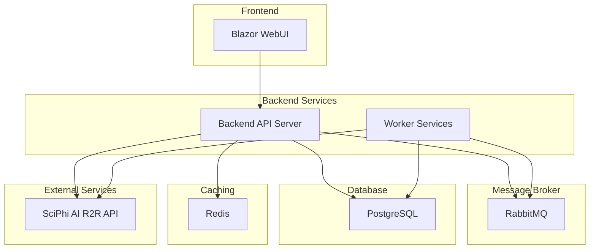
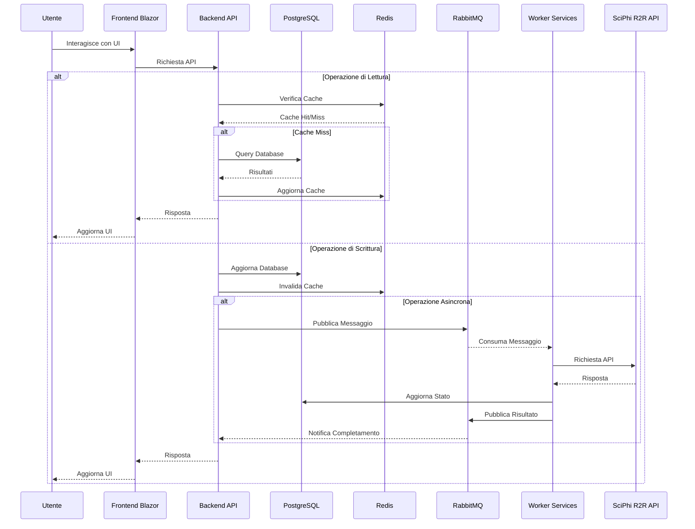
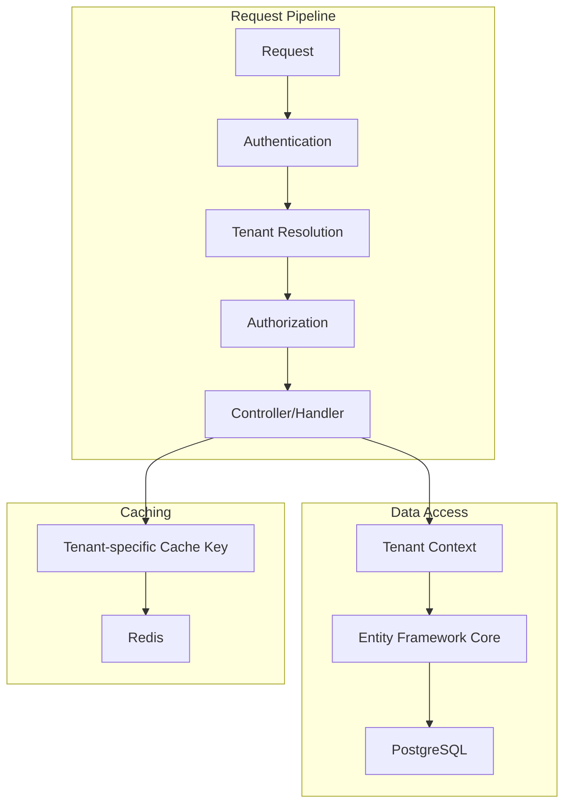

# README: Architettura e Deployment

## Panoramica del Sistema

Questo documento descrive l'architettura complessiva e le procedure di deployment per il sistema WebUI multitenant di SciPhi AI R2R. Il sistema è progettato per fornire un'interfaccia utente enterprise-grade che permette a diverse organizzazioni (tenant) di gestire collezioni di documenti e interagire con esse tramite un chatbot basato su LLM.



## Componenti del Sistema

### 1. Frontend Blazor

Il frontend è sviluppato in Microsoft .NET 9.0 Blazor e utilizza MudBlazor come libreria di componenti UI. Fornisce un'interfaccia utente intuitiva e responsive per i diversi ruoli (Admin, Company, User).

**Tecnologie Principali:**
- .NET 9.0 Blazor (Server o WebAssembly)
- MudBlazor
- Material Design 3
- TailwindCSS (opzionale per personalizzazioni)

**Dettagli:** [README Frontend Blazor](./README_frontend_blazor.md)

### 2. Backend API Server

Il backend è un'applicazione .NET 9.0 Web API che funge da intermediario tra il frontend e i servizi esterni, gestendo autenticazione, autorizzazione, e logica di business.

**Tecnologie Principali:**
- .NET 9.0 Web API
- Entity Framework Core 9.0
- JWT Authentication
- CQRS pattern (opzionale)

**Dettagli:** [README Backend API Server](./README_backend_api_server.md)

### 3. Worker Services

Servizi background che elaborano operazioni asincrone e a lunga durata, come l'upload e l'elaborazione di documenti.

**Tecnologie Principali:**
- .NET 9.0 Worker Services
- RabbitMQ.Client

### 4. PostgreSQL

Database relazionale per la persistenza dei dati del sistema, inclusi utenti, companies, collezioni, documenti, e configurazioni.

**Versione Consigliata:** PostgreSQL 16+

**Dettagli:** [Modello Dati PostgreSQL](./modello_dati_postgresql.md)

### 5. RabbitMQ

Message broker per la gestione delle code di elaborazione documenti e altre operazioni asincrone.

**Versione Consigliata:** RabbitMQ 3.12+

**Dettagli:** [Integrazione R2R e RabbitMQ](./integrazione_r2r_rabbitmq.md)

### 6. Redis

Sistema di caching distribuito per migliorare le performance e ridurre il carico sul backend e sul servizio R2R API.

**Versione Consigliata:** Redis 7.0+

**Dettagli:** [Integrazione Redis](./integrazione_redis.md)

### 7. SciPhi AI R2R API

Servizio esterno che fornisce funzionalità di elaborazione documenti e interazione con LLM.

**Endpoint:** http://192.168.1.4:7272

## Architettura Dettagliata

### Diagramma di Flusso Dati



### Architettura Multitenancy

Il sistema implementa un modello di multitenancy con isolamento a livello di database e applicazione:

1. **Isolamento Dati:**
   - Schema database con relazioni tenant-aware
   - Row-Level Security in PostgreSQL
   - Filtri automatici in Entity Framework Core

2. **Isolamento Applicativo:**
   - Middleware di risoluzione tenant
   - Context tenant in ogni richiesta
   - Caching con namespace per tenant



### Sicurezza

1. **Autenticazione:**
   - JWT (JSON Web Tokens)
   - Refresh token con rotazione
   - Multi-factor authentication (opzionale)

2. **Autorizzazione:**
   - Policy-based authorization
   - Role-based access control (RBAC)
   - Claims-based permissions

3. **Sicurezza Dati:**
   - Encryption at rest
   - TLS per comunicazioni
   - Sanitizzazione input
   - Protezione contro CSRF, XSS, SQL Injection

**Dettagli:** [Autenticazione e Autorizzazione](./autenticazione_autorizzazione_aggiornato.md)

## Requisiti di Deployment

### Requisiti Hardware

#### Ambiente Produzione (Raccomandato)

| Componente | CPU | RAM | Storage | Istanze |
|------------|-----|-----|---------|---------|
| Frontend Server | 4+ vCPU | 8+ GB | 50+ GB SSD | 2+ |
| Backend API Server | 4+ vCPU | 8+ GB | 50+ GB SSD | 2+ |
| Worker Services | 4+ vCPU | 8+ GB | 100+ GB SSD | 2+ per tipo |
| PostgreSQL | 8+ vCPU | 32+ GB | 1+ TB SSD | 3+ (1 primary, 2+ replica) |
| Redis | 4+ vCPU | 16+ GB | 50+ GB SSD | 3+ (1 primary, 2+ replica) |
| RabbitMQ | 4+ vCPU | 8+ GB | 100+ GB SSD | 3+ (cluster) |

#### Ambiente Staging/QA

Circa 50% delle risorse di produzione, con configurazione identica ma scala ridotta.

#### Ambiente Sviluppo

Ambiente containerizzato con risorse sufficienti per sviluppo locale.

### Requisiti Software

- **Sistema Operativo:** Ubuntu Server 22.04 LTS o Rocky Linux 9
- **Container Runtime:** Docker 24+ o Containerd
- **Orchestrazione:** Kubernetes (opzionale per deployment avanzati)
- **Web Server:** NGINX o IIS (per frontend)
- **SSL:** Let's Encrypt o certificati commerciali

**Dettagli:** [Scalabilità e Robustezza](./scalabilita_robustezza.md)

## Procedure di Deployment

### Preparazione Ambiente

#### 1. Setup Database PostgreSQL

```bash
# Installazione PostgreSQL
sudo apt update
sudo apt install -y postgresql-16 postgresql-contrib-16

# Configurazione di base
sudo -u postgres psql -c "CREATE DATABASE r2rwebui;"
sudo -u postgres psql -c "CREATE USER r2rwebui WITH ENCRYPTED PASSWORD 'StrongPassword123';"
sudo -u postgres psql -c "GRANT ALL PRIVILEGES ON DATABASE r2rwebui TO r2rwebui;"

# Applicazione schema iniziale
psql -U r2rwebui -d r2rwebui -f schema.sql
```

#### 2. Setup Redis

```bash
# Installazione Redis
sudo apt update
sudo apt install -y redis-server

# Configurazione di base
sudo sed -i 's/supervised no/supervised systemd/g' /etc/redis/redis.conf
sudo sed -i 's/# requirepass foobared/requirepass StrongRedisPassword123/g' /etc/redis/redis.conf
sudo systemctl restart redis-server
```

#### 3. Setup RabbitMQ

```bash
# Installazione RabbitMQ
sudo apt update
sudo apt install -y rabbitmq-server

# Abilitazione management plugin
sudo rabbitmq-plugins enable rabbitmq_management

# Creazione utente e vhost
sudo rabbitmqctl add_user r2rwebui StrongRabbitPassword123
sudo rabbitmqctl add_vhost r2rwebui_vhost
sudo rabbitmqctl set_permissions -p r2rwebui_vhost r2rwebui ".*" ".*" ".*"
sudo rabbitmqctl set_user_tags r2rwebui administrator
```

### Deployment Backend API Server

#### Opzione 1: Deployment Diretto

```bash
# Pubblicazione applicazione
dotnet publish -c Release -o ./publish

# Copia file su server
scp -r ./publish/* user@server:/var/www/r2rwebui-api/

# Configurazione NGINX
sudo nano /etc/nginx/sites-available/r2rwebui-api
# [Configurazione NGINX]

sudo ln -s /etc/nginx/sites-available/r2rwebui-api /etc/nginx/sites-enabled/
sudo systemctl reload nginx

# Configurazione servizio systemd
sudo nano /etc/systemd/system/r2rwebui-api.service
# [Configurazione systemd]

sudo systemctl enable r2rwebui-api
sudo systemctl start r2rwebui-api
```

#### Opzione 2: Deployment Docker

```bash
# Build Docker image
docker build -t r2rwebui-api:latest .

# Run container
docker run -d \
  --name r2rwebui-api \
  -p 5001:80 \
  -e "ConnectionStrings__DefaultConnection=Host=postgres;Database=r2rwebui;Username=r2rwebui;Password=StrongPassword123" \
  -e "ConnectionStrings__Redis=redis:6379,password=StrongRedisPassword123" \
  -e "RabbitMQ__Host=rabbitmq" \
  -e "RabbitMQ__Username=r2rwebui" \
  -e "RabbitMQ__Password=StrongRabbitPassword123" \
  -e "RabbitMQ__VirtualHost=r2rwebui_vhost" \
  -e "R2R__ApiUrl=http://192.168.1.4:7272" \
  --restart unless-stopped \
  r2rwebui-api:latest
```

#### Opzione 3: Deployment Kubernetes

```yaml
# deployment.yaml
apiVersion: apps/v1
kind: Deployment
metadata:
  name: r2rwebui-api
  namespace: r2rwebui
spec:
  replicas: 3
  selector:
    matchLabels:
      app: r2rwebui-api
  template:
    metadata:
      labels:
        app: r2rwebui-api
    spec:
      containers:
      - name: r2rwebui-api
        image: r2rwebui-api:latest
        ports:
        - containerPort: 80
        env:
        - name: ConnectionStrings__DefaultConnection
          valueFrom:
            secretKeyRef:
              name: r2rwebui-secrets
              key: db-connection-string
        - name: ConnectionStrings__Redis
          valueFrom:
            secretKeyRef:
              name: r2rwebui-secrets
              key: redis-connection-string
        # [Altri env]
        resources:
          requests:
            memory: "512Mi"
            cpu: "250m"
          limits:
            memory: "1Gi"
            cpu: "500m"
        readinessProbe:
          httpGet:
            path: /health
            port: 80
          initialDelaySeconds: 10
          periodSeconds: 30
        livenessProbe:
          httpGet:
            path: /health
            port: 80
          initialDelaySeconds: 30
          periodSeconds: 60

# service.yaml
apiVersion: v1
kind: Service
metadata:
  name: r2rwebui-api
  namespace: r2rwebui
spec:
  selector:
    app: r2rwebui-api
  ports:
  - port: 80
    targetPort: 80
  type: ClusterIP

# ingress.yaml
apiVersion: networking.k8s.io/v1
kind: Ingress
metadata:
  name: r2rwebui-api
  namespace: r2rwebui
  annotations:
    nginx.ingress.kubernetes.io/ssl-redirect: "true"
spec:
  rules:
  - host: api.r2rwebui.example.com
    http:
      paths:
      - path: /
        pathType: Prefix
        backend:
          service:
            name: r2rwebui-api
            port:
              number: 80
  tls:
  - hosts:
    - api.r2rwebui.example.com
    secretName: r2rwebui-tls
```

### Deployment Worker Services

Simile al deployment del Backend API Server, ma con configurazioni specifiche per i worker.

### Deployment Frontend Blazor

#### Opzione 1: Blazor Server

```bash
# Pubblicazione applicazione
dotnet publish -c Release -o ./publish

# Copia file su server
scp -r ./publish/* user@server:/var/www/r2rwebui-frontend/

# Configurazione NGINX
sudo nano /etc/nginx/sites-available/r2rwebui-frontend
# [Configurazione NGINX]

sudo ln -s /etc/nginx/sites-available/r2rwebui-frontend /etc/nginx/sites-enabled/
sudo systemctl reload nginx

# Configurazione servizio systemd
sudo nano /etc/systemd/system/r2rwebui-frontend.service
# [Configurazione systemd]

sudo systemctl enable r2rwebui-frontend
sudo systemctl start r2rwebui-frontend
```

#### Opzione 2: Blazor WebAssembly

```bash
# Pubblicazione applicazione
dotnet publish -c Release -o ./publish

# Copia file su server
scp -r ./publish/wwwroot/* user@server:/var/www/r2rwebui-frontend/

# Configurazione NGINX
sudo nano /etc/nginx/sites-available/r2rwebui-frontend
# server {
#     listen 80;
#     server_name frontend.r2rwebui.example.com;
#     root /var/www/r2rwebui-frontend;
#     index index.html;
#     location / {
#         try_files $uri $uri/ /index.html =404;
#     }
# }

sudo ln -s /etc/nginx/sites-available/r2rwebui-frontend /etc/nginx/sites-enabled/
sudo systemctl reload nginx
```

### Configurazione NGINX

#### Backend API Server

```nginx
server {
    listen 80;
    server_name api.r2rwebui.example.com;
    
    location / {
        proxy_pass http://localhost:5001;
        proxy_http_version 1.1;
        proxy_set_header Upgrade $http_upgrade;
        proxy_set_header Connection keep-alive;
        proxy_set_header Host $host;
        proxy_cache_bypass $http_upgrade;
        proxy_set_header X-Forwarded-For $proxy_add_x_forwarded_for;
        proxy_set_header X-Forwarded-Proto $scheme;
    }
}
```

#### Frontend Blazor Server

```nginx
server {
    listen 80;
    server_name frontend.r2rwebui.example.com;
    
    location / {
        proxy_pass http://localhost:5002;
        proxy_http_version 1.1;
        proxy_set_header Upgrade $http_upgrade;
        proxy_set_header Connection "Upgrade";
        proxy_set_header Host $host;
        proxy_cache_bypass $http_upgrade;
        proxy_set_header X-Forwarded-For $proxy_add_x_forwarded_for;
        proxy_set_header X-Forwarded-Proto $scheme;
    }
}
```

#### Frontend Blazor WebAssembly

```nginx
server {
    listen 80;
    server_name frontend.r2rwebui.example.com;
    root /var/www/r2rwebui-frontend;
    index index.html;
    
    location / {
        try_files $uri $uri/ /index.html =404;
    }
    
    # Caching statico
    location ~* \.(js|css|png|jpg|jpeg|gif|ico|svg|woff|woff2|ttf|eot)$ {
        expires 30d;
        add_header Cache-Control "public, no-transform";
    }
}
```

### Configurazione SSL/TLS

```bash
# Installazione Certbot
sudo apt install -y certbot python3-certbot-nginx

# Ottenimento certificati
sudo certbot --nginx -d api.r2rwebui.example.com -d frontend.r2rwebui.example.com

# Rinnovo automatico
sudo systemctl status certbot.timer
```

## Configurazione Applicazione

### Backend API Server

File di configurazione principale: `appsettings.json`

```json
{
  "ConnectionStrings": {
    "DefaultConnection": "Host=localhost;Database=r2rwebui;Username=r2rwebui;Password=StrongPassword123",
    "Redis": "localhost:6379,password=StrongRedisPassword123"
  },
  "RabbitMQ": {
    "Host": "localhost",
    "Username": "r2rwebui",
    "Password": "StrongRabbitPassword123",
    "VirtualHost": "r2rwebui_vhost"
  },
  "R2R": {
    "ApiUrl": "http://192.168.1.4:7272",
    "DefaultTimeout": 30,
    "MaxRetries": 3
  },
  "Authentication": {
    "JwtSecret": "YourSuperSecretKeyHereThatIsAtLeast32CharsLong",
    "JwtIssuer": "r2rwebui",
    "JwtAudience": "r2rwebui-clients",
    "JwtExpiryMinutes": 60,
    "RefreshTokenExpiryDays": 7
  },
  "Logging": {
    "LogLevel": {
      "Default": "Information",
      "Microsoft.AspNetCore": "Warning"
    }
  },
  "AllowedHosts": "*",
  "Cors": {
    "AllowedOrigins": [
      "https://frontend.r2rwebui.example.com"
    ]
  }
}
```

### Frontend Blazor

File di configurazione principale: `appsettings.json`

```json
{
  "BackendApiUrl": "https://api.r2rwebui.example.com",
  "Authentication": {
    "TokenStorageMethod": "localStorage", // o "sessionStorage"
    "AutoRefreshToken": true
  },
  "UI": {
    "DefaultTheme": "light", // o "dark", "system"
    "EnableAnimations": true,
    "DefaultPageSize": 10
  },
  "Logging": {
    "LogLevel": {
      "Default": "Information",
      "Microsoft.AspNetCore": "Warning"
    }
  },
  "AllowedHosts": "*"
}
```

## Monitoraggio e Logging

### Logging Centralizzato

Configurazione per ELK Stack (Elasticsearch, Logstash, Kibana) o Grafana Loki:

```json
// appsettings.json (Backend)
{
  "Serilog": {
    "MinimumLevel": {
      "Default": "Information",
      "Override": {
        "Microsoft": "Warning",
        "System": "Warning"
      }
    },
    "WriteTo": [
      {
        "Name": "Console"
      },
      {
        "Name": "File",
        "Args": {
          "path": "logs/r2rwebui-.log",
          "rollingInterval": "Day"
        }
      },
      {
        "Name": "Elasticsearch",
        "Args": {
          "nodeUris": "http://elasticsearch:9200",
          "indexFormat": "r2rwebui-logs-{0:yyyy.MM}",
          "autoRegisterTemplate": true
        }
      }
    ],
    "Enrich": [ "FromLogContext", "WithMachineName", "WithThreadId" ]
  }
}
```

### Health Checks

```csharp
// Program.cs (Backend)
builder.Services.AddHealthChecks()
    .AddNpgSql(builder.Configuration.GetConnectionString("DefaultConnection"), name: "database")
    .AddRedis(builder.Configuration.GetConnectionString("Redis"), name: "redis")
    .AddRabbitMQ(rabbitConnectionString, name: "rabbitmq")
    .AddUrlGroup(new Uri("http://192.168.1.4:7272/v3/health"), name: "r2r-api");

app.MapHealthChecks("/health", new HealthCheckOptions
{
    ResponseWriter = UIResponseWriter.WriteHealthCheckUIResponse
});
```

### Metriche

Configurazione per Prometheus e Grafana:

```csharp
// Program.cs (Backend)
builder.Services.AddMetrics();
builder.Services.AddMetricsTrackingMiddleware();
builder.Services.AddMetricsReportingHostedService();
builder.Services.AddMetricsEndpoints();

app.UseMetricsAllMiddleware();
app.UseMetricsAllEndpoints();
```

## Backup e Disaster Recovery

### Backup Database

```bash
# Backup giornaliero
pg_dump -U r2rwebui -d r2rwebui -F c -f /backups/r2rwebui_$(date +%Y%m%d).dump

# Rotazione backup (mantiene ultimi 30 giorni)
find /backups/ -name "r2rwebui_*.dump" -type f -mtime +30 -delete
```

### Backup Configurazioni

```bash
# Backup configurazioni
tar -czf /backups/configs_$(date +%Y%m%d).tar.gz /etc/nginx/sites-available/ /etc/systemd/system/r2rwebui-*.service /var/www/r2rwebui-*/appsettings.json
```

### Disaster Recovery

Procedura di ripristino:

1. **Ripristino Database:**
   ```bash
   pg_restore -U postgres -d r2rwebui -c /backups/r2rwebui_YYYYMMDD.dump
   ```

2. **Ripristino Configurazioni:**
   ```bash
   tar -xzf /backups/configs_YYYYMMDD.tar.gz -C /
   ```

3. **Riavvio Servizi:**
   ```bash
   sudo systemctl restart r2rwebui-api r2rwebui-frontend
   ```

## Aggiornamenti e Manutenzione

### Aggiornamento Backend API Server

```bash
# Stop servizio
sudo systemctl stop r2rwebui-api

# Backup configurazione
cp /var/www/r2rwebui-api/appsettings.json /var/www/r2rwebui-api/appsettings.json.bak

# Aggiornamento file
rm -rf /var/www/r2rwebui-api/*
scp -r ./publish/* user@server:/var/www/r2rwebui-api/

# Ripristino configurazione
cp /var/www/r2rwebui-api/appsettings.json.bak /var/www/r2rwebui-api/appsettings.json

# Restart servizio
sudo systemctl start r2rwebui-api
```

### Aggiornamento Frontend Blazor

```bash
# Stop servizio (solo per Blazor Server)
sudo systemctl stop r2rwebui-frontend

# Backup configurazione
cp /var/www/r2rwebui-frontend/appsettings.json /var/www/r2rwebui-frontend/appsettings.json.bak

# Aggiornamento file
rm -rf /var/www/r2rwebui-frontend/*
scp -r ./publish/* user@server:/var/www/r2rwebui-frontend/

# Ripristino configurazione
cp /var/www/r2rwebui-frontend/appsettings.json.bak /var/www/r2rwebui-frontend/appsettings.json

# Restart servizio (solo per Blazor Server)
sudo systemctl start r2rwebui-frontend
```

### Aggiornamento Database Schema

```bash
# Applicazione migrazioni
dotnet ef database update --project R2RWebUI.Infrastructure --startup-project R2RWebUI.API
```

## Troubleshooting

### Problemi Comuni e Soluzioni

1. **Errore di Connessione Database:**
   - Verificare credenziali in `appsettings.json`
   - Controllare firewall e regole di accesso
   - Verificare stato servizio PostgreSQL: `sudo systemctl status postgresql`
   - Controllare log PostgreSQL: `sudo tail -f /var/log/postgresql/postgresql-16-main.log`

2. **Errore di Connessione Redis:**
   - Verificare credenziali in `appsettings.json`
   - Controllare stato servizio Redis: `sudo systemctl status redis-server`
   - Testare connessione: `redis-cli -a StrongRedisPassword123 ping`
   - Controllare log Redis: `sudo tail -f /var/log/redis/redis-server.log`

3. **Errore di Connessione RabbitMQ:**
   - Verificare credenziali in `appsettings.json`
   - Controllare stato servizio RabbitMQ: `sudo systemctl status rabbitmq-server`
   - Verificare vhost e permessi: `sudo rabbitmqctl list_permissions -p r2rwebui_vhost`
   - Controllare log RabbitMQ: `sudo tail -f /var/log/rabbitmq/rabbit@hostname.log`

4. **Errore di Connessione R2R API:**
   - Verificare URL in `appsettings.json`
   - Testare connessione: `curl -v http://192.168.1.4:7272/v3/health`
   - Controllare log applicazione per errori specifici

5. **Errori 500 dal Backend API:**
   - Controllare log applicazione: `sudo journalctl -u r2rwebui-api.service`
   - Verificare configurazioni e connessioni a servizi dipendenti
   - Controllare permessi file e directory

6. **Problemi di Performance:**
   - Controllare utilizzo risorse: `htop`, `iostat`, `vmstat`
   - Verificare configurazione connection pooling
   - Analizzare query lente in PostgreSQL
   - Controllare hit rate cache Redis

### Log da Controllare

- **Backend API Server:** `/var/log/r2rwebui/api.log` o `sudo journalctl -u r2rwebui-api.service`
- **Frontend Blazor Server:** `/var/log/r2rwebui/frontend.log` o `sudo journalctl -u r2rwebui-frontend.service`
- **Worker Services:** `/var/log/r2rwebui/workers.log` o `sudo journalctl -u r2rwebui-worker-*.service`
- **NGINX:** `/var/log/nginx/access.log` e `/var/log/nginx/error.log`
- **PostgreSQL:** `/var/log/postgresql/postgresql-16-main.log`
- **Redis:** `/var/log/redis/redis-server.log`
- **RabbitMQ:** `/var/log/rabbitmq/rabbit@hostname.log`

## Sicurezza

### Hardening Server

```bash
# Aggiornamenti di sicurezza
sudo apt update
sudo apt upgrade -y

# Firewall
sudo ufw allow ssh
sudo ufw allow http
sudo ufw allow https
sudo ufw enable

# Fail2ban
sudo apt install -y fail2ban
sudo systemctl enable fail2ban
sudo systemctl start fail2ban

# SSH hardening
sudo nano /etc/ssh/sshd_config
# PermitRootLogin no
# PasswordAuthentication no
# X11Forwarding no
sudo systemctl restart ssh
```

### Hardening Database

```bash
# Configurazione PostgreSQL
sudo nano /etc/postgresql/16/main/pg_hba.conf
# [Configurazione accessi restrittivi]

sudo nano /etc/postgresql/16/main/postgresql.conf
# listen_addresses = 'localhost'
# ssl = on
# ssl_cert_file = '/etc/ssl/certs/ssl-cert-snakeoil.pem'
# ssl_key_file = '/etc/ssl/private/ssl-cert-snakeoil.key'

sudo systemctl restart postgresql
```

### Hardening Redis

```bash
# Configurazione Redis
sudo nano /etc/redis/redis.conf
# bind 127.0.0.1
# protected-mode yes
# requirepass StrongRedisPassword123
# rename-command FLUSHALL ""
# rename-command FLUSHDB ""
# rename-command CONFIG ""

sudo systemctl restart redis-server
```

### Hardening RabbitMQ

```bash
# Configurazione RabbitMQ
sudo rabbitmqctl add_vhost r2rwebui_vhost
sudo rabbitmqctl set_permissions -p r2rwebui_vhost r2rwebui ".*" ".*" ".*"
sudo rabbitmqctl clear_permissions -p / r2rwebui
sudo rabbitmqctl delete_user guest
```

## Riferimenti

- [Documentazione Architettura Sistema](./architettura_sistema.md)
- [README Backend API Server](./README_backend_api_server.md)
- [README Frontend Blazor](./README_frontend_blazor.md)
- [Modello Dati PostgreSQL](./modello_dati_postgresql.md)
- [Integrazione R2R e RabbitMQ](./integrazione_r2r_rabbitmq.md)
- [Integrazione Redis](./integrazione_redis.md)
- [Autenticazione e Autorizzazione](./autenticazione_autorizzazione_aggiornato.md)
- [Scalabilità e Robustezza](./scalabilita_robustezza.md)
- [Workflow Dettagliati per Ruoli](./workflow_ruoli_dettagliati.md)
- [Guida Template Grafico](./guida_template_grafico.md) (da creare)

## Conclusioni

Questo documento fornisce una guida completa per l'architettura e il deployment del sistema WebUI multitenant per SciPhi AI R2R. Seguendo queste linee guida, è possibile implementare un sistema enterprise-grade scalabile, robusto e sicuro.

Per ulteriori dettagli su componenti specifici, consultare i documenti di riferimento collegati.
