# Workflow Dettagliati per Ruoli

## Panoramica

Questo documento descrive in dettaglio i workflow operativi per ciascun ruolo utente nel sistema WebUI multitenant per SciPhi AI R2R. I ruoli principali sono Admin, Company e User, ciascuno con responsabilità e permessi specifici. I workflow sono progettati per garantire un'esperienza utente intuitiva e coerente, rispettando al contempo i vincoli di sicurezza e isolamento dei dati.

## Ruolo: Admin

L'amministratore di sistema ha accesso completo a tutte le funzionalità e dati del sistema, con responsabilità di gestione globale.

### Workflow 1: Gestione Companies

**Obiettivo**: Creare, visualizzare, modificare e disattivare aziende nel sistema.

**Flusso**:

1. **Dashboard Admin**
   - L'Admin accede alla dashboard principale
   - Visualizza statistiche globali: numero totale di companies, utenti, collezioni, documenti
   - Visualizza grafici di utilizzo: upload documenti per periodo, query chatbot per periodo
   - Visualizza stato del sistema: health check R2R, stato code RabbitMQ, metriche Redis

2. **Lista Companies**
   - L'Admin naviga alla sezione "Companies"
   - Visualizza elenco paginato di tutte le companies
   - Può filtrare per nome, stato (attivo/inattivo), data creazione
   - Può ordinare per vari campi (nome, data creazione, numero utenti)

3. **Creazione Company**
   - L'Admin clicca su "Nuova Company"
   - Compila form con dati azienda:
     - Nome azienda (obbligatorio)
     - Logo (opzionale)
     - Impostazioni specifiche:
       - LLM da utilizzare (default: gpt-4)
       - API Key LLM
       - Numero massimo documenti per utente
       - Numero massimo query chatbot all'ora
       - Altre impostazioni R2R
   - Salva la nuova company
   - Sistema crea automaticamente un account admin per la company

4. **Dettaglio Company**
   - L'Admin seleziona una company dall'elenco
   - Visualizza dettagli company:
     - Informazioni generali
     - Statistiche di utilizzo
     - Lista utenti associati
     - Lista collezioni
     - Impostazioni specifiche
   - Può modificare qualsiasi dato della company
   - Può disattivare/riattivare la company

5. **Monitoraggio Utilizzo Company**
   - L'Admin visualizza dashboard di utilizzo per company specifica
   - Grafici di utilizzo risorse:
     - Numero documenti caricati nel tempo
     - Numero query chatbot nel tempo
     - Errori di elaborazione documenti
     - Utilizzo storage
   - Può esportare report in formato CSV/PDF

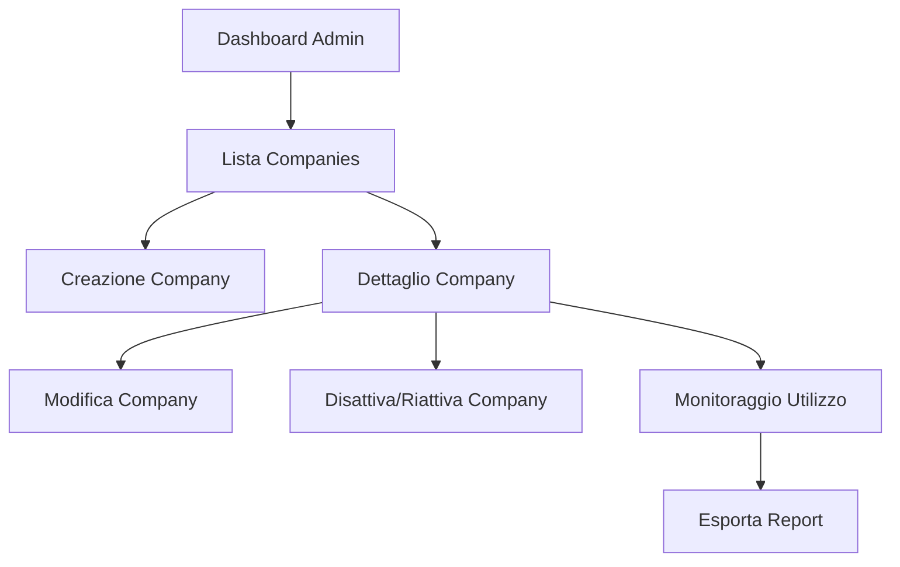

### Workflow 2: Gestione Utenti Globale

**Obiettivo**: Gestire tutti gli utenti del sistema, indipendentemente dalla company.

**Flusso**:

1. **Lista Utenti Globale**
   - L'Admin naviga alla sezione "Utenti"
   - Visualizza elenco paginato di tutti gli utenti
   - Può filtrare per nome, email, company, ruolo, stato
   - Può ordinare per vari campi

2. **Creazione Utente**
   - L'Admin clicca su "Nuovo Utente"
   - Seleziona company di appartenenza
   - Compila form con dati utente:
     - Nome e cognome
     - Email
     - Username
     - Ruolo (Admin, Company, User)
     - Password temporanea (o opzione per invio automatico)
   - Salva il nuovo utente
   - Sistema invia email con credenziali temporanee

3. **Dettaglio Utente**
   - L'Admin seleziona un utente dall'elenco
   - Visualizza dettagli utente:
     - Informazioni personali
     - Company di appartenenza
     - Ruolo
     - Statistiche di utilizzo
     - Collezioni create
   - Può modificare qualsiasi dato dell'utente
   - Può reimpostare la password
   - Può disattivare/riattivare l'utente

4. **Impersonificazione Utente**
   - L'Admin può "impersonare" un utente
   - Accede al sistema con la vista dell'utente selezionato
   - Banner persistente indica modalità impersonificazione
   - Può tornare alla vista Admin in qualsiasi momento

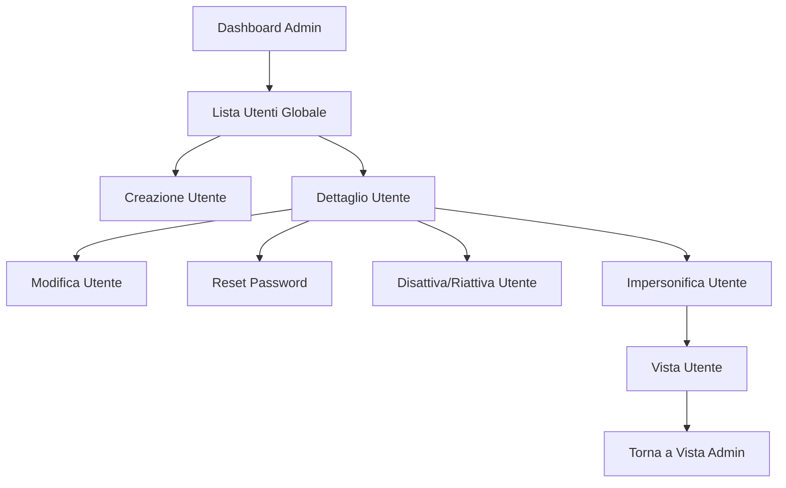

### Workflow 3: Configurazione Globale Sistema

**Obiettivo**: Gestire le impostazioni globali del sistema.

**Flusso**:

1. **Impostazioni Globali**
   - L'Admin naviga alla sezione "Impostazioni"
   - Configura parametri globali:
     - URL R2R API server
     - Timeout connessione
     - Parametri circuit breaker
     - Configurazione RabbitMQ
     - Configurazione Redis
     - Impostazioni email

2. **Gestione API Keys**
   - L'Admin gestisce le API keys globali
   - Può creare, visualizzare, revocare API keys
   - Associa API keys a servizi specifici

3. **Configurazione Backup**
   - L'Admin configura policy di backup
   - Imposta frequenza, retention, destinazione
   - Visualizza stato ultimi backup
   - Può avviare backup manuale

4. **Log di Sistema**
   - L'Admin accede ai log di sistema
   - Può filtrare per livello, componente, periodo
   - Visualizza dettagli errori
   - Può esportare log per analisi

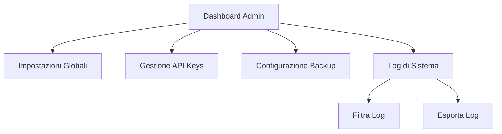

## Ruolo: Company

L'amministratore aziendale (Company) ha accesso alle risorse e agli utenti della propria azienda, con responsabilità di gestione a livello di tenant.

### Workflow 1: Dashboard Company

**Obiettivo**: Monitorare l'utilizzo e le risorse della propria azienda.

**Flusso**:

1. **Dashboard Company**
   - Il Company admin accede alla dashboard principale
   - Visualizza statistiche aziendali:
     - Numero utenti attivi
     - Numero collezioni
     - Numero documenti totali
     - Query chatbot totali
   - Visualizza grafici di utilizzo:
     - Upload documenti nel tempo
     - Query chatbot nel tempo
     - Distribuzione collezioni per utente

2. **Monitoraggio Risorse**
   - Il Company admin visualizza utilizzo risorse:
     - Percentuale utilizzo quota documenti
     - Percentuale utilizzo quota query
     - Errori di elaborazione documenti
   - Riceve alert quando l'utilizzo supera soglie configurabili

3. **Report di Utilizzo**
   - Il Company admin può generare report di utilizzo
   - Seleziona periodo di riferimento
   - Seleziona metriche da includere
   - Esporta report in formato CSV/PDF

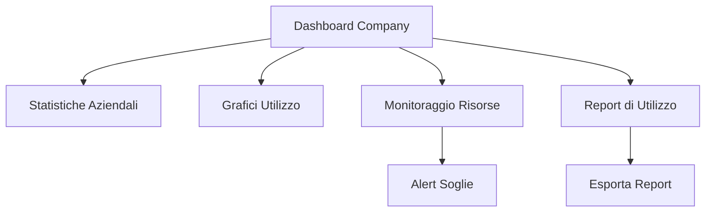

### Workflow 2: Gestione Utenti Company

**Obiettivo**: Gestire gli utenti della propria azienda.

**Flusso**:

1. **Lista Utenti Company**
   - Il Company admin naviga alla sezione "Utenti"
   - Visualizza elenco paginato degli utenti della propria azienda
   - Può filtrare per nome, email, ruolo, stato
   - Può ordinare per vari campi

2. **Creazione Utente**
   - Il Company admin clicca su "Nuovo Utente"
   - Compila form con dati utente:
     - Nome e cognome
     - Email
     - Username
     - Ruolo (Company, User)
     - Password temporanea (o opzione per invio automatico)
   - Salva il nuovo utente
   - Sistema invia email con credenziali temporanee

3. **Dettaglio Utente**
   - Il Company admin seleziona un utente dall'elenco
   - Visualizza dettagli utente:
     - Informazioni personali
     - Ruolo
     - Statistiche di utilizzo
     - Collezioni create
   - Può modificare dati dell'utente
   - Può reimpostare la password
   - Può disattivare/riattivare l'utente

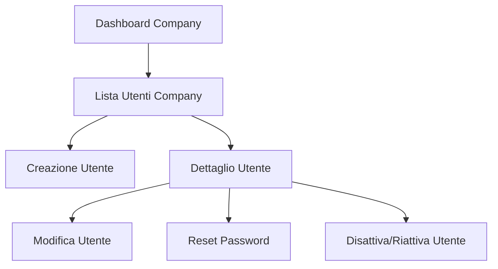

### Workflow 3: Gestione Collezioni Company

**Obiettivo**: Visualizzare e gestire tutte le collezioni della propria azienda.

**Flusso**:

1. **Lista Collezioni**
   - Il Company admin naviga alla sezione "Collezioni"
   - Visualizza elenco paginato di tutte le collezioni dell'azienda
   - Può filtrare per nome, utente proprietario, data creazione
   - Può ordinare per vari campi

2. **Dettaglio Collezione**
   - Il Company admin seleziona una collezione dall'elenco
   - Visualizza dettagli collezione:
     - Informazioni generali
     - Utente proprietario
     - Lista documenti
     - Statistiche di utilizzo
   - Può visualizzare documenti nella collezione
   - Non può modificare o eliminare collezioni (solo visualizzazione)

3. **Chatbot su Collezioni**
   - Il Company admin può selezionare una o più collezioni
   - Accede all'interfaccia chatbot
   - Può porre domande basate sui documenti nelle collezioni selezionate
   - Visualizza risposte con citazioni ai documenti originali
   - Può salvare conversazioni per riferimento futuro

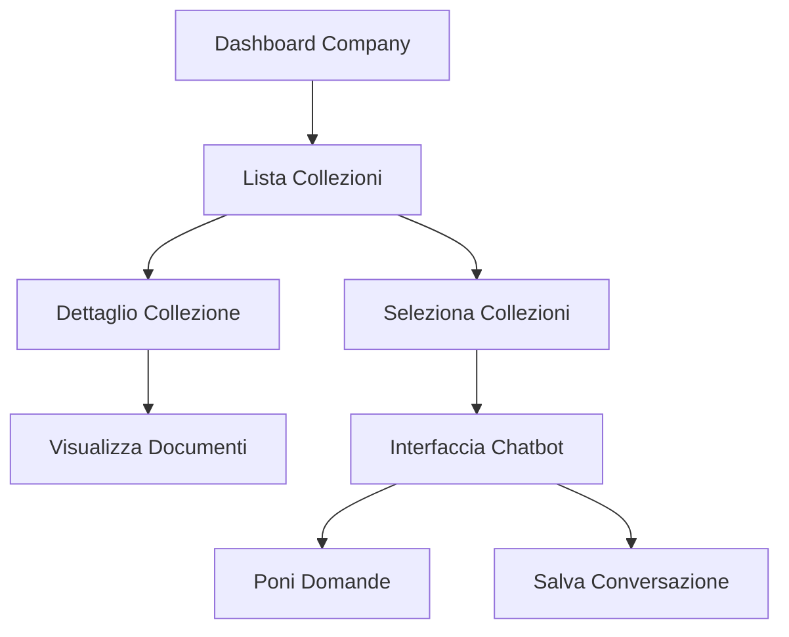

### Workflow 4: Impostazioni Company

**Obiettivo**: Gestire le impostazioni specifiche dell'azienda.

**Flusso**:

1. **Profilo Azienda**
   - Il Company admin naviga alla sezione "Impostazioni"
   - Visualizza e modifica dati aziendali:
     - Nome azienda
     - Logo
     - Informazioni di contatto

2. **Configurazione R2R**
   - Il Company admin configura parametri R2R specifici:
     - LLM da utilizzare
     - API Key LLM
     - Parametri di elaborazione documenti

3. **Limiti e Quote**
   - Il Company admin visualizza limiti configurati:
     - Numero massimo documenti per utente
     - Numero massimo query chatbot all'ora
   - Non può modificare questi limiti (solo Admin globale)
   - Può richiedere aumento limiti tramite form

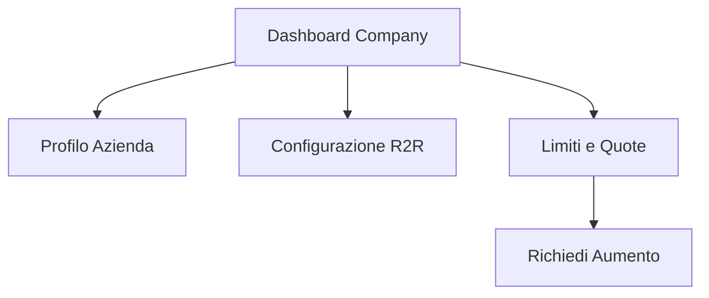

## Ruolo: User

L'utente standard ha accesso limitato alle proprie risorse e collezioni, con focus sull'interazione con i documenti e il chatbot.

### Workflow 1: Dashboard User

**Obiettivo**: Fornire una panoramica delle risorse e attività dell'utente.

**Flusso**:

1. **Dashboard User**
   - L'utente accede alla dashboard principale
   - Visualizza statistiche personali:
     - Numero collezioni
     - Numero documenti
     - Query chatbot recenti
   - Accesso rapido alle collezioni recenti
   - Accesso rapido alle conversazioni recenti

2. **Attività Recenti**
   - L'utente visualizza cronologia attività:
     - Documenti caricati recentemente
     - Collezioni create/modificate
     - Conversazioni chatbot recenti
   - Può filtrare per tipo attività e periodo

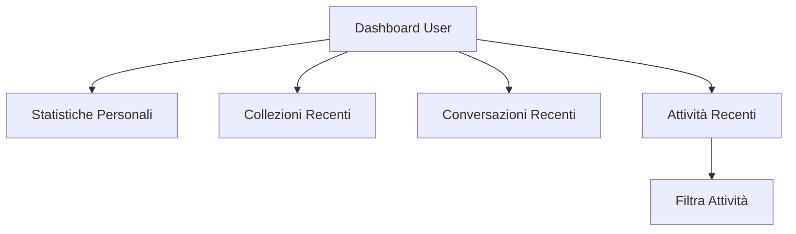

### Workflow 2: Gestione Collezioni

**Obiettivo**: Creare e gestire collezioni di documenti.

**Flusso**:

1. **Lista Collezioni**
   - L'utente naviga alla sezione "Collezioni"
   - Visualizza elenco paginato delle proprie collezioni
   - Può filtrare per nome, data creazione
   - Può ordinare per vari campi

2. **Creazione Collezione**
   - L'utente clicca su "Nuova Collezione"
   - Compila form con dati collezione:
     - Nome (obbligatorio)
     - Descrizione (opzionale)
   - Salva la nuova collezione

3. **Dettaglio Collezione**
   - L'utente seleziona una collezione dall'elenco
   - Visualizza dettagli collezione:
     - Informazioni generali
     - Lista documenti
     - Statistiche di utilizzo
   - Può modificare dati della collezione
   - Può eliminare la collezione (con conferma)

4. **Upload Documenti**
   - L'utente seleziona una collezione
   - Clicca su "Upload Documenti"
   - Seleziona file da caricare (supporto drag & drop)
   - Può caricare più file contemporaneamente
   - Visualizza progresso upload
   - Riceve notifiche stato elaborazione documenti

5. **Gestione Documenti**
   - L'utente visualizza lista documenti nella collezione
   - Può filtrare per nome, tipo, stato elaborazione
   - Visualizza dettagli documento:
     - Nome file
     - Dimensione
     - Data upload
     - Stato elaborazione
     - Metadati estratti
   - Può eliminare documenti (con conferma)
   - Può visualizzare errori di elaborazione
   - Può ritentare elaborazione documenti falliti

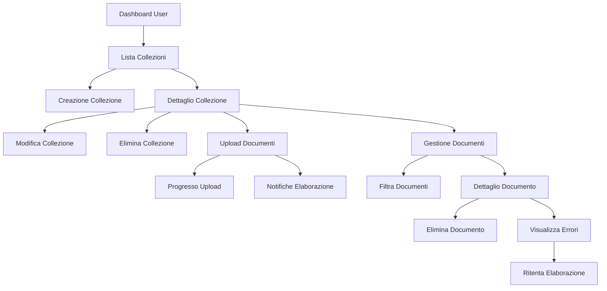

### Workflow 3: Interazione Chatbot

**Obiettivo**: Interagire con il chatbot basato sui documenti nelle collezioni.

**Flusso**:

1. **Selezione Collezioni**
   - L'utente naviga alla sezione "Chatbot"
   - Visualizza lista delle proprie collezioni
   - Seleziona una o più collezioni da utilizzare come contesto

2. **Nuova Conversazione**
   - L'utente clicca su "Nuova Conversazione"
   - Opzionalmente assegna un titolo alla conversazione
   - Interfaccia chatbot si inizializza con le collezioni selezionate

3. **Interazione Chatbot**
   - L'utente digita domande nel campo input
   - Visualizza indicatore di elaborazione durante generazione risposta
   - Riceve risposta dal chatbot con:
     - Testo generato
     - Citazioni ai documenti originali
     - Link ai documenti citati
   - Può continuare la conversazione con domande di follow-up
   - Può valutare la qualità delle risposte (feedback)

4. **Gestione Conversazioni**
   - L'utente visualizza lista conversazioni salvate
   - Può riprendere conversazioni precedenti
   - Può rinominare conversazioni
   - Può eliminare conversazioni
   - Può esportare conversazioni in formato PDF/Markdown

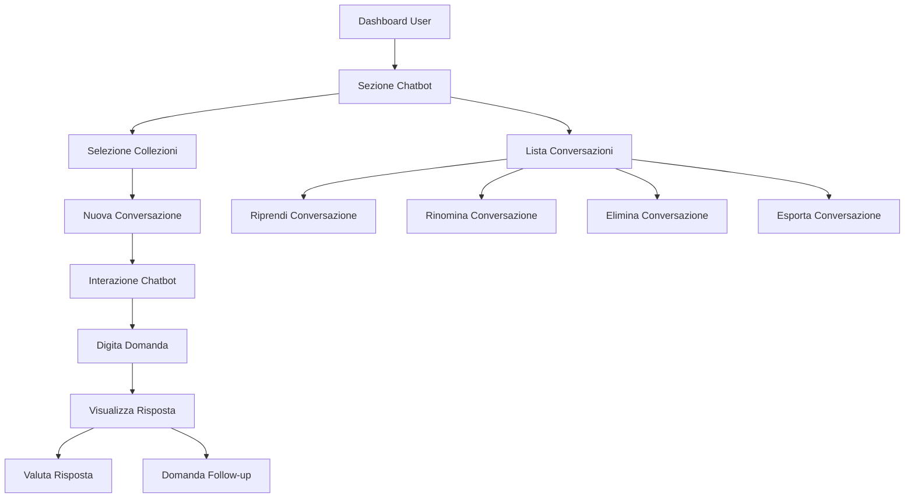

### Workflow 4: Profilo Utente

**Obiettivo**: Gestire le impostazioni personali dell'utente.

**Flusso**:

1. **Visualizza Profilo**
   - L'utente clicca sul proprio nome/avatar nell'header
   - Seleziona "Profilo"
   - Visualizza dati personali:
     - Nome e cognome
     - Email
     - Username
     - Ruolo

2. **Modifica Profilo**
   - L'utente clicca su "Modifica Profilo"
   - Può modificare:
     - Nome e cognome
     - Avatar
     - Preferenze di notifica
   - Salva modifiche

3. **Cambio Password**
   - L'utente seleziona "Cambia Password"
   - Inserisce password attuale
   - Inserisce nuova password (con requisiti di complessità)
   - Conferma nuova password
   - Riceve conferma cambio password

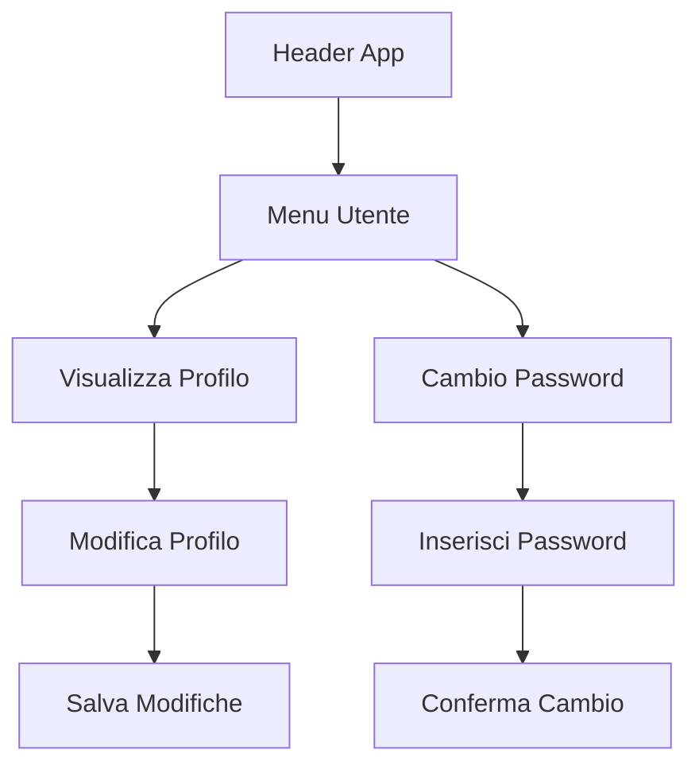

## Interazioni tra Ruoli

### Workflow: Escalation Problemi

**Obiettivo**: Gestire l'escalation di problemi tra i diversi livelli di utenti.

**Flusso**:

1. **Segnalazione Problema (User)**
   - L'utente riscontra un problema (es. errore elaborazione documento)
   - Clicca su "Segnala Problema"
   - Compila form con descrizione problema
   - Invia segnalazione al Company admin

2. **Gestione Problema (Company)**
   - Il Company admin riceve notifica problema
   - Visualizza dettagli segnalazione
   - Può risolvere direttamente se ha permessi sufficienti
   - Può escalare all'Admin globale se necessario

3. **Risoluzione Problema (Admin)**
   - L'Admin globale riceve notifica problema escalato
   - Visualizza dettagli segnalazione
   - Risolve il problema
   - Comunica risoluzione a Company admin e User

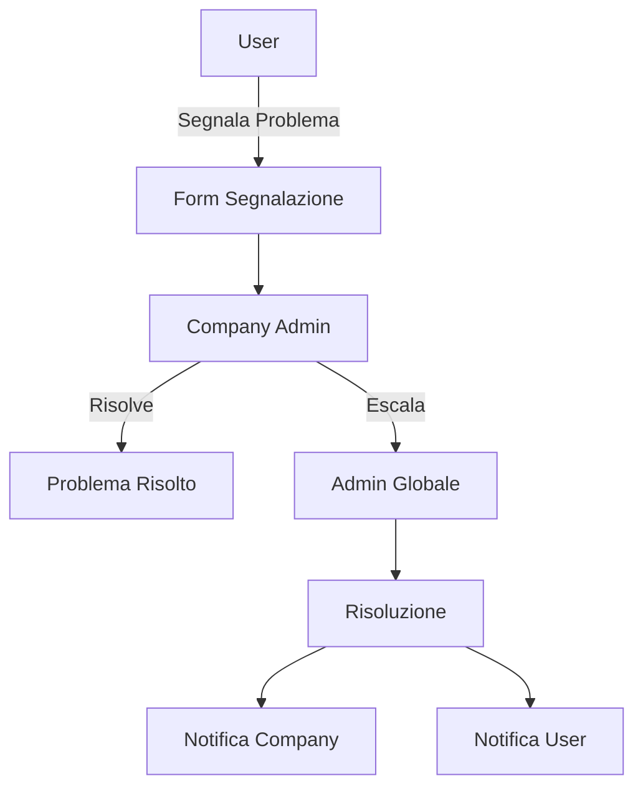

### Workflow: Richiesta Aumento Quote

**Obiettivo**: Gestire richieste di aumento quote tra Company e Admin.

**Flusso**:

1. **Richiesta Aumento (Company)**
   - Il Company admin visualizza utilizzo vicino ai limiti
   - Clicca su "Richiedi Aumento Quote"
   - Compila form con:
     - Tipo quota (documenti, query)
     - Aumento richiesto
     - Motivazione
   - Invia richiesta all'Admin

2. **Valutazione Richiesta (Admin)**
   - L'Admin riceve notifica richiesta
   - Visualizza dettagli richiesta
   - Valuta utilizzo attuale e motivazione
   - Approva o rifiuta richiesta
   - Imposta nuovi limiti se approvata

3. **Notifica Esito (Company)**
   - Il Company admin riceve notifica esito
   - Visualizza nuovi limiti se approvata
   - Riceve motivazione se rifiutata

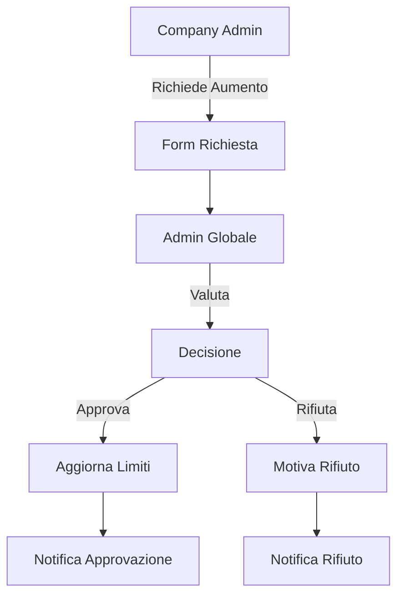

## Notifiche e Alerts

### Sistema di Notifiche

Il sistema include un framework di notifiche per mantenere gli utenti informati su eventi rilevanti:

1. **Notifiche in-app**
   - Appaiono nell'header dell'applicazione
   - Contatore indica notifiche non lette
   - Dropdown mostra elenco notifiche recenti
   - Cliccando su notifica si accede al contesto relativo

2. **Notifiche email**
   - Inviate per eventi critici o che richiedono azione
   - Configurabili per tipo e frequenza
   - Includono link diretti alle sezioni rilevanti

3. **Tipi di notifiche per ruolo**

   **Admin**:
   - Nuove companies registrate
   - Problemi di sistema (errori R2R, code bloccate)
   - Richieste di aumento quote
   - Utilizzo risorse oltre soglie critiche

   **Company**:
   - Nuovi utenti registrati
   - Problemi segnalati dagli utenti
   - Utilizzo risorse oltre soglie di attenzione
   - Risposte a richieste di aumento quote

   **User**:
   - Completamento elaborazione documenti
   - Errori elaborazione documenti
   - Risposte a segnalazioni problemi
   - Notifiche di sistema (manutenzione, aggiornamenti)

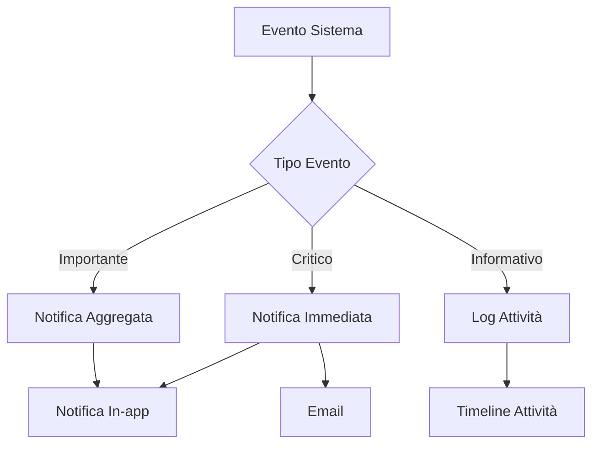

## Responsive Design e Accessibilità

### Design Responsive

L'interfaccia utente è progettata per funzionare su dispositivi di diverse dimensioni:

1. **Layout Adattivo**
   - Desktop: Layout completo con sidebar sempre visibile
   - Tablet: Layout con sidebar collassabile
   - Mobile: Layout verticale con menu hamburger

2. **Componenti Responsive**
   - Tabelle: Scroll orizzontale o visualizzazione a schede su mobile
   - Form: Adattamento campi per schermi piccoli
   - Grafici: Ridimensionamento automatico

3. **Navigazione Contestuale**
   - Breadcrumb per navigazione gerarchica
   - Back button contestuale
   - Menu di navigazione adattivo

### Accessibilità

L'interfaccia rispetta le linee guida WCAG 2.1 AA:

1. **Supporto Tastiera**
   - Navigazione completa tramite tastiera
   - Focus visibile e logico
   - Scorciatoie da tastiera per azioni comuni

2. **Supporto Screen Reader**
   - Etichette ARIA appropriate
   - Testo alternativo per immagini
   - Annunci dinamici per aggiornamenti UI

3. **Design Inclusivo**
   - Contrasto colori adeguato
   - Testo ridimensionabile
   - Modalità dark/light
   - Animazioni ridotte per utenti sensibili

## Conclusioni

I workflow dettagliati per i ruoli Admin, Company e User forniscono una guida completa per l'implementazione dell'interfaccia utente del sistema WebUI multitenant per SciPhi AI R2R. Questi workflow sono progettati per garantire:

1. **Separazione delle responsabilità** tra i diversi ruoli
2. **Isolamento dei dati** tra tenant
3. **Esperienza utente intuitiva** per ciascun ruolo
4. **Scalabilità** per gestire un numero crescente di utenti e documenti
5. **Accessibilità** per tutti gli utenti

L'implementazione di questi workflow con MudBlazor garantirà un'interfaccia moderna, reattiva e facile da usare, rispettando al contempo i requisiti di sicurezza e isolamento dei dati in un ambiente multitenant.
