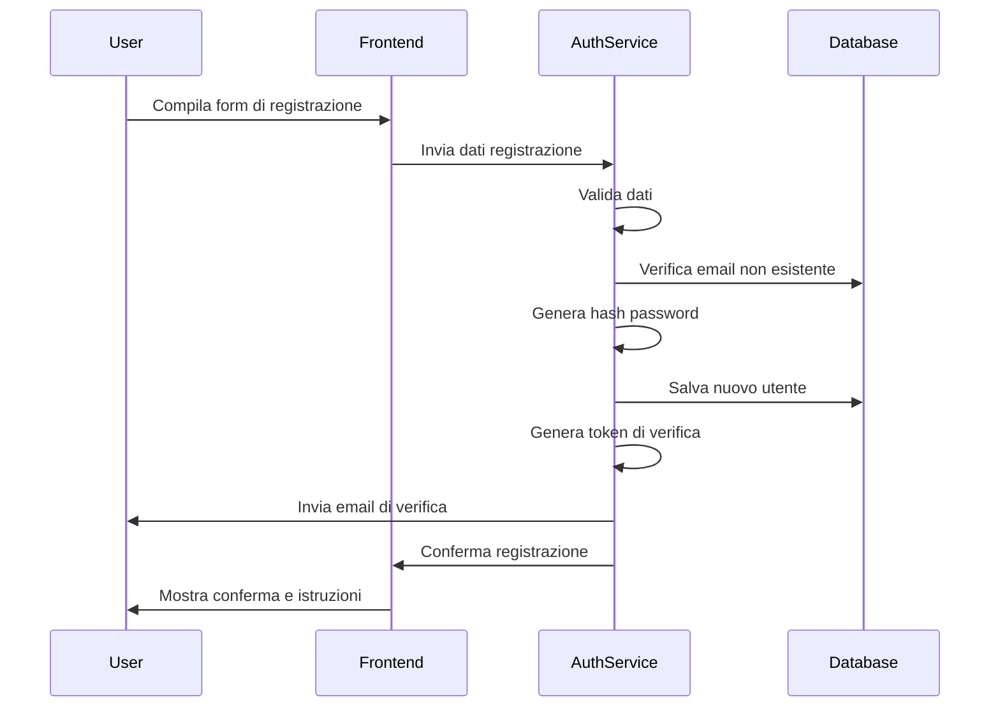
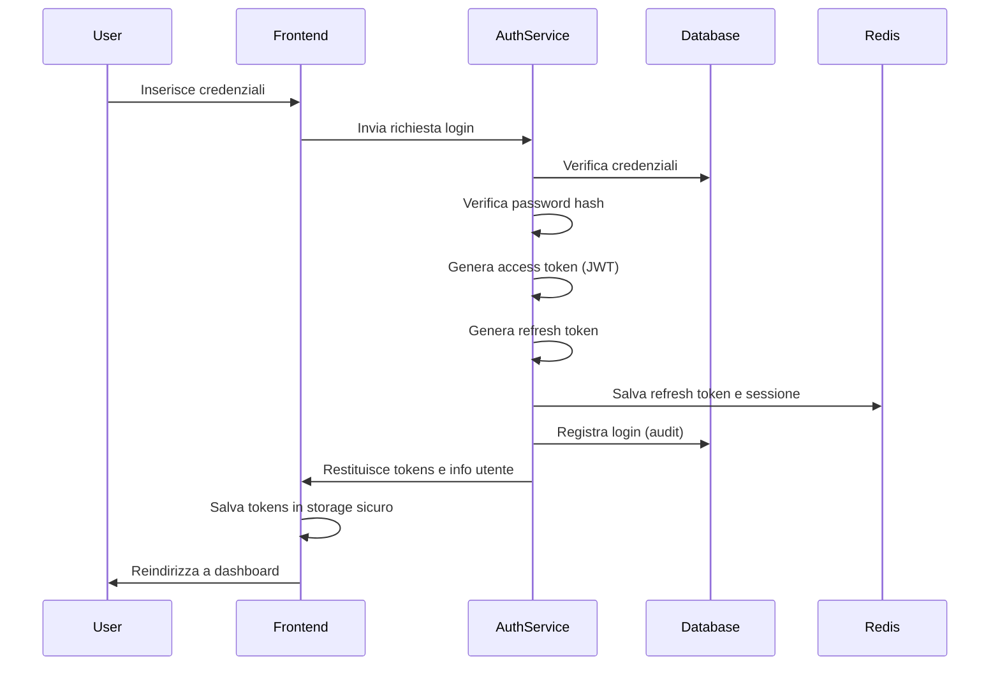
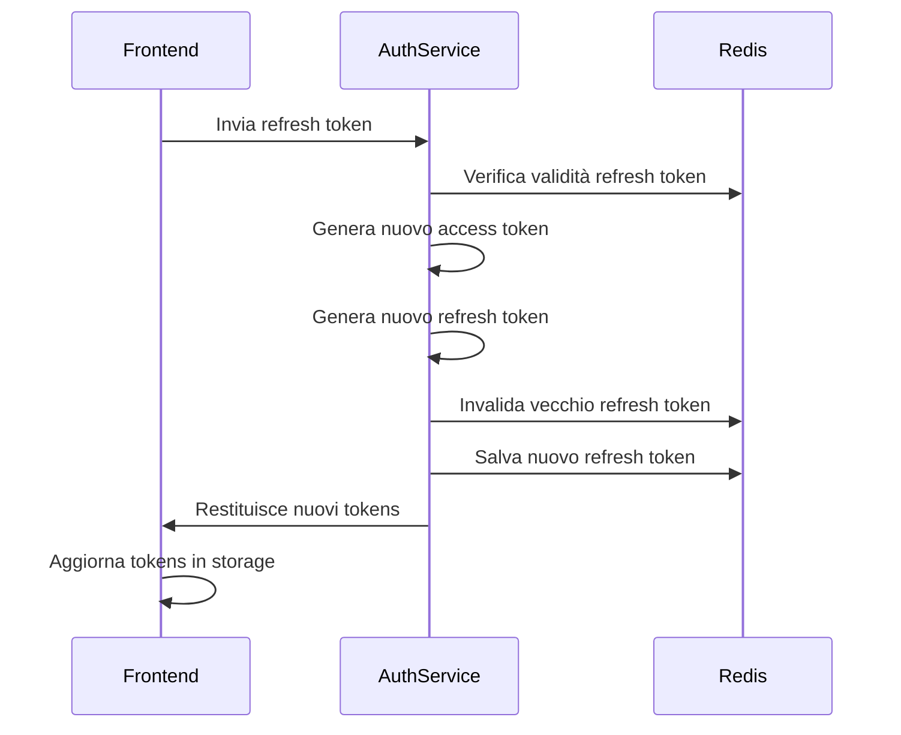
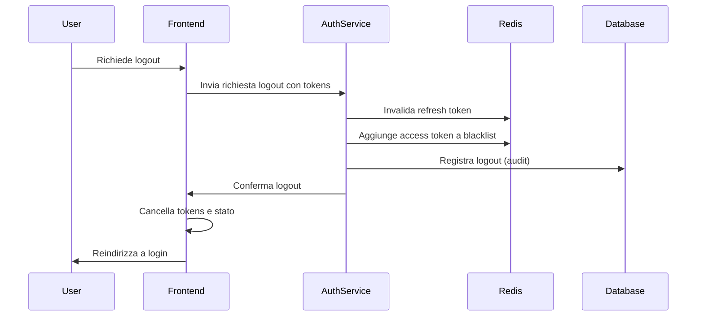
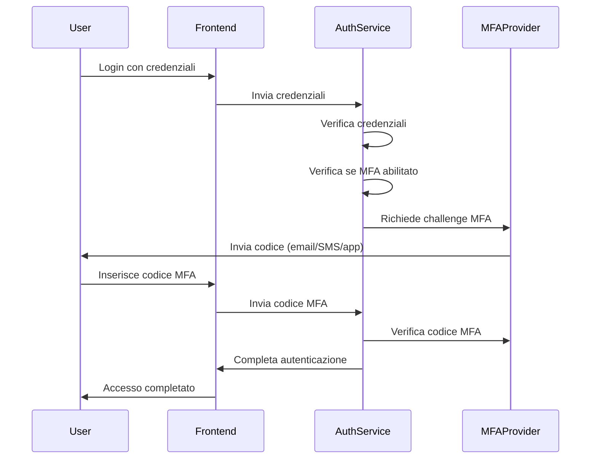
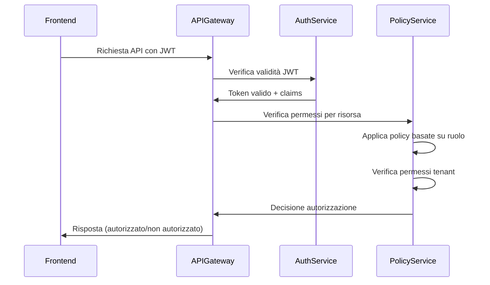
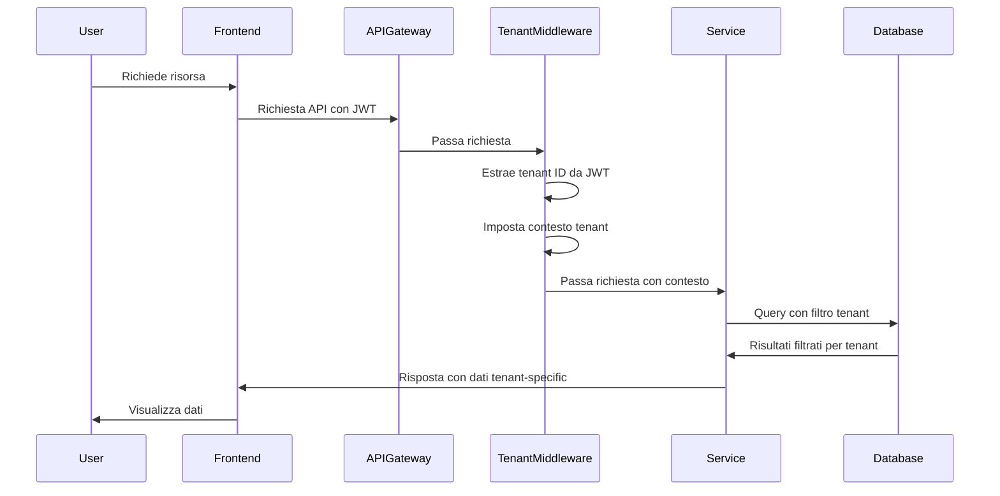
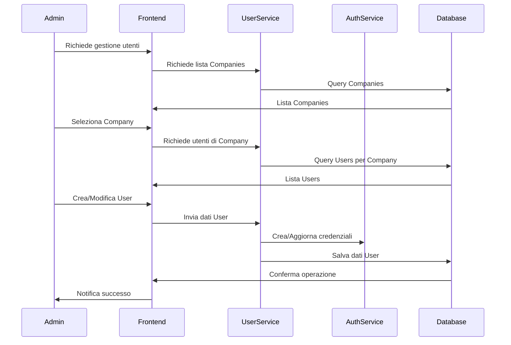
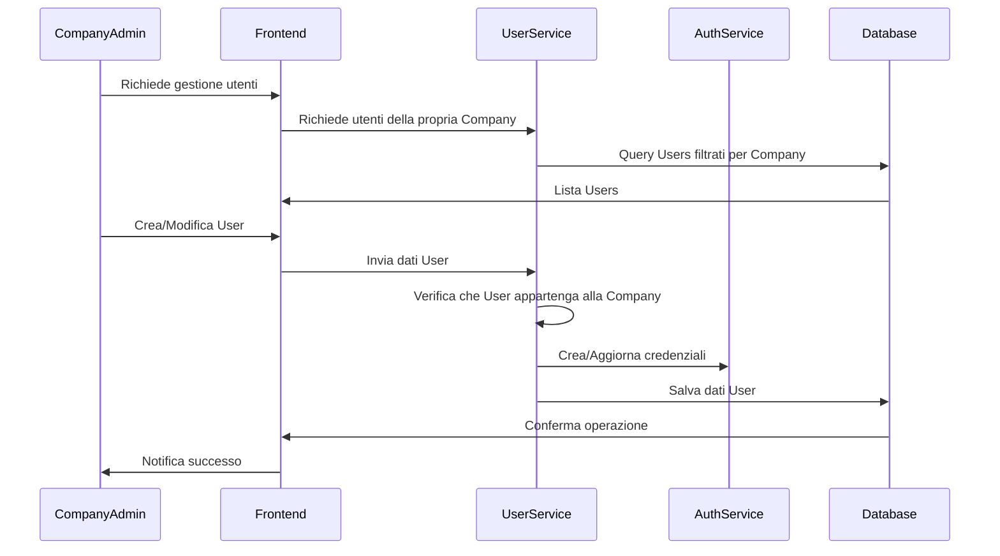

# Flussi di Autenticazione e Autorizzazione per WebUI Multitenant SciPhi AI R2R

## Panoramica

Questo documento descrive i flussi di autenticazione e autorizzazione per il sistema WebUI multitenant di SciPhi AI R2R. Il sistema implementa un modello di sicurezza robusto e scalabile che supporta i tre ruoli principali: Admin, Company e User, ciascuno con permessi e capacità differenziate.

## Architettura di Sicurezza

L'architettura di sicurezza è basata sui seguenti principi:

1. **Autenticazione robusta**: Utilizzo di JWT (JSON Web Tokens) con refresh token
2. **Autorizzazione granulare**: RBAC (Role-Based Access Control) con policy dettagliate
3. **Multitenancy sicura**: Isolamento completo tra tenant
4. **Audit completo**: Logging di tutte le operazioni di sicurezza
5. **Protezione avanzata**: Supporto per MFA e protezione contro attacchi comuni

## Ruoli e Permessi

### Admin (Amministratore di Sistema)

**Descrizione**: Amministratore globale del sistema con accesso completo a tutte le funzionalità.

**Permessi**:
- Gestione completa di Companies (creazione, modifica, disattivazione)
- Gestione completa di Users all'interno delle Companies
- Configurazione delle impostazioni globali del sistema
- Configurazione delle impostazioni globali di R2R API
- Monitoraggio e analisi di tutto il sistema
- Accesso ai log di sistema e audit trail

### Company (Amministratore Aziendale)

**Descrizione**: Amministratore di una specifica azienda/tenant con accesso alle funzionalità relative alla propria azienda.

**Permessi**:
- Gestione degli Users della propria Company
- Visualizzazione e modifica delle impostazioni specifiche della Company
- Monitoraggio dell'utilizzo (documenti creati, interrogazioni effettuate)
- Visualizzazione dei log relativi alla propria Company
- Accesso a tutte le collezioni di documenti degli Users della propria Company
- Interrogazione del chatbot su tutte le collezioni della propria Company

### User (Utente Standard)

**Descrizione**: Utente finale che utilizza il sistema per gestire le proprie collezioni di documenti e interagire con il chatbot.

**Permessi**:
- Gestione delle proprie collezioni di documenti
- Upload e cancellazione di file nelle proprie collezioni
- Interrogazione del chatbot selezionando quali collezioni utilizzare
- Visualizzazione dei propri log e statistiche di utilizzo

## Flussi di Autenticazione

### 1. Registrazione Utente



**Dettagli implementativi**:
- Validazione robusta dei dati di input (email, password, ecc.)
- Password hash con algoritmo bcrypt e salt unico
- Email di verifica con token sicuro a scadenza limitata
- Rate limiting per prevenire abusi

### 2. Login Utente



**Dettagli implementativi**:
- JWT con scadenza breve (15-30 minuti)
- Refresh token con scadenza più lunga (7-14 giorni)
- Memorizzazione sicura dei token nel browser (HttpOnly cookies)
- Rotazione dei refresh token ad ogni utilizzo
- Blacklisting dei token revocati in Redis

### 3. Refresh Token



**Dettagli implementativi**:
- Verifica che il refresh token non sia stato revocato
- Invalidazione immediata del vecchio refresh token
- Controllo dell'IP e/o device fingerprint per sicurezza aggiuntiva

### 4. Logout



**Dettagli implementativi**:
- Invalidazione immediata di tutti i token attivi
- Pulizia completa dello stato dell'applicazione
- Registrazione dell'evento di logout per audit

### 5. Multi-Factor Authentication (MFA)



**Dettagli implementativi**:
- Supporto per diversi metodi MFA (TOTP, SMS, email)
- Codici di backup per recupero emergenza
- Configurazione MFA obbligatoria per Admin e Company, opzionale per User

## Flussi di Autorizzazione

### 1. Verifica Permessi



**Dettagli implementativi**:
- Verifica del token JWT ad ogni richiesta API
- Estrazione dei claims (ruolo, tenant, ecc.) dal token
- Applicazione di policy basate su ruolo e tenant
- Controlli di sicurezza aggiuntivi per operazioni sensibili

### 2. Isolamento Tenant



**Dettagli implementativi**:
- Middleware dedicato per la risoluzione del tenant
- Filtro automatico di tutte le query in base al tenant
- Impossibilità di accedere a dati di altri tenant
- Validazione incrociata dei parametri di richiesta

### 3. Gestione Utenti da parte di Admin



**Dettagli implementativi**:
- Verifica che l'Admin abbia i permessi necessari
- Validazione dei dati utente prima del salvataggio
- Generazione di password temporanee per nuovi utenti
- Notifica via email agli utenti creati/modificati

### 4. Gestione Utenti da parte di Company



**Dettagli implementativi**:
- Filtro automatico per mostrare solo gli utenti della propria Company
- Impossibilità di modificare utenti di altre Companies
- Limitazioni sui ruoli che possono essere assegnati

## Implementazione Tecnica

### JWT Structure

```json
{
  "header": {
    "alg": "RS256",
    "typ": "JWT"
  },
  "payload": {
    "sub": "user123",
    "name": "John Doe",
    "email": "john@example.com",
    "role": "User",
    "companyId": "company456",
    "tenantId": "tenant789",
    "permissions": ["read:documents", "write:documents", "read:collections"],
    "iat": 1625176800,
    "exp": 1625178600,
    "iss": "r2r-webui",
    "aud": "r2r-api"
  },
  "signature": "..."
}
```

### Policy Definition (esempio per ruolo User)

```csharp
public class UserPolicy : IAuthorizationPolicy
{
    public Task<AuthorizationResult> EvaluateAsync(AuthorizationContext context)
    {
        // Verifica che l'utente abbia il ruolo User
        if (!context.User.IsInRole("User"))
            return Task.FromResult(AuthorizationResult.Fail("Ruolo non autorizzato"));
        
        // Verifica che l'utente stia accedendo alle proprie risorse
        var resourceUserId = context.Resource.GetUserId();
        var currentUserId = context.User.GetUserId();
        
        if (resourceUserId != currentUserId)
            return Task.FromResult(AuthorizationResult.Fail("Accesso non autorizzato a risorse di altri utenti"));
        
        // Verifica limiti di quota
        var quotaService = context.GetService<IQuotaService>();
        var isWithinQuota = await quotaService.CheckQuotaAsync(currentUserId, context.Action);
        
        if (!isWithinQuota)
            return Task.FromResult(AuthorizationResult.Fail("Quota superata"));
        
        return Task.FromResult(AuthorizationResult.Success());
    }
}
```

### Middleware per Risoluzione Tenant

```csharp
public class TenantResolutionMiddleware
{
    private readonly RequestDelegate _next;
    
    public TenantResolutionMiddleware(RequestDelegate next)
    {
        _next = next;
    }
    
    public async Task InvokeAsync(HttpContext context, ITenantContextAccessor tenantContextAccessor)
    {
        // Estrai tenant ID dal token JWT
        var tenantId = context.User.FindFirst("tenantId")?.Value;
        
        if (string.IsNullOrEmpty(tenantId))
        {
            context.Response.StatusCode = 401;
            await context.Response.WriteAsync("Tenant non specificato");
            return;
        }
        
        // Imposta il contesto tenant per questa richiesta
        tenantContextAccessor.SetCurrentTenant(tenantId);
        
        // Continua con la pipeline
        await _next(context);
    }
}
```

## Considerazioni di Sicurezza

### Protezione contro Attacchi Comuni

1. **Cross-Site Scripting (XSS)**
   - Utilizzo di Content Security Policy (CSP)
   - Sanitizzazione di tutti gli input utente
   - Encoding appropriato dell'output

2. **Cross-Site Request Forgery (CSRF)**
   - Token anti-CSRF per tutte le richieste POST/PUT/DELETE
   - Validazione dell'origine delle richieste
   - SameSite cookie policy

3. **SQL Injection**
   - Utilizzo di query parametrizzate
   - ORM con protezione integrata
   - Validazione degli input

4. **Brute Force**
   - Rate limiting per tentativi di login
   - Blocco temporaneo degli account dopo tentativi falliti
   - CAPTCHA per login sospetti

### Audit e Logging

Tutte le operazioni di sicurezza vengono registrate in log dedicati:

1. **Eventi di Autenticazione**
   - Login (successo/fallimento)
   - Logout
   - Reset password
   - Modifica credenziali

2. **Eventi di Autorizzazione**
   - Tentativi di accesso non autorizzati
   - Modifiche ai permessi
   - Elevazione di privilegi

3. **Operazioni Amministrative**
   - Creazione/modifica/eliminazione di utenti
   - Modifica delle impostazioni di sistema
   - Modifica delle configurazioni di sicurezza

## Integrazione con R2R API

L'autenticazione e l'autorizzazione per le chiamate al server R2R API vengono gestite come segue:

1. **Autenticazione verso R2R**
   - Utilizzo di API key specifiche per tenant
   - Rotazione periodica delle API key
   - Memorizzazione sicura delle API key (crittografate nel database)

2. **Autorizzazione per Operazioni R2R**
   - Mapping dei permessi interni ai permessi R2R
   - Verifica delle quote prima di inoltrare richieste
   - Logging di tutte le chiamate API

## Conclusioni

Il sistema di autenticazione e autorizzazione proposto è progettato per essere robusto, sicuro e scalabile, supportando i requisiti di un'applicazione multitenant enterprise-grade. L'utilizzo di JWT con refresh token, RBAC con policy granulari, e un sistema completo di audit garantisce la sicurezza e la tracciabilità di tutte le operazioni, mentre l'isolamento dei tenant assicura la privacy e la separazione dei dati tra le diverse aziende.
