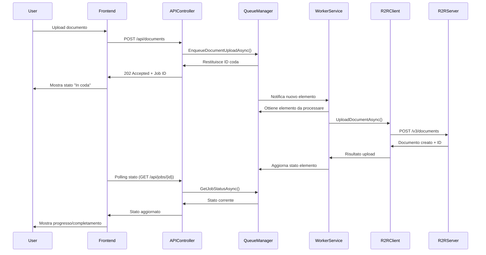
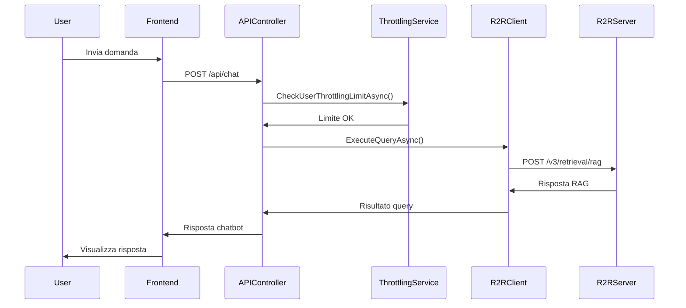
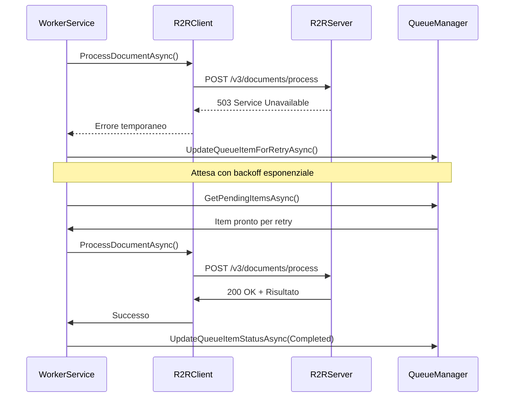

# Integrazione con R2R e Sistema di Gestione Code

## Panoramica

Questo documento descrive l'integrazione tecnica tra il backend API server e il server SciPhi AI R2R API, con particolare attenzione al sistema avanzato di gestione code per l'upload e l'elaborazione dei documenti. L'architettura è progettata per essere robusta, scalabile e resiliente, gestendo efficacemente i limiti di elaborazione di R2R.

## Architettura di Integrazione

L'integrazione tra il backend API server e il server R2R è basata su un'architettura a microservizi con pattern di comunicazione asincrona, implementando i seguenti principi:

1. **Disaccoppiamento**: Separazione tra richieste client e elaborazione R2R
2. **Resilienza**: Gestione robusta di errori e fallimenti
3. **Scalabilità**: Capacità di gestire carichi variabili
4. **Osservabilità**: Monitoraggio completo di tutte le operazioni

### Diagramma di Integrazione

```
┌─────────────────┐     ┌─────────────────┐     ┌─────────────────┐
│                 │     │                 │     │                 │
│  Frontend       │     │  Backend        │     │  R2R API Server │
│  Blazor         │◄────┤  API Server     │◄────┤  (Esistente)    │
│                 │     │                 │     │                 │
└─────────────────┘     └────────┬────────┘     └────────┬────────┘
                                 │                       │
                        ┌────────▼────────┐     ┌────────▼────────┐
                        │                 │     │                 │
                        │  Queue System   │     │  Redis Cache    │
                        │                 │     │                 │
                        └─────────────────┘     └─────────────────┘
```

## Client R2R

Il backend API server include un client R2R dedicato che gestisce tutte le comunicazioni con il server R2R API.

### Caratteristiche del Client R2R

1. **Configurazione Dinamica**:
   - Endpoint configurabile (http://192.168.1.4:7272)
   - Timeout e retry personalizzabili
   - Supporto per API key specifiche per tenant

2. **Gestione Errori**:
   - Categorizzazione degli errori (temporanei vs. permanenti)
   - Retry automatico con backoff esponenziale
   - Circuit breaker per prevenire cascate di errori

3. **Monitoraggio**:
   - Logging dettagliato di tutte le chiamate
   - Metriche di performance (latenza, tasso di successo)
   - Alerting per problemi critici

### Implementazione del Client R2R

```csharp
public class R2RClient : IR2RClient
{
    private readonly HttpClient _httpClient;
    private readonly ILogger<R2RClient> _logger;
    private readonly CircuitBreakerPolicy _circuitBreaker;
    private readonly RetryPolicy _retryPolicy;
    
    public R2RClient(HttpClient httpClient, IOptions<R2ROptions> options, ILogger<R2RClient> logger)
    {
        _httpClient = httpClient;
        _logger = logger;
        
        // Configura l'HttpClient
        _httpClient.BaseAddress = new Uri(options.Value.ApiEndpoint);
        _httpClient.Timeout = TimeSpan.FromSeconds(options.Value.TimeoutSeconds);
        
        // Configura le policy di resilienza
        _retryPolicy = Policy
            .Handle<HttpRequestException>()
            .Or<TimeoutException>()
            .WaitAndRetryAsync(
                options.Value.MaxRetries,
                retryAttempt => TimeSpan.FromSeconds(Math.Pow(2, retryAttempt)),
                onRetry: (exception, timeSpan, retryCount, context) =>
                {
                    _logger.LogWarning(exception, "Retry {RetryCount} after {TimeSpan}s delay due to: {Message}",
                        retryCount, timeSpan.TotalSeconds, exception.Message);
                });
                
        _circuitBreaker = Policy
            .Handle<HttpRequestException>()
            .CircuitBreakerAsync(
                options.Value.CircuitBreakerThreshold,
                TimeSpan.FromMinutes(options.Value.CircuitBreakerDurationMinutes),
                onBreak: (ex, breakDelay) =>
                {
                    _logger.LogError(ex, "Circuit breaker opened for {BreakDelay}m", breakDelay.TotalMinutes);
                },
                onReset: () =>
                {
                    _logger.LogInformation("Circuit breaker reset");
                });
    }
    
    public async Task<DocumentResponse> CreateDocumentAsync(DocumentRequest request, string apiKey, CancellationToken cancellationToken = default)
    {
        return await ExecuteWithResilienceAsync<DocumentResponse>(
            async () =>
            {
                var content = new MultipartFormDataContent();
                // Aggiungi file e metadati al content
                
                _httpClient.DefaultRequestHeaders.Authorization = new AuthenticationHeaderValue("Bearer", apiKey);
                var response = await _httpClient.PostAsync("/v3/documents", content, cancellationToken);
                response.EnsureSuccessStatusCode();
                
                return await response.Content.ReadFromJsonAsync<DocumentResponse>();
            });
    }
    
    // Altri metodi per le diverse API di R2R
    
    private async Task<T> ExecuteWithResilienceAsync<T>(Func<Task<T>> action)
    {
        return await _retryPolicy.WrapAsync(_circuitBreaker).ExecuteAsync(action);
    }
}
```

## Sistema di Gestione Code

Il sistema di gestione code è progettato per gestire efficacemente i limiti di elaborazione di R2R, garantendo che le richieste vengano processate in modo ordinato e controllato.

### Architettura del Sistema di Code

```
┌─────────────────┐     ┌─────────────────┐     ┌─────────────────┐
│                 │     │                 │     │                 │
│  API Endpoints  │────►│  Queue Manager  │────►│  Worker Service │
│                 │     │                 │     │                 │
└─────────────────┘     └────────┬────────┘     └────────┬────────┘
                                 │                       │
                        ┌────────▼────────┐     ┌────────▼────────┐
                        │                 │     │                 │
                        │  Queue Storage  │     │  R2R Client     │
                        │                 │     │                 │
                        └─────────────────┘     └─────────────────┘
```

### Componenti del Sistema di Code

1. **Queue Manager**:
   - Gestisce l'inserimento di nuovi elementi in coda
   - Implementa prioritizzazione e throttling
   - Monitora lo stato delle code

2. **Queue Storage**:
   - Memorizza gli elementi in coda in modo persistente
   - Supporta transazioni e operazioni atomiche
   - Garantisce durabilità anche in caso di riavvii

3. **Worker Service**:
   - Processa gli elementi in coda in background
   - Gestisce il parallelismo controllato
   - Implementa retry e gestione errori

### Tipi di Code

Il sistema implementa diverse code specializzate:

1. **DocumentUploadQueue**: Per l'upload di nuovi documenti
2. **DocumentProcessingQueue**: Per l'elaborazione di documenti già caricati
3. **EntityExtractionQueue**: Per l'estrazione di entità dai documenti
4. **MaintenanceQueue**: Per operazioni di manutenzione (pulizia, ottimizzazione)

### Prioritizzazione

Le code implementano un sistema di priorità basato su:

1. **Tenant**: Possibilità di assegnare priorità diverse a tenant diversi
2. **Tipo di Operazione**: Operazioni interattive hanno priorità maggiore
3. **Tempo di Attesa**: Prevenzione della starvation con aging
4. **SLA**: Rispetto di Service Level Agreement configurabili

### Implementazione del Queue Manager

```csharp
public class QueueManager : IQueueManager
{
    private readonly IQueueStorage _queueStorage;
    private readonly ILogger<QueueManager> _logger;
    private readonly IOptions<QueueOptions> _options;
    private readonly ITenantService _tenantService;
    private readonly IThrottlingService _throttlingService;
    
    public QueueManager(
        IQueueStorage queueStorage,
        ILogger<QueueManager> logger,
        IOptions<QueueOptions> options,
        ITenantService tenantService,
        IThrottlingService throttlingService)
    {
        _queueStorage = queueStorage;
        _logger = logger;
        _options = options;
        _tenantService = tenantService;
        _throttlingService = throttlingService;
    }
    
    public async Task<string> EnqueueDocumentUploadAsync(DocumentUploadRequest request, int userId, int companyId)
    {
        // Verifica limiti di throttling
        if (!await _throttlingService.CheckThrottlingLimitAsync(companyId, ThrottlingType.DocumentUpload))
        {
            throw new ThrottlingException("Limite di upload documenti raggiunto");
        }
        
        // Crea l'elemento in coda
        var queueItem = new QueueItem
        {
            QueueName = QueueNames.DocumentUpload,
            ItemType = typeof(DocumentUploadRequest).Name,
            ItemData = JsonSerializer.Serialize(request),
            Status = QueueItemStatus.Pending,
            Priority = await CalculatePriorityAsync(companyId, QueueNames.DocumentUpload),
            CompanyId = companyId,
            UserId = userId,
            CreatedAt = DateTime.UtcNow
        };
        
        // Salva in coda
        var queueItemId = await _queueStorage.SaveQueueItemAsync(queueItem);
        
        _logger.LogInformation("Document upload request enqueued with ID {QueueItemId} for company {CompanyId}", queueItemId, companyId);
        
        return queueItemId;
    }
    
    private async Task<int> CalculatePriorityAsync(int companyId, string queueName)
    {
        // Ottieni priorità base per il tenant
        var tenantPriority = await _tenantService.GetTenantPriorityAsync(companyId);
        
        // Priorità base per tipo di coda
        var queuePriority = queueName switch
        {
            QueueNames.DocumentUpload => _options.Value.DocumentUploadBasePriority,
            QueueNames.DocumentProcessing => _options.Value.DocumentProcessingBasePriority,
            QueueNames.EntityExtraction => _options.Value.EntityExtractionBasePriority,
            _ => 0
        };
        
        // Combina le priorità
        return tenantPriority + queuePriority;
    }
    
    // Altri metodi per gestire diverse tipologie di elementi in coda
}
```

### Implementazione del Worker Service

```csharp
public class DocumentProcessingWorker : BackgroundService
{
    private readonly IQueueStorage _queueStorage;
    private readonly IR2RClient _r2rClient;
    private readonly ILogger<DocumentProcessingWorker> _logger;
    private readonly IOptions<WorkerOptions> _options;
    private readonly IServiceScopeFactory _scopeFactory;
    
    public DocumentProcessingWorker(
        IQueueStorage queueStorage,
        IR2RClient r2rClient,
        ILogger<DocumentProcessingWorker> logger,
        IOptions<WorkerOptions> options,
        IServiceScopeFactory scopeFactory)
    {
        _queueStorage = queueStorage;
        _r2rClient = r2rClient;
        _logger = logger;
        _options = options;
        _scopeFactory = scopeFactory;
    }
    
    protected override async Task ExecuteAsync(CancellationToken stoppingToken)
    {
        _logger.LogInformation("Document Processing Worker starting");
        
        while (!stoppingToken.IsCancellationRequested)
        {
            try
            {
                // Ottieni elementi in coda da processare
                var queueItems = await _queueStorage.GetPendingItemsAsync(
                    QueueNames.DocumentProcessing,
                    _options.Value.BatchSize,
                    stoppingToken);
                
                if (queueItems.Any())
                {
                    _logger.LogInformation("Processing {Count} document processing requests", queueItems.Count);
                    
                    // Processa in parallelo con limite di concorrenza
                    await Parallel.ForEachAsync(
                        queueItems,
                        new ParallelOptions
                        {
                            MaxDegreeOfParallelism = _options.Value.MaxConcurrency,
                            CancellationToken = stoppingToken
                        },
                        async (item, ct) => await ProcessQueueItemAsync(item, ct));
                }
                else
                {
                    // Nessun elemento da processare, attendi
                    await Task.Delay(_options.Value.PollingInterval, stoppingToken);
                }
            }
            catch (Exception ex) when (ex is not OperationCanceledException)
            {
                _logger.LogError(ex, "Error in document processing worker");
                await Task.Delay(TimeSpan.FromSeconds(5), stoppingToken);
            }
        }
    }
    
    private async Task ProcessQueueItemAsync(QueueItem item, CancellationToken cancellationToken)
    {
        try
        {
            // Aggiorna stato a "In elaborazione"
            await _queueStorage.UpdateQueueItemStatusAsync(
                item.QueueItemId,
                QueueItemStatus.Processing,
                processingStartedAt: DateTime.UtcNow);
            
            // Deserializza la richiesta
            var request = JsonSerializer.Deserialize<DocumentProcessingRequest>(item.ItemData);
            
            using (var scope = _scopeFactory.CreateScope())
            {
                // Ottieni servizi necessari dallo scope
                var tenantService = scope.ServiceProvider.GetRequiredService<ITenantService>();
                var apiKey = await tenantService.GetR2RApiKeyAsync(item.CompanyId);
                
                // Chiama R2R API
                var response = await _r2rClient.ProcessDocumentAsync(request, apiKey, cancellationToken);
                
                // Aggiorna stato a "Completato"
                await _queueStorage.UpdateQueueItemStatusAsync(
                    item.QueueItemId,
                    QueueItemStatus.Completed,
                    completedAt: DateTime.UtcNow);
                
                _logger.LogInformation("Document processing completed for queue item {QueueItemId}", item.QueueItemId);
            }
        }
        catch (Exception ex)
        {
            _logger.LogError(ex, "Error processing queue item {QueueItemId}", item.QueueItemId);
            
            // Incrementa contatore retry
            if (item.RetryCount < item.MaxRetries)
            {
                // Calcola prossimo retry con backoff esponenziale
                var nextRetryDelay = TimeSpan.FromSeconds(Math.Pow(2, item.RetryCount + 1));
                var nextRetryAt = DateTime.UtcNow.Add(nextRetryDelay);
                
                await _queueStorage.UpdateQueueItemForRetryAsync(
                    item.QueueItemId,
                    item.RetryCount + 1,
                    nextRetryAt,
                    ex.Message);
                
                _logger.LogWarning(
                    "Queue item {QueueItemId} scheduled for retry {RetryCount}/{MaxRetries} at {NextRetryAt}",
                    item.QueueItemId, item.RetryCount + 1, item.MaxRetries, nextRetryAt);
            }
            else
            {
                // Massimo numero di retry raggiunto
                await _queueStorage.UpdateQueueItemStatusAsync(
                    item.QueueItemId,
                    QueueItemStatus.Failed,
                    errorMessage: ex.Message);
                
                _logger.LogError(
                    "Queue item {QueueItemId} failed after {MaxRetries} retries",
                    item.QueueItemId, item.MaxRetries);
            }
        }
    }
}
```

## Throttling e Rate Limiting

Il sistema implementa meccanismi di throttling e rate limiting per prevenire sovraccarichi del server R2R.

### Livelli di Throttling

1. **Per Tenant**: Limiti specifici per ogni tenant
2. **Per Utente**: Limiti per singolo utente all'interno di un tenant
3. **Globale**: Limiti complessivi per l'intero sistema

### Implementazione del Throttling Service

```csharp
public class ThrottlingService : IThrottlingService
{
    private readonly IDistributedCache _cache;
    private readonly IOptions<ThrottlingOptions> _options;
    private readonly ILogger<ThrottlingService> _logger;
    
    public ThrottlingService(
        IDistributedCache cache,
        IOptions<ThrottlingOptions> options,
        ILogger<ThrottlingService> logger)
    {
        _cache = cache;
        _options = options;
        _logger = logger;
    }
    
    public async Task<bool> CheckThrottlingLimitAsync(int companyId, ThrottlingType throttlingType)
    {
        // Ottieni chiave cache per questo tipo di throttling e tenant
        var cacheKey = $"throttling:{throttlingType}:{companyId}";
        
        // Ottieni contatore corrente
        var counterBytes = await _cache.GetAsync(cacheKey);
        var counter = counterBytes != null ? BitConverter.ToInt32(counterBytes) : 0;
        
        // Ottieni limite configurato
        var limit = throttlingType switch
        {
            ThrottlingType.DocumentUpload => _options.Value.DocumentUploadLimitPerHour,
            ThrottlingType.QueryExecution => _options.Value.QueryExecutionLimitPerHour,
            _ => 100 // Default
        };
        
        // Verifica se il limite è stato raggiunto
        if (counter >= limit)
        {
            _logger.LogWarning(
                "Throttling limit reached for company {CompanyId}, type {ThrottlingType}: {Counter}/{Limit}",
                companyId, throttlingType, counter, limit);
            return false;
        }
        
        // Incrementa contatore
        counter++;
        await _cache.SetAsync(
            cacheKey,
            BitConverter.GetBytes(counter),
            new DistributedCacheEntryOptions
            {
                AbsoluteExpirationRelativeToNow = TimeSpan.FromHours(1)
            });
        
        return true;
    }
    
    public async Task<bool> CheckUserThrottlingLimitAsync(int userId, int companyId, ThrottlingType throttlingType)
    {
        // Implementazione simile ma specifica per utente
        // ...
    }
    
    public async Task ResetThrottlingCountersAsync(int companyId)
    {
        // Reset di tutti i contatori per un tenant
        foreach (ThrottlingType type in Enum.GetValues(typeof(ThrottlingType)))
        {
            var cacheKey = $"throttling:{type}:{companyId}";
            await _cache.RemoveAsync(cacheKey);
        }
    }
}
```

## Monitoraggio e Osservabilità

Il sistema implementa meccanismi completi di monitoraggio e osservabilità per garantire la trasparenza delle operazioni.

### Metriche Monitorate

1. **Coda**:
   - Lunghezza della coda
   - Tempo di attesa medio
   - Tasso di elaborazione
   - Tasso di errori

2. **R2R API**:
   - Latenza delle chiamate
   - Tasso di successo/errore
   - Stato del circuit breaker

3. **Risorse**:
   - Utilizzo CPU/memoria
   - Connessioni di rete
   - Utilizzo disco

### Dashboard di Monitoraggio

Il sistema include una dashboard di monitoraggio accessibile agli amministratori, che visualizza:

1. **Stato delle Code**: Visualizzazione in tempo reale dello stato delle code
2. **Metriche di Performance**: Grafici di performance e utilizzo risorse
3. **Alerting**: Notifiche per condizioni anomale
4. **Audit Trail**: Registro completo delle operazioni

## Flussi di Integrazione

### 1. Upload e Processamento Documento



### 2. Interrogazione Chatbot



### 3. Gestione Errori e Retry



## Configurazione e Ottimizzazione

### Parametri Configurabili

1. **Connessione R2R**:
   - Endpoint API
   - Timeout
   - Numero massimo di retry
   - Parametri circuit breaker

2. **Code**:
   - Dimensione batch
   - Intervallo di polling
   - Concorrenza massima
   - Priorità per tipo di operazione

3. **Throttling**:
   - Limiti per tenant
   - Limiti per utente
   - Periodi di reset

### Ottimizzazione delle Performance

1. **Caching**:
   - Cache dei risultati di query frequenti
   - Cache delle configurazioni
   - Cache delle informazioni di autenticazione

2. **Batch Processing**:
   - Raggruppamento di operazioni simili
   - Elaborazione in batch quando possibile

3. **Compressione**:
   - Compressione dei dati trasmessi
   - Ottimizzazione dimensione payload

## Considerazioni di Sicurezza

1. **Protezione API Key**:
   - Crittografia delle API key in storage
   - Rotazione periodica delle chiavi
   - Accesso limitato alle chiavi

2. **Validazione Input**:
   - Validazione di tutti gli input utente
   - Sanitizzazione dei dati prima dell'invio a R2R
   - Controlli di sicurezza sui file caricati

3. **Audit e Logging**:
   - Logging di tutte le operazioni critiche
   - Audit trail completo per operazioni di sicurezza
   - Monitoraggio per attività sospette

## Conclusioni

L'integrazione con R2R e il sistema di gestione code proposti sono progettati per essere robusti, scalabili e resilienti, gestendo efficacemente i limiti di elaborazione di R2R. L'architettura asincrona con code persistenti garantisce che nessuna operazione venga persa, mentre i meccanismi di resilienza assicurano il corretto funzionamento anche in presenza di errori temporanei. Il sistema di monitoraggio completo fornisce visibilità su tutte le operazioni, permettendo di identificare e risolvere rapidamente eventuali problemi.
