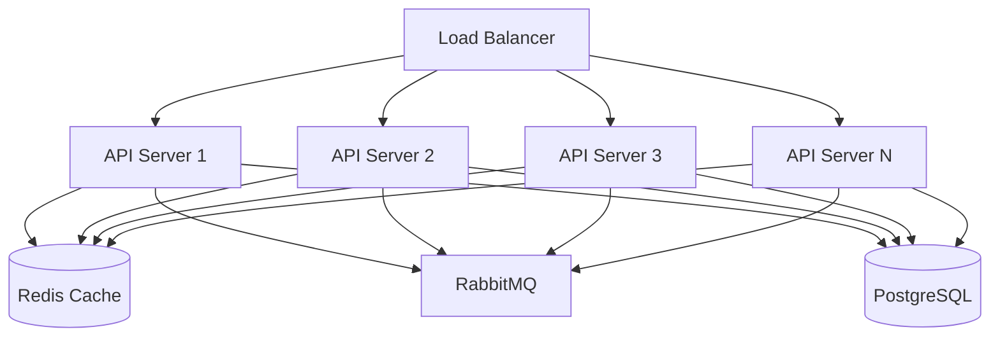
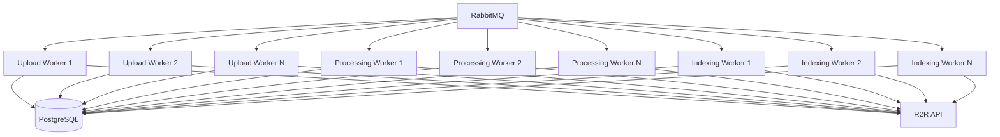
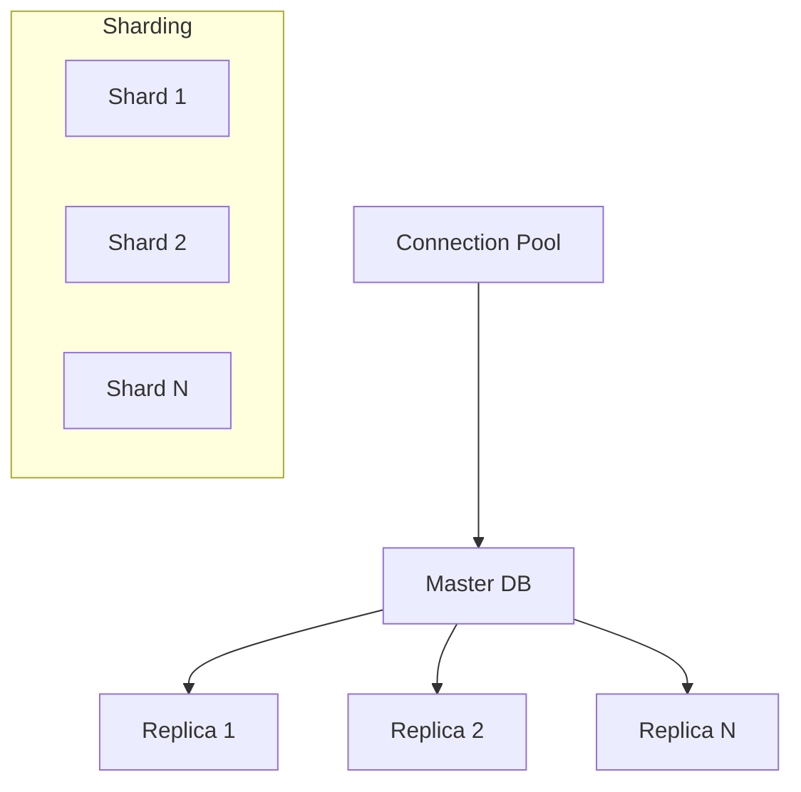
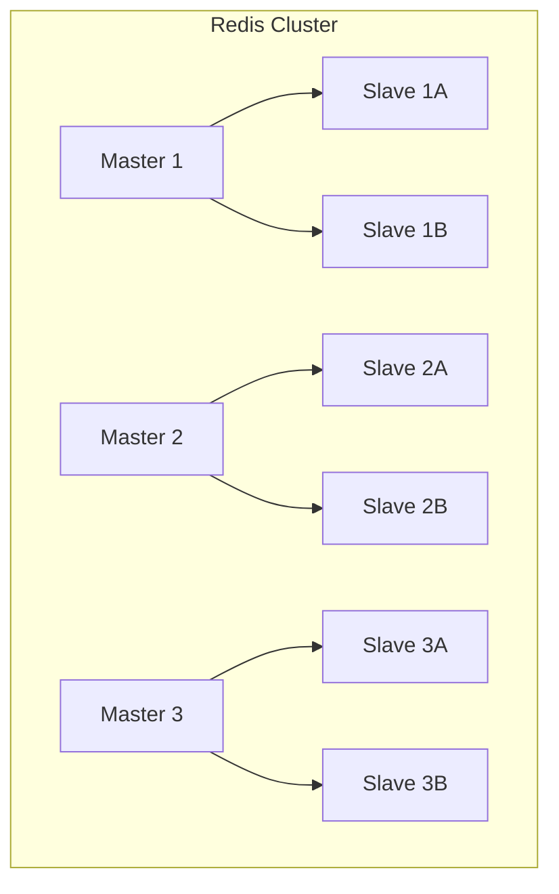
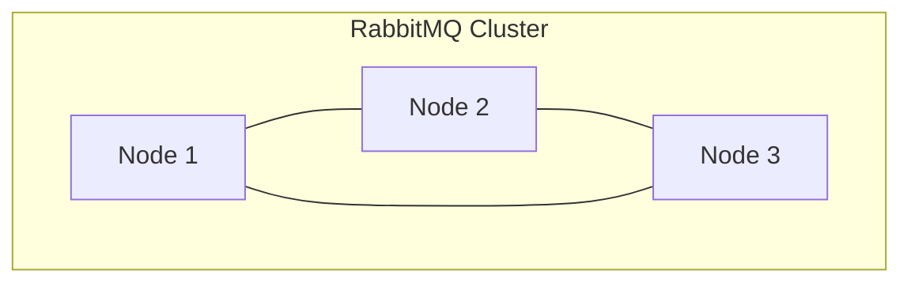
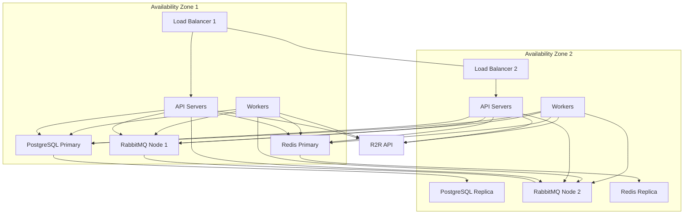

# Stima di Scalabilità e Robustezza del Sistema

## Panoramica

Questo documento fornisce una valutazione approfondita della scalabilità e robustezza del sistema WebUI multitenant per SciPhi AI R2R, con raccomandazioni enterprise-grade per garantire prestazioni, affidabilità e resilienza in ambienti di produzione ad alto carico. L'analisi copre dimensionamento, strategie di scaling, punti di failure, meccanismi di resilienza e raccomandazioni hardware/software.

## Dimensionamento e Capacità

### Stima Carico di Lavoro

Per dimensionare correttamente il sistema, consideriamo i seguenti parametri di carico:

| Parametro | Stima Base | Stima Media | Stima Alta |
|-----------|------------|-------------|------------|
| Numero di Companies | 10 | 50 | 200 |
| Utenti per Company | 5 | 20 | 100 |
| Utenti Concorrenti | 10 | 50 | 250 |
| Collezioni per Company | 20 | 100 | 500 |
| Documenti per Collezione | 50 | 200 | 1.000 |
| Dimensione Media Documento | 2 MB | 5 MB | 10 MB |
| Upload Documenti/Ora | 50 | 200 | 1.000 |
| Query Chatbot/Ora | 100 | 500 | 2.500 |
| Dimensione DB (Anno 1) | 100 GB | 500 GB | 2 TB |

### Requisiti di Storage

1. **Database PostgreSQL**:
   - Dati strutturati: 20-30% della dimensione totale documenti
   - Indici: 10-15% della dimensione dati
   - Logs e WAL: 5-10% della dimensione dati
   - Spazio totale: 1.5-2x dimensione dati stimata

2. **Storage Documenti Temporanei**:
   - Picco upload concorrenti: 2-3x upload/ora × dimensione media
   - Buffer elaborazione: 5-10x dimensione media documento

3. **Redis Cache**:
   - Working set: 10-15% dei dati attivi
   - Overhead: 20-30% per strutture dati Redis
   - Raccomandazione: 2-4 GB per istanza iniziale, scalabile

4. **RabbitMQ**:
   - Dimensionamento code: 2-3x picco messaggi/minuto
   - Persistenza: 1-2 GB per nodo iniziale

### Requisiti di Elaborazione

1. **API Server**:
   - CPU: 2-4 vCPU per istanza
   - Memoria: 4-8 GB per istanza
   - Istanze iniziali: 2-3 (min)
   - Scaling: +1 istanza ogni 50 utenti concorrenti

2. **Worker Services**:
   - CPU: 2-4 vCPU per istanza
   - Memoria: 4-8 GB per istanza
   - Istanze iniziali: 2-3 per tipo di worker
   - Scaling: +1 istanza ogni 100 documenti/ora

3. **Database**:
   - CPU: 4-8 vCPU per nodo
   - Memoria: 16-32 GB per nodo
   - Storage: SSD ad alte prestazioni
   - IOPS richiesti: 1000-5000 IOPS

4. **Redis**:
   - CPU: 2-4 vCPU per nodo
   - Memoria: 8-16 GB per nodo (principalmente in-memory)

5. **RabbitMQ**:
   - CPU: 2-4 vCPU per nodo
   - Memoria: 4-8 GB per nodo

## Strategie di Scaling

### Scaling Orizzontale

Il sistema è progettato per supportare lo scaling orizzontale di tutti i componenti principali:

1. **API Server**:
   - Architettura stateless per facilitare scaling orizzontale
   - Load balancer con sticky sessions per ottimizzare caching
   - Auto-scaling basato su metriche di utilizzo CPU e richieste/secondo
   - Health checks per rimozione automatica istanze problematiche

2. **Worker Services**:
   - Scaling indipendente per ogni tipo di worker
   - Consumo parallelo da code RabbitMQ con prefetch limit
   - Auto-scaling basato su lunghezza code e latenza elaborazione
   - Deployment blue/green per aggiornamenti senza downtime

3. **Database PostgreSQL**:
   - Replica read per scaling letture
   - Sharding per tenant per scaling scritture
   - Connection pooling con PgBouncer
   - Partitioning tabelle per performance con grandi volumi

4. **Redis Cache**:
   - Cluster Redis per sharding dati
   - Replica read per scaling letture
   - Persistenza AOF per durabilità
   - Eviction policies configurate per gestione memoria

5. **RabbitMQ**:
   - Cluster con mirroring code
   - Federazione per distribuzione geografica
   - Shovel per bilanciamento carico
   - Lazy queues per gestione picchi

### Scaling Verticale

Sebbene il sistema sia progettato principalmente per scaling orizzontale, alcuni componenti beneficiano anche di scaling verticale:

1. **Database PostgreSQL**:
   - Aumento CPU/RAM per query complesse
   - Storage SSD ad alte prestazioni
   - Ottimizzazione configurazione per memoria disponibile

2. **Redis Cache**:
   - Aumento memoria per maggiore hit rate
   - CPU più potenti per operazioni complesse (sorted sets, lua scripts)

3. **Worker Services specializzati**:
   - Istanze ad alta memoria per elaborazione documenti grandi
   - Istanze ottimizzate per CPU per operazioni intensive

## Punti di Failure e Mitigazione

### Single Points of Failure (SPOF)

Identificazione e mitigazione dei potenziali SPOF:

| Componente | Rischio | Strategia di Mitigazione |
|------------|---------|--------------------------|
| Load Balancer | Alto | Configurazione active-passive con failover automatico |
| Database Master | Alto | Replica sincrona con promozione automatica |
| Redis Primary | Medio | Sentinel per failover automatico |
| RabbitMQ | Medio | Cluster con mirroring code |
| R2R API | Alto | Circuit breaker, retry, fallback graceful |
| Storage Documenti | Medio | Replica multi-AZ, backup regolari |
| Worker Services | Basso | Auto-scaling, retry automatici |
| API Server | Basso | Auto-scaling, deployment multi-AZ |

### Architettura Fault-Tolerant

### Resilienza per Componente

1. **API Server**:
   - Health checks per auto-healing
   - Circuit breaker per servizi esterni
   - Graceful degradation per funzionalità non critiche
   - Rate limiting per protezione da sovraccarico

2. **Database PostgreSQL**:
   - Replica sincrona per alta disponibilità
   - Backup incrementali ogni ora
   - Point-in-time recovery (PITR)
   - Monitoraggio continuo con alerting

3. **Redis Cache**:
   - Configurazione Sentinel per alta disponibilità
   - Persistenza AOF per durabilità
   - Replica asincrona multi-AZ
   - Politiche di eviction configurate

4. **RabbitMQ**:
   - Cluster con mirroring code
   - Persistenza messaggi su disco
   - Dead letter queues per messaggi non elaborabili
   - TTL e limiti di retry configurati

5. **Worker Services**:
   - Retry con backoff esponenziale
   - Circuit breaker per servizi esterni
   - Idempotenza per operazioni critiche
   - Transazioni atomiche per consistenza

6. **R2R Integration**:
   - Circuit breaker con fallback
   - Caching risultati per resilienza
   - Retry con backoff esponenziale
   - Timeout configurabili

## Disaster Recovery

### RPO (Recovery Point Objective) e RTO (Recovery Time Objective)

| Livello | RPO | RTO | Strategia |
|---------|-----|-----|-----------|
| Tier 1 (Critico) | 5 minuti | 1 ora | Multi-AZ, replica sincrona |
| Tier 2 (Importante) | 1 ora | 4 ore | Backup frequenti, replica asincrona |
| Tier 3 (Non critico) | 24 ore | 24 ore | Backup giornalieri |

### Strategie di Backup

1. **Database PostgreSQL**:
   - Backup completi giornalieri
   - Backup incrementali ogni ora
   - WAL archiving continuo
   - Retention: 7 giorni completi, 30 giorni incrementali

2. **Documenti e File**:
   - Backup incrementali giornalieri
   - Replica cross-region per documenti critici
   - Retention: 30 giorni

3. **Configurazione Sistema**:
   - Infrastructure as Code (IaC)
   - Backup configurazioni in repository Git
   - Automazione deployment completo

### Piano di Disaster Recovery

1. **Scenario: Failure Availability Zone**
   - Failover automatico a zona secondaria
   - Promozione replica database
   - Rerouting traffico via DNS/load balancer
   - RTO stimato: 10-15 minuti

2. **Scenario: Corruption Database**
   - Restore da ultimo backup valido
   - Replay WAL fino al punto pre-corruption
   - Verifica integrità dati
   - RTO stimato: 30-60 minuti

3. **Scenario: Failure R2R API**
   - Attivazione modalità degradata
   - Utilizzo cache per operazioni di lettura
   - Accodamento operazioni di scrittura
   - Notifica utenti di funzionalità limitate
   - RTO per funzionalità complete: dipendente da R2R

4. **Scenario: Attacco DDoS**
   - WAF e rate limiting in prima linea
   - Scaling automatico risorse
   - Filtro traffico sospetto
   - Blocco IP per pattern abusivi
   - RTO stimato: 15-30 minuti

## Monitoraggio e Alerting

### Metriche Chiave

1. **Metriche Infrastruttura**:
   - CPU, memoria, disco, rete per tutti i nodi
   - Latenza e throughput rete
   - IOPS e latenza storage
   - Connessioni database

2. **Metriche Applicazione**:
   - Richieste/secondo per endpoint
   - Latenza risposta per endpoint
   - Errori per endpoint
   - Utenti attivi concorrenti

3. **Metriche Business**:
   - Upload documenti/ora
   - Query chatbot/ora
   - Tempo elaborazione documenti
   - Utilizzo per tenant

4. **Metriche Cache**:
   - Hit rate cache
   - Eviction rate
   - Memoria utilizzata
   - Comandi/secondo

5. **Metriche Code**:
   - Lunghezza code
   - Throughput messaggi
   - Tempo elaborazione messaggi
   - Rate errori

### Sistema di Alerting

Configurazione alerting multi-livello:

| Livello | Descrizione | Esempio | Notifica |
|---------|-------------|---------|----------|
| P1 | Critico - Impatto servizio | Database down | SMS + Email + Chiamata |
| P2 | Alto - Degradazione servizio | Latenza API elevata | SMS + Email |
| P3 | Medio - Rischio potenziale | Utilizzo CPU >80% | Email |
| P4 | Basso - Informativo | Spike traffico | Dashboard |

### Dashboard Operativo

Dashboard centralizzato con:
- Stato servizi in tempo reale
- Metriche chiave performance
- Alerting attivi
- Capacity planning
- Trend utilizzo risorse

## Raccomandazioni Hardware/Software

### Ambiente Produzione

#### Hardware Raccomandato

1. **API Server**:
   - Istanze: min 3, consigliato 5+
   - CPU: 4-8 vCPU per istanza
   - RAM: 8-16 GB per istanza
   - Storage: 50-100 GB SSD
   - Network: 1-10 Gbps

2. **Worker Services**:
   - Istanze: min 3 per tipo, consigliato 5+
   - CPU: 4-8 vCPU per istanza
   - RAM: 8-16 GB per istanza
   - Storage: 100-200 GB SSD
   - Network: 1-10 Gbps

3. **Database PostgreSQL**:
   - Nodi: min 3 (1 primary, 2 replica)
   - CPU: 8-16 vCPU per nodo
   - RAM: 32-64 GB per nodo
   - Storage: 1-4 TB SSD ad alte prestazioni (5000+ IOPS)
   - Network: 10 Gbps

4. **Redis Cache**:
   - Nodi: min 3 (1 primary, 2 replica)
   - CPU: 4-8 vCPU per nodo
   - RAM: 16-32 GB per nodo
   - Storage: 50-100 GB SSD (per persistenza)
   - Network: 10 Gbps

5. **RabbitMQ**:
   - Nodi: min 3
   - CPU: 4-8 vCPU per nodo
   - RAM: 8-16 GB per nodo
   - Storage: 100-200 GB SSD
   - Network: 10 Gbps

#### Software Raccomandato

1. **Sistema Operativo**:
   - Ubuntu Server 22.04 LTS o Rocky Linux 9
   - Kernel ottimizzato per workload specifici
   - Configurazione sicurezza hardened

2. **Container Orchestration**:
   - Kubernetes (K8s) per orchestrazione
   - Helm per deployment
   - Istio per service mesh
   - Prometheus + Grafana per monitoring

3. **Database**:
   - PostgreSQL 16+
   - PgBouncer per connection pooling
   - Patroni per HA
   - TimescaleDB per metriche (opzionale)

4. **Cache**:
   - Redis 7.0+
   - Redis Sentinel o Redis Cluster
   - RedisGears per elaborazione (opzionale)

5. **Message Queue**:
   - RabbitMQ 3.12+
   - Configurazione cluster con quorum queues
   - Shovel plugin per federazione

6. **Load Balancer**:
   - NGINX o HAProxy
   - Configurazione SSL termination
   - Rate limiting e WAF integrati

7. **CI/CD**:
   - GitHub Actions o GitLab CI
   - ArgoCD per GitOps
   - Terraform per IaC
   - Automated testing pipeline

### Ambiente Staging/QA

Ambiente staging che replica produzione con scala ridotta:
- 50% delle risorse di produzione
- Dati anonimizzati da produzione
- Configurazione identica
- Isolamento completo da produzione

### Ambiente Sviluppo

Ambiente sviluppo leggero ma funzionalmente completo:
- Versioni containerizzate di tutti i servizi
- Dati sintetici o subset anonimizzato
- Risorse ridotte ma sufficienti per testing
- Supporto deployment locale via Docker Compose

## Ottimizzazioni Performance

### Database

1. **Indici Ottimizzati**:
   - Analisi query frequenti con EXPLAIN ANALYZE
   - Indici composti per query complesse
   - Indici parziali per subset dati
   - Indici espressione per funzioni

2. **Partitioning**:
   - Partitioning per data per tabelle di log e audit
   - Partitioning per tenant per isolamento
   - Partitioning per hash per distribuzione uniforme

3. **Query Optimization**:
   - Prepared statements per ridurre parsing
   - Ottimizzazione join e subquery
   - Materializzazione viste per query complesse
   - Analisi e vacuum regolari

### Caching

1. **Strategia Multi-livello**:
   - Cache browser (HTTP caching)
   - Cache applicazione (in-memory)
   - Cache distribuita (Redis)
   - Cache risultati query (materialized views)

2. **Politiche Cache**:
   - Time-to-live (TTL) basato su volatilità dati
   - Invalidazione selettiva su update
   - Preloading cache per dati frequenti
   - Write-through per dati critici

### API Optimization

1. **Payload Optimization**:
   - Compressione gzip/brotli
   - Risposte parziali con campi selezionati
   - Paginazione efficiente
   - ETags per caching condizionale

2. **Connection Management**:
   - Keep-alive connections
   - Connection pooling
   - HTTP/2 per multiplexing
   - WebSockets per dati real-time

### Frontend

1. **Bundle Optimization**:
   - Code splitting per route
   - Tree shaking
   - Lazy loading componenti
   - Minificazione e compressione

2. **Rendering Strategy**:
   - Server-side rendering per SEO e first load
   - Hydration per interattività
   - Progressive enhancement
   - Service workers per offline

## Sicurezza e Compliance

### Sicurezza Infrastruttura

1. **Network Security**:
   - VPC con subnet private/public
   - Security groups restrittivi
   - WAF per protezione applicativa
   - DDoS protection

2. **Endpoint Security**:
   - TLS 1.3 obbligatorio
   - HSTS preload
   - Certificate pinning
   - CSP restrittivo

3. **Access Control**:
   - IAM con least privilege
   - MFA per accessi amministrativi
   - Rotazione credenziali automatica
   - Bastion host per accesso SSH

### Sicurezza Dati

1. **Encryption**:
   - Encryption at rest per tutti i dati
   - Encryption in transit (TLS)
   - Encryption a livello applicativo per dati sensibili
   - Key management service

2. **Data Isolation**:
   - Row-level security in PostgreSQL
   - Namespace separati in Redis
   - Virtual host separati in RabbitMQ
   - Tenant context in applicazione

3. **Audit e Compliance**:
   - Logging completo azioni
   - Audit trail immutabile
   - Retention log conforme a requisiti
   - Reporting automatizzato

## Conclusioni e Raccomandazioni Finali

Il sistema WebUI multitenant per SciPhi AI R2R è progettato per essere altamente scalabile, resiliente e performante. Le raccomandazioni chiave per garantire un'implementazione enterprise-grade sono:

1. **Architettura Multi-AZ**:
   - Deployment su almeno due zone di disponibilità
   - Replica sincrona per database critici
   - Load balancing con failover automatico

2. **Scaling Proattivo**:
   - Monitoraggio predittivo per capacity planning
   - Auto-scaling basato su metriche di utilizzo
   - Provisioning anticipato per picchi previsti

3. **Resilienza End-to-End**:
   - Circuit breaker per tutti i servizi esterni
   - Retry con backoff per operazioni fallibili
   - Graceful degradation per funzionalità non critiche

4. **Monitoraggio Completo**:
   - Visibilità su tutti i componenti
   - Alerting proattivo multi-canale
   - Dashboards operativi e business

5. **Sicurezza Integrata**:
   - Security by design in ogni componente
   - Isolamento dati rigoroso tra tenant
   - Audit completo per compliance

6. **Ottimizzazione Continua**:
   - Performance testing regolare
   - Analisi query e ottimizzazione
   - Tuning parametri in base a metriche reali

Seguendo queste raccomandazioni, il sistema sarà in grado di gestire carichi di lavoro enterprise con alta affidabilità, performance costanti e sicurezza robusta, garantendo un'esperienza utente ottimale anche in condizioni di utilizzo intenso.
